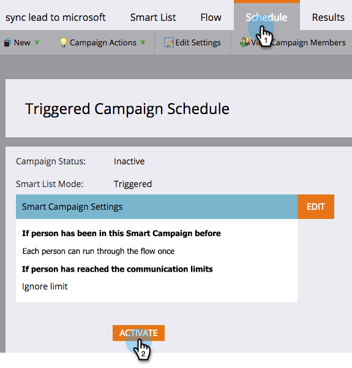

# Een waarschuwing automatiseren voor mogelijk dubbele personen {#automate-an-alert-for-possible-duplicate-people}

Wilt u een waarschuwing telkens wanneer een mogelijk dubbele persoon wordt gemaakt? Hieronder wordt beschreven hoe u een slimme campagne kunt opzetten om dit te doen.

1. [Maak een nieuwe slimme campagne](/help/marketo/product-docs/core-marketo-concepts/smart-campaigns/creating-a-smart-campaign/create-a-new-smart-campaign.md). Definieer de volgende slimme lijst:

* Trigger: **Persoon is gemaakt**
* Filter: **Velden dupliceren.** Veldnaam  **is Volledige naam**

   

   >[!TIP]
   >
   >Wees creatief. Experimenteer met verschillende velden voor betere filterresultaten.

1. Kies [Waarschuwing verzenden](/help/marketo/product-docs/core-marketo-concepts/smart-campaigns/flow-actions/send-alert.md) Stroomactie in de flowstap.

   

   >[!TIP]
   >
   >Het gebruiken van [verzend het teken van Info ](/help/marketo/product-docs/email-marketing/general/using-tokens/use-the-send-alert-info-token.md) van het Alarm om een verbinding aan de persoon in uw CRM op te nemen.

   >[!CAUTION]
   >
   >Als je een grote lijst importeert, krijg je mogelijk een hoop van deze berichten tegelijk!
   >
   >Twee mensen met dezelfde naam betekenen niet automatisch dat ze dezelfde persoon zijn.

1. Activeer de campagne in **Programma** tabel.

   

Dat is het! Deze slimme campagne wordt elke keer gestart wanneer er in Marketo een nieuwe persoon met een bestaande volledige naam wordt gemaakt.

>[!MORELIKETHIS]
>
>[Dubbele personen zoeken en samenvoegen](/help/marketo/product-docs/core-marketo-concepts/smart-lists-and-static-lists/managing-people-in-smart-lists/find-and-merge-duplicate-people.md)
