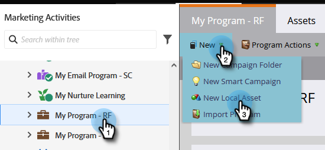

# Waarschuwing voor verkoper {#alert-the-sales-rep}

## Opdracht: De verkoper waarschuwen wanneer iemand een formulier op uw website invult {#mission-alert-the-sales-rep-when-a-person-fills-out-a-form-on-your-web-site}

Als je automatisch e-mailberichten wilt verzenden naar verkopers, hoef je alleen maar een waarschuwingsbericht en een e-mailcampagne te sturen. Zo doe je het.

>[!PREREQUISITES]
>
>[Openingspagina met formulier](/help/marketo/getting-started/quick-wins/landing-page-with-a-form.md){target="_blank"}

## Stap 1: Een waarschuwings-e-mail maken {#step-create-an-alert-email}

1. Ga naar de **[!UICONTROL Marketing Activities]** gebied.

   

1. Selecteren **Mijn programma** die u hebt gemaakt in het dialoogvenster [Openingspagina met formulier](/help/marketo/getting-started/quick-wins/landing-page-with-a-form.md){target="_blank"} quick win , then under **[!UICONTROL New]** klikken **[!UICONTROL New Local Asset]**.

   

1. Klik op **[!UICONTROL Email]**.

   

1. **Naam** Selecteer een sjabloon en klik op **[!UICONTROL Create]**.

   

1. Voer de **Van naam**, **Van e-mail**, **[!UICONTROL Reply-to]**, en **[!UICONTROL Subject]** dat u uw verkoopteam wilt zien.

   

1. Dubbelklik om de e-mailtekst te bewerken.

   

1. Typ de e-mailinhoud.

   

1. Plaats de cursor op de plaats waar u de contactgegevens van de persoon wilt invoegen en klik op de knop **Token invoegen** pictogram.

   

1. Zoek en selecteer de `{{SP_Send_Alert_Info}}` **[!UICONTROL Token]** en klik op **[!UICONTROL Insert]**.

   

   >[!NOTE]
   >
   >{{SP_Send_Alert_Info}} is een speciale token voor e-mailberichten met een waarschuwing. Zie [Het token voor waarschuwinggegevens verzenden gebruiken](/help/marketo/product-docs/email-marketing/general/using-tokens/use-the-send-alert-info-token.md){target="_blank"}{target="_blank"} voor meer informatie.

1. Klik op **[!UICONTROL Save]**.

   

1. Klik op de knop **[!UICONTROL Email Actions]** vervolgkeuzelijst en selecteer **[!UICONTROL Approve and Close]**.

   

## Stap 2: Een waarschuwingsactiecampagne maken {#step-create-an-alert-trigger-campaign}

1. Selecteren **Mijn programma** eerder gemaakt, dan onder **[!UICONTROL New]** klikken **[!UICONTROL New Smart Campaign]**.

   

1. **Naam** de campagne &quot;My Alert Campaign&quot; en klik op **[!UICONTROL Create]**.

   

1. Onder de **[!UICONTROL Smart List]** , zoekt en sleept u de **[!UICONTROL Fills Out Form]** activeren op het canvas.

   

1. Selecteer het formulier dat we eerder hebben gemaakt.

   

1. Onder de **[!UICONTROL Flow]** , zoekt en sleept u de **[!UICONTROL Send Alert]** stroomactie naar het canvas.

   

1. Selecteren **[!UICONTROL My Alert Email]** eerder gemaakt en verlaat **[!UICONTROL Send To]** als **[!UICONTROL Sales Owner]**.

   

1. Typ uw e-mailadres in het dialoogvenster **[!UICONTROL To Other Emails]** veld.

   

1. Ga naar de **[!UICONTROL Schedule]** en klik op de knop **[!UICONTROL Activate]** knop.

   

   >[!TIP]
   >
   >Stel de **[!UICONTROL Qualification Rules]** tot **[!UICONTROL every time]** (door de slimme campagne te bewerken) zodat dezelfde persoon waarschuwingen meerdere keren kan activeren.

1. Klikken **[!UICONTROL Activate]** op het bevestigingsscherm.

   

## Stap 3: Test het! {#step-test-it-out}

1. Selecteer de openingspagina en klik op **[!UICONTROL View Approved Page]**.

   

   >[!NOTE]
   >
   >Vergeet niet landingspagina&#39;s goed te keuren. ze gaan niet live tot ze goedgekeurd zijn.

1. Het formulier invullen en klikken **[!UICONTROL Submit]**.

   

1. Je ontvangt binnenkort je e-mail. Nadat u hebt gecontroleerd dat alles werkt zoals het hoort, verwijdert u uw e-mailadres uit de verzendwaarschuwingsstroom (zie stap 2.7 hierboven).

   >[!NOTE]
   >
   >Klik op de knop **[!UICONTROL Person Info]** in Marketo om de contactgegevens te bekijken.

## Opdracht voltooid! {#mission-complete}

  

[◄ Missie 7: Een e-mail aanpassen](/help/marketo/getting-started/quick-wins/personalize-an-email.md)

[Missie 9: Persoonlijke gegevens bijwerken ►](/help/marketo/getting-started/quick-wins/update-person-data.md)
