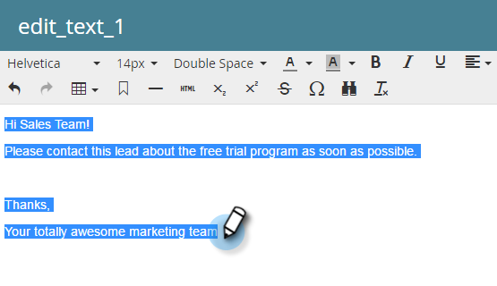

# Waarschuwing voor verkoper {#alert-the-sales-rep}

## Mission: waarschuwen als iemand een formulier invult op uw website {#mission-alert-the-sales-rep-when-a-person-fills-out-a-form-on-your-web-site}

Als je automatisch e-mailberichten wilt verzenden naar verkopers, hoef je alleen maar een waarschuwingsbericht en een e-mailcampagne te sturen. Zo doe je het.

>[!PREREQUISITES]
>
>[&#x200B; het Bestaan Pagina met een Vorm &#x200B;](/help/marketo/getting-started/quick-wins/landing-page-with-a-form.md){target="_blank"}

## Stap 1: Een e-mail met een waarschuwing maken {#step-create-an-alert-email}

1. Ga naar het **[!UICONTROL Marketing Activities]** -gebied.

   

1. Selecteer **Mijn Programma** dat u in de [&#x200B; het Bestaan Pagina met een Vorm &#x200B;](/help/marketo/getting-started/quick-wins/landing-page-with-a-form.md){target="_blank"} snel wint, toen onder **[!UICONTROL New]** klikt **[!UICONTROL New Local Asset]** creeerde.

   

1. Klik op **[!UICONTROL Email]**.

   

1. **Naam** e-mail &quot;Mijn e-mailalarm&quot;, selecteer een malplaatje en klik **[!UICONTROL Create]**.

   

1. Ga **van Naam** in, **van E-mail**, **[!UICONTROL Reply-to]**, en **[!UICONTROL Subject]** dat u uw verkoopteam wilt zien.

   

1. Dubbelklik om de e-mailtekst te bewerken.

   

1. Typ de e-mailinhoud.

   

1. Plaats uw curseur waar u de het contactinfo van de persoon wilt opnemen en **klikken Symbolisch** pictogram van het Tussenvoegsel.

   

1. Zoek en selecteer de `{{SP_Send_Alert_Info}}` **[!UICONTROL Token]** en klik op **[!UICONTROL Insert]** .

   

   >[!NOTE]
   >
   >{{SP_Send_Alert_Info}} is een speciale token voor e-mailmeldingen. Zie [&#x200B; Gebruik het Send Token van Info van de Waarschuwing &#x200B;](/help/marketo/product-docs/email-marketing/general/using-tokens/use-the-send-alert-info-token.md){target="_blank"}{target="_blank"} om meer te leren.

1. Klik op **[!UICONTROL Save]**.

   

1. Klik op de vervolgkeuzelijst **[!UICONTROL Email Actions]** en selecteer **[!UICONTROL Approve and Close]** .

   

## Stap 2: Een waarschuwingscampagne maken {#step-create-an-alert-trigger-campaign}

1. Selecteer **Mijn die Programma** eerder, dan onder **[!UICONTROL New]** wordt gecreeerd klikt **[!UICONTROL New Smart Campaign]**.

   

1. **Naam** de campagne &quot;Mijn Waakzame Campagne&quot;en klik **[!UICONTROL Create]**.

   

1. Zoek en sleep de trigger **[!UICONTROL Smart List]** onder het tabblad **[!UICONTROL Fills Out Form]** naar het canvas.

   

1. Selecteer het formulier dat we eerder hebben gemaakt.

   

1. Zoek onder het tabblad **[!UICONTROL Flow]** de **[!UICONTROL Send Alert]** -flowactie naar het canvas en sleep deze.

   

1. Selecteer **[!UICONTROL My Alert Email]** die u eerder hebt gemaakt en laat **[!UICONTROL Send To]** as **[!UICONTROL Sales Owner]** staan.

   

1. Typ uw e-mailadres in het veld **[!UICONTROL To Other Emails]** .

   

1. Ga naar de tab **[!UICONTROL Schedule]** en klik op de knop **[!UICONTROL Activate]** .

   

   >[!TIP]
   >
   >Stel **[!UICONTROL Qualification Rules]** in op **[!UICONTROL every time]** (door de slimme campagne te bewerken) zodat dezelfde persoon waarschuwingen meerdere keren kan activeren.

1. Klik op **[!UICONTROL Activate]** op het bevestigingsscherm.

   

## Stap 3: Test het! {#step-test-it-out}

1. Selecteer de openingspagina en klik op **[!UICONTROL View Approved Page]** .

   

   >[!NOTE]
   >
   >Vergeet niet landingspagina&#39;s goed te keuren, ze gaan niet live tot ze goedgekeurd zijn.

1. Vul het formulier in en klik op **[!UICONTROL Submit]** .

   

1. Je ontvangt binnenkort je e-mail. Nadat u hebt gecontroleerd dat alles werkt zoals het hoort, verwijdert u uw e-mailadres uit de verzendwaarschuwingsstroom (zie stap 2.7 hierboven).

   >[!NOTE]
   >
   >Klik op de tab **[!UICONTROL Person Info]** in Marketo om de contactgegevens weer te geven.

## Opdracht voltooid! {#mission-complete}

  

[◄ Opdracht 7: Een e-mail personaliseren](/help/marketo/getting-started/quick-wins/personalize-an-email.md)

[Mission 9: Update Person Data ►](/help/marketo/getting-started/quick-wins/update-person-data.md)
