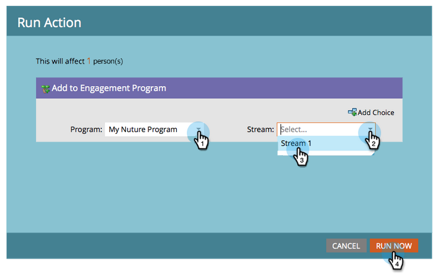

# Drip, Drip, Nurture {#drip-drip-nurture}

## Missie: De mensen die uw recente vakbeurs bijwoonden, opvoeden {#mission-nurture-the-people-who-attended-your-recent-tradeshow}

In Marketo kunt u eenvoudig een geavanceerd en geavanceerd opvoedingssysteem maken. Zo!

>[!PREREQUISITES]
>
>* [&#x200B; krijgt Opstelling en voegt een Persoon &#x200B;](/help/marketo/getting-started/quick-wins/get-set-up-and-add-a-person.md){target="_blank"} toe
>* [&#x200B; de Invoer een Lijst van Mensen &#x200B;](/help/marketo/getting-started/quick-wins/import-a-list-of-people.md){target="_blank"}

## Stap 1: Een betrokkenheidsprogramma maken {#step-create-an-engagement-program}

1. Ga naar het **[!UICONTROL Marketing Activities]** -gebied.

   

1. Selecteer de **het Leren** omslag, klik **[!UICONTROL New]** drop-down en selecteer **[!UICONTROL New Program]**.

   

1. Voer een **[!UICONTROL Name]** in en selecteer **[!UICONTROL Engagement]** voor de **[!UICONTROL Program Type]** .

   

1. Zorg ervoor dat het veld **[!UICONTROL Channel]** **[!UICONTROL Nurture]** is en klik op **[!UICONTROL Create]** .

   

   U hebt nu een betrokkenheidsprogramma gemaakt.

## Stap 2: Een e-mail maken {#step-create-an-email}

1. Selecteer uw betrokkenheidsprogramma, klik op **[!UICONTROL New]** en selecteer **[!UICONTROL New Local Asset]** .

   

1. Klik op **[!UICONTROL Email]**.

   

1. Voer een **[!UICONTROL Name]** in, selecteer de **[!UICONTROL Template]** die u wilt gebruiken en klik op **[!UICONTROL Create]** .

   

   >[!NOTE]
   >
   >Ziet u de e-maileditor niet? Uw browser heeft het venster waarschijnlijk geblokkeerd. Schakel pop-ups in vanuit `app.marketo.com` in uw browser en klik op **[!UICONTROL Edit Draft]** in de bovenste menubalk.

1. Voer een onderwerp in.

   

1. Selecteer het gebied van het e-mailbericht dat u wilt bewerken, klik op het tandwielpictogram en selecteer **[!UICONTROL Edit]** .

   

1. Bewerk uw e-mail en klik op **[!UICONTROL Save]** .

   

1. Klik onder **[!UICONTROL Email Actions]** op **[!UICONTROL Approve and Close]** .

   

   >[!NOTE]
   >
   >Vergeet niet uw e-mails goed te keuren of u kunt ze later niet activeren.

1. Maak nu een andere e-mail door de handelingen in stap 2-7 te herhalen.

   

## Stap 3: Inhoud toevoegen aan uw stream {#step-add-content-to-your-stream}

Nu is het tijd om een inhoudsstroom voor uw betrokkenheidsprogramma te maken met de e-mails die u hebt gemaakt.

1. Selecteer uw betrokkenheidsprogramma en klik op de tab **[!UICONTROL Streams]** .

   

1. Klik op de knop **[!UICONTROL Add Content]** in de stream.

   

   >[!TIP]
   >
   >U kunt ook het pictogram **+** gebruiken.

1. Laat het type E-mail geselecteerd. Zoek en selecteer de twee e-mails die u hebt gemaakt.

   

## Stap 4: Stream-inhoud activeren {#step-activate-stream-content}

1. Activeer alle inhoud tegelijk door op het pictogram voor het stroomversnelling te klikken en vervolgens op **[!UICONTROL Activate all content]** te klikken.

   

   >[!NOTE]
   >
   >U kunt inhoud niet activeren zonder deze eerst goed te keuren.

   Geweldig werk! Nog één stap en het betrokkenheidsprogramma is klaar.

## Stap 5: De stroomkring instellen {#step-set-the-stream-cadence}

1. Klik op **[!UICONTROL Set Stream Cadence]**.

   

1. Bewerk de instellingen zodat deze overeenkomen met het gewenste schema en klik op **[!UICONTROL Save]** .

   

   Uw betrokkenheidsprogramma is allemaal ingesteld. Laten we nu een testpersoon aan uw programma toevoegen.

   >[!NOTE]
   >
   >De testpersoon is de persoon die uw betrokkenheidsprogramma controleert om te testen of het correct is voordat deze naar klanten wordt verzonden.

## Stap 6: Voeg een testpersoon toe aan uw betrokkenheidsprogramma {#step-add-a-test-person-to-your-engagement-program}

1. Ga naar het **[!UICONTROL Database]** -gebied.

   

1. Zoek naar uw testpersoon.

   

   >[!NOTE]
   >
   >Zorg ervoor dat de testpersoon een geldig e-mailadres heeft, zodat u de ontvangst van e-mails tijdens het testen kunt bevestigen.

1. Klik met de rechtermuisknop op de persoon en klik vervolgens op **[!UICONTROL Programs]** en **[!UICONTROL Add to Engagement Program...]** .

   

1. Selecteer **[!UICONTROL Program]** en **[!UICONTROL Stream]** en klik vervolgens op **[!UICONTROL Run Now]** .

   

1. Opdracht voltooid!

1. U ontvangt een e-mail op het door u opgegeven tijdstip en tijdstip.

   >[!NOTE]
   >
   >Leer meer over [&#x200B; Programma&#39;s van de Betrokkenheid &#x200B;](/help/marketo/product-docs/email-marketing/drip-nurturing/creating-an-engagement-program/understanding-engagement-programs.md){target="_blank"}.

## Opdracht voltooid! {#mission-complete}

  

[◄ Opdracht 5: Een lijst met personen importeren](/help/marketo/getting-started/quick-wins/import-a-list-of-people.md)

[Opdracht 7: Een e-mail personaliseren ►](/help/marketo/getting-started/quick-wins/personalize-an-email.md)
