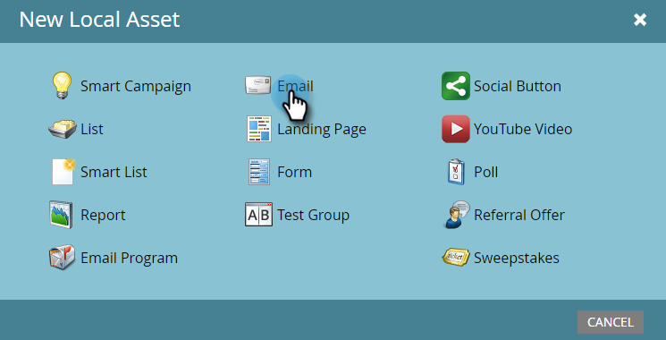
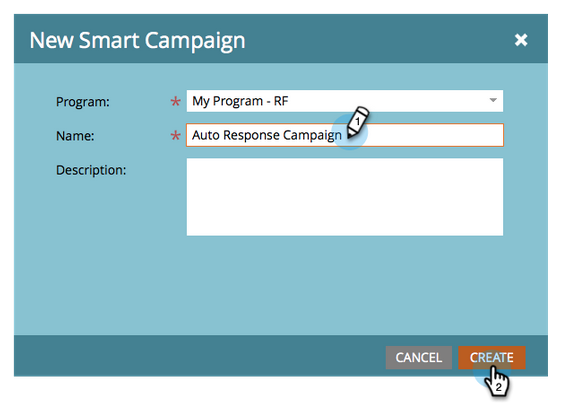
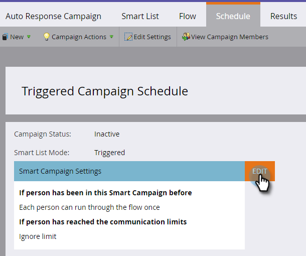

# Automatische e-mailreactie {#email-auto-response}

## Opdracht: Een bedankje per e-mail verzenden wanneer iemand een formulier {#mission-send-out-a-thank-you-email-when-a-person-fills-out-a-form} invult

>[!PREREQUISITES]
>
>* [Instellen en een persoon toevoegen](/help/marketo/getting-started/quick-wins/get-set-up-and-add-a-person.md)
>* [Openingspagina met formulier](/help/marketo/getting-started/quick-wins/landing-page-with-a-form.md)

## Stap 1: Een e-mail {#step-create-an-email} maken

1. Ga naar het gebied Marketingactiviteiten.

   

1. Selecteer Mijn Programma in het linkermenu, klik Nieuwe drop-down, en selecteer Nieuw Lokaal Middel.

   

1. Klik op E-mail.

   

1. Geef uw e-mail de naam &quot;Auto Response Email&quot;, kies een sjabloon en klik op Maken.

   

   Een e-maileditor wordt geopend in een nieuw venster of op een nieuw tabblad. Als pop-ups worden geblokkeerd, klikt u op **Concept bewerken** op de overzichtspagina voor middelen om het e-mailbericht te openen.

1. Voer een onderwerpregel in en dubbelklik op het bewerkbare gebied van de e-mail.

   

   _Boven op de e-maileditor wordt een RTF-editor geopend._

1. Markeer de bestaande e-mailinhoud.

   

1. Typ uw e-mailinhoud en klik op Opslaan.

   

1. De wijzigingen worden automatisch opgeslagen. Sluit het tabblad/venster van de e-maileditor.

   

1. Selecteer uw nieuwe e-mail. Klik onder E-mailhandelingen op Goedkeuren.

   

## Stap 2: Een slimme campagne maken {#step-create-a-smart-campaign}

1. Klik **Mijn Programma** met de rechtermuisknop aan en klik **Nieuwe Slimme Campagne**.

   

1. **Geef** uw slimme campagne &quot;Auto Response Campaign&quot; een naam en klik op  **Maken**.

   

1. Ga naar **Slimme lijst** tabel.

   

   Deze campagne wordt uitgevoerd wanneer een persoon het formulier invult dat u in [**Landing Page hebt gemaakt met een formulier**](/help/marketo/getting-started/quick-wins/landing-page-with-a-form.md).

1. Zoek en sleep de trigger **Formulier invullen** naar het linkercanvas.

   

1. Selecteer **Mijn formulier** in de vervolgkeuzelijst. Klik op het tabblad **Stroom**.

   

1. Sleep de stroomactie **E-mail verzenden** naar het linkercanvas.

   

1. Selecteer uw **Automatische reactie-e-mail** en ga naar het tabblad **Schema**.

   

1. Klik **Bewerken**.

   

1. Selecteer **telkens** en klik **sparen**.

   

1. Klik **Activeren**.

   

1. Klik **Activeer** op het bevestigingsscherm.

   

>[!NOTE]
>
>Zodra actief, zal deze campagne lopen telkens als een persoon het gespecificeerde formulier invult. De campagne blijft actief tot ze gedeactiveerd is.

## Stap 3: Formulier {#step-fill-out-the-form} invullen

1. Selecteer **Mijn pagina**. Dit is gemaakt op de [Landing Page met een Form](/help/marketo/getting-started/quick-wins/landing-page-with-a-form.md) quick win.

   

1. Klik **Goedgekeurde pagina weergeven**.

   

   De openingspagina voor gratis proefversie wordt geopend op een nieuw tabblad.

1. Vul het formulier in met uw voornaam, achternaam en e-mailadres en klik vervolgens op **Verzenden**.

   

>[!NOTE]
>
>Gebruik uw werkelijke e-mailadres zodat u het e-mailbericht kunt ontvangen.

## Opdracht voltooid {#mission-complete}

Binnen een paar minuten ziet u het e-mailbericht voor automatische reacties in uw Postvak IN. Geweldig werk!

  

[◄ Missie 3: Eenvoudige scores](/help/marketo/getting-started/quick-wins/simple-scoring.md)

[Missie 5: Een lijst met leads importeren ►](/help/marketo/getting-started/quick-wins/import-a-list-of-people.md)
