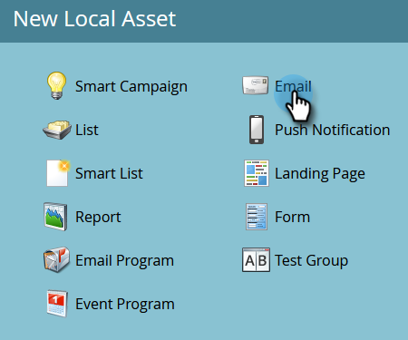
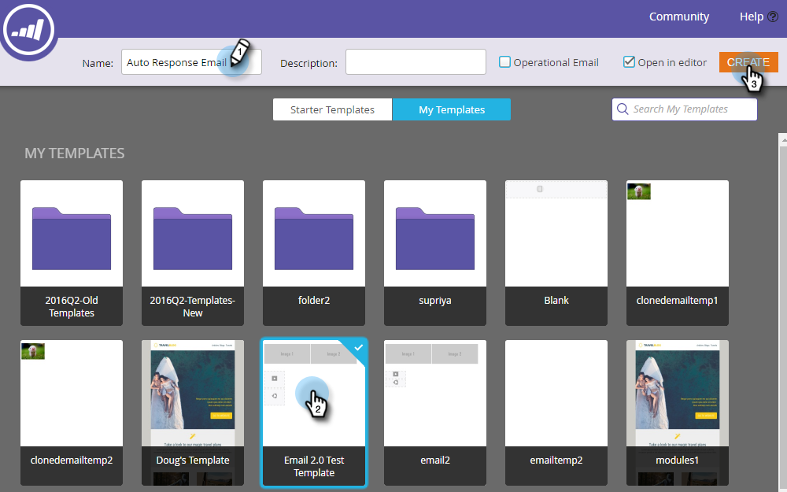
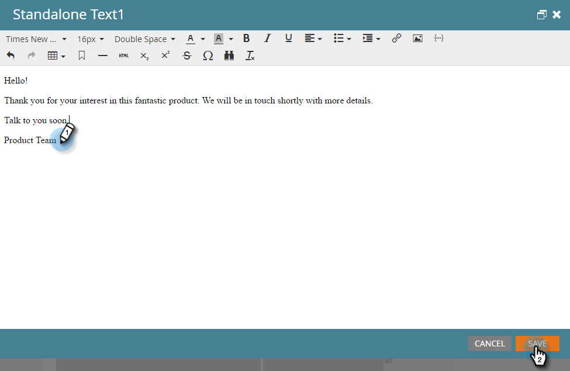
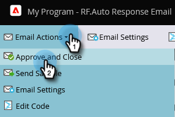
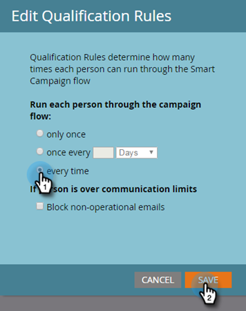

# Automatische reactie e-mail {#email-auto-response}

## Mission: verzend een bedankje-e-mail wanneer iemand een formulier invult {#mission-send-out-a-thank-you-email-when-a-person-fills-out-a-form}

>[!PREREQUISITES]
>
>* [ krijgt Opstelling en voegt een Persoon ](/help/marketo/getting-started/quick-wins/get-set-up-and-add-a-person.md){target="_blank"} toe
>* [ het Bestaan Pagina met een Vorm ](/help/marketo/getting-started/quick-wins/landing-page-with-a-form.md){target="_blank"}

## Stap 1: Een e-mail maken {#step-create-an-email}

1. Ga naar het [!UICONTROL Marketing Activities] -gebied.

   

1. Selecteer het programma in het linkermenu, klik op de vervolgkeuzelijst **[!UICONTROL New]** en selecteer **[!UICONTROL New Local Asset]** .

   

1. Selecteer **[!UICONTROL Email]**.

   

1. Geef uw e-mail de naam &quot;Auto Response Email&quot;, kies een sjabloon en klik op **[!UICONTROL Create]** .

   

   Een e-maileditor wordt geopend in een nieuw venster of op een nieuw tabblad. Als pop-ups zijn geblokkeerd, klikt u op **[!UICONTROL Edit Draft]** op de overzichtspagina van het element om het e-mailbericht te openen.

1. Voer een onderwerpregel in en dubbelklik op het bewerkbare gebied van de e-mail.

   

   _de rijke tekstredacteur van A zal bovenop de e-mailredacteur openen._

1. Markeer de bestaande e-mailinhoud.

   

1. Typ uw e-mailinhoud en klik op **[!UICONTROL Save]** .

   

1. Klik op de vervolgkeuzelijst **[!UICONTROL Email Actions]** en selecteer **[!UICONTROL Approve and Close]** .

   

## Stap 2: Een slimme campagne maken {#step-create-a-smart-campaign}

1. Selecteer het programma, klik op de vervolgkeuzelijst **[!UICONTROL New]** en selecteer **[!UICONTROL New Smart Campaign]** .

   

1. **Naam** uw slimme campagne &quot;AutoCampagne van de Reactie&quot;en klik **[!UICONTROL Create]**.

   

1. Ga naar het tabblad **[!UICONTROL Smart List]**.

   

   Wij vestigen opstelling deze campagne om te lopen wanneer een persoon de vorm invult u in [**het Landen Pagina met een Vorm**](/help/marketo/getting-started/quick-wins/landing-page-with-a-form.md){target="_blank"} creeerde.

1. Zoek en sleep de trigger **[!UICONTROL Fills Out Form]** naar het canvas.

   

1. Selecteer **[!UICONTROL My Form]** in de vervolgkeuzelijst. Klik vervolgens op de tab **[!UICONTROL Flow]** .

   

1. Sleep de **[!UICONTROL Send Email]** flowactie naar het linkercanvas.

   

1. Selecteer uw **Auto E-mail van de Reactie**. Klik vervolgens op de tab **[!UICONTROL Schedule]** .

   

1. Klik op **[!UICONTROL Edit]**.

   

1. Selecteer **[!UICONTROL every time]** en klik op **[!UICONTROL Save]** .

   

1. Klik op **[!UICONTROL Activate]**.

   

1. Klik op **[!UICONTROL Activate]** op het bevestigingsscherm.

   

>[!NOTE]
>
>Zodra actief, zal deze campagne lopen telkens als een persoon het gespecificeerde formulier invult. De campagne blijft actief tot ze gedeactiveerd is.

## Stap 3: Vul het formulier in {#step-fill-out-the-form}

1. Selecteer **Mijn Pagina** (dit werd gecreeerd in de [ Aanvoerende Pagina met een Vorm ](/help/marketo/getting-started/quick-wins/landing-page-with-a-form.md){target="_blank"} snel wint) en klik **[!UICONTROL Preview]**.

   

   _Uw &quot;Vrije Proefversie&quot;het landen pagina zal in een nieuw lusje openen._

1. Vul het formulier in met uw voornaam, achternaam en e-mailadres en klik vervolgens op **[!UICONTROL Submit]** .

   

>[!NOTE]
>
>Gebruik uw werkelijke e-mailadres zodat u het e-mailbericht kunt ontvangen.

## Opdracht voltooid {#mission-complete}

Binnen een paar minuten ziet u het e-mailbericht voor automatische reacties in uw Postvak IN.

[◄ Opdracht 3: eenvoudige scores](/help/marketo/getting-started/quick-wins/simple-scoring.md)

[Missie 5: Een lijst met personen importeren ►](/help/marketo/getting-started/quick-wins/import-a-list-of-people.md)
