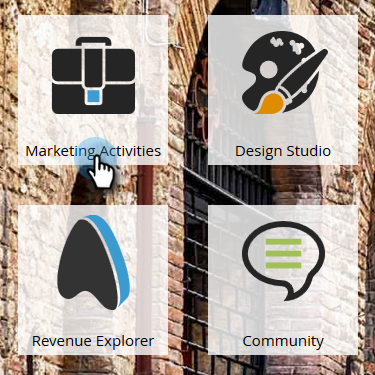
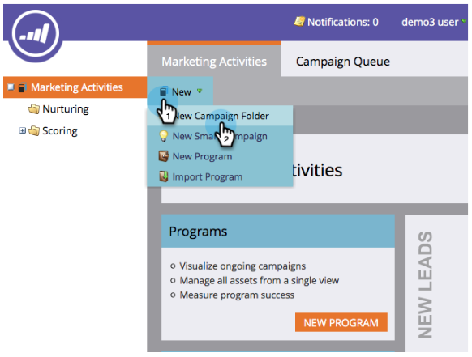

# Instellen en een persoon toevoegen {#get-set-up-and-add-a-person}

Er zijn een paar dingen te doen voordat u de missies begint.

## Stap 1: Aanmelden bij Marketo {#step-log-in-to-marketo}

1. [Aanmelden bij Marketo](https://app.marketo.com) met de gegevens die u per e-mail hebt ontvangen.

   

## Stap 2: Een leermap maken {#step-create-a-learning-folder}

Laten we een map maken voor alles wat u in de missies gaat maken.

1. Ga naar de **Marketingactiviteiten** gebied.

   

1. Klik op de knop **Nieuw** vervolgkeuzelijst en selecteer **Nieuwe campagnemap**.

   

1. Geef de map &quot;Learning&quot; een naam en klik op **Maken**.

   

1. De nieuwe leermap wordt weergegeven in het linkermenu.

   

## Stap 3: Uw eigen persoon toevoegen als persoon {#step-add-yourself-as-a-person}

Voeg uzelf toe als persoon in Marketo zodat u later teste-mails naar uzelf kunt sturen.

1. Ga naar de **Database** gebied.

   

1. Klik op de knop **Nieuw** vervolgkeuzelijst en selecteer **Nieuwe persoon**.

   

1. Typ uw voornaam en achternaam, e-mailadres en bedrijfsnaam en klik vervolgens op **Maken** om uzelf toe te voegen als een persoon.

   

   >[!CAUTION]
   >
   >Marketo doet het **niet** e-mailadressen met emojis ondersteunen.

1. Om uw mensen te bekijken, open uw Slimme Lijsten van het Systeem in het linkermenu, dan klik Alle Mensen.

   

1. Klik op de knop **Mensen** tab. U zou zich in het gegevensbestand moeten zien.

   

## Installatie voltooid {#set-up-complete}

Je bent klaar om je eerste missie te beginnen!

  

[Missie 1: Een e-mailschok verzenden ►](/help/marketo/getting-started/quick-wins/send-an-email.md)
