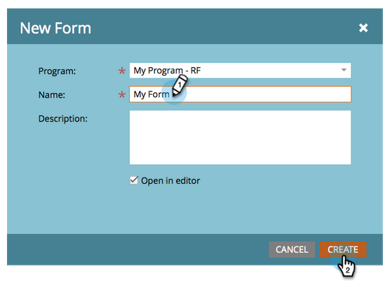
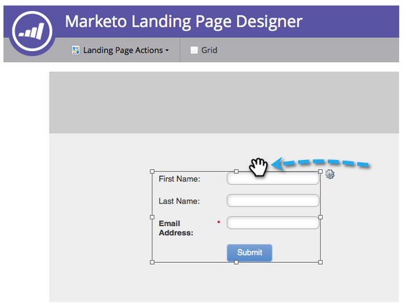

# Openingspagina met formulier {#landing-page-with-a-form}

## Opdracht: Maak een openingspagina met een formulier voor het verkrijgen van nieuwe personen. {#mission-create-a-landing-page-with-a-form-to-acquire-new-people}

>[!PREREQUISITES]
>
>[Instellen en een persoon toevoegen](/help/marketo/getting-started/quick-wins/get-set-up-and-add-a-person.md)

## STAP 1: Een programma maken {#step-create-a-program}

1. Ga naar de **Marketingactiviteiten** gebied.

   

1. Selecteer **Leren** map gemaakt in het dialoogvenster [vorige quick win](/help/marketo/getting-started/quick-wins/send-an-email.md).

   

1. Onder **Nieuw**, klikt u op **Nieuw programma**.

   

1. Een programma invoeren **Naam** selecteert u een **Kanaal** en klik op **Maken**.

   >[!NOTE]
   >
   >Neem uw initialen op aan het einde van de programmanaam om deze uniek te maken.

   

   >[!NOTE]
   >
   >Een programma is een specifiek marketinginitiatief. De **kanaal** is bedoeld als leveringsmechanisme, zoals Webinar, Sponsorship, of Online Advertentie. U kunt verschillende kanaalopties in uw drop-down zien, afhankelijk van wat in uw eigen instantie beschikbaar is. U kunt ook [uw eigen kanaal maken](/help/marketo/product-docs/administration/tags/create-a-program-channel.md).

   

Echt waar! Nu we een programma hebben gemaakt, gaan we verder en maken we wat inhoud.

## STAP 2: Een formulier maken {#step-create-a-form}

1. Selecteer het programma en klik op **Nieuw** dan **Nieuw lokaal element**.

   

1. Selecteren **Formulier**.

   

1. Een formulier invoeren **Naam** en klik op **Maken**.

   

   >[!NOTE]
   >
   >Zorg ervoor dat de **Openen in editor** is ingeschakeld. Als het niet is, zult u moeten klikken **Formulier bewerken** tab.

   >[!TIP]
   >
   >Ziet u de formuliereditor niet? Uw browser heeft het venster waarschijnlijk geblokkeerd. Pop-ups inschakelen vanuit [app.marketo.com](https://app.marketo.com/) in uw browser en klik op Concept bewerken in de bovenste menubalk.

1. Selecteer **E-mailadres** veld en controle **Is vereist**.

   

1. Klikken **Volgende**.

   

1. Klik op de pijlen om door de thema&#39;s te schuiven. Selecteer een optie.

   

1. Klikken **Volgende**.

   

1. Selecteer onder de sectie Pagina bedankt de optie **Externe URL** for **Opvolgen met**.

   

1. Voer de URL in.

   

   >[!NOTE]
   >
   >Op de pagina Follow-up wordt de bezoeker omgeleid nadat hij het formulier heeft ingevuld. Externe URL is één optie, maar er zijn er meer. Zie [Een pagina voor bedankt formulier instellen](/help/marketo/product-docs/demand-generation/forms/creating-a-form/set-a-form-thank-you-page.md).

1. Klikken **Voltooien**.

   

1. Klikken **Goedkeuren en Sluiten**.

   

   Super! Nu heb je een programma met een formulier erin. Laten we verder gaan en een pagina maken.

   

## STAP 3: Een bestemmingspagina maken en uw formulier toevoegen {#step-create-a-landing-page-and-add-your-form}

1. Selecteer het programma en klik op **Nieuw** en vervolgens **Nieuw lokaal element**.

   

1. Selecteren **Openingspagina**.

   

1. Een pagina invoeren **Naam** selecteert u een sjabloon en klikt u op **Maken**.

   >[!NOTE]
   >
   >Je hebt misschien een andere sjabloon dan die in onze screenshot. Het is oké, kies er een en ga door.

   

1. Wanneer de bestemmingspagina-editor wordt geopend, sleept u het formulierelement naar het canvas.

   

1. Zoek en selecteer het formulier en klik op **Invoegen**.

   

1. Sleep het formulier naar de gewenste locatie.

   

1. Alle wijzigingen worden automatisch opgeslagen. Sluit het tabblad/venster van de formuliereditor.

   

   Geweldig werk! Er staat nu een bestemmingspagina met een formulier op. We keuren uw pagina goed om deze live te zetten.

## STAP 4: Uw bestemmingspagina goedkeuren {#step-approve-your-landing-page}

1. Selecteer de bestemmingspagina, onder **Handelingen op bestemmingspagina** klikken **Goedkeuren**.

   >[!NOTE]
   >
   >Als de landingspagina wordt goedgekeurd, wordt deze live en beschikbaar op internet.

   

   Perfect! Zie je het groene vinkje erop?

   

## STAP 5: Uw formulier testen {#step-test-your-form}

1. Selecteer de openingspagina en klik op **Goedgekeurde pagina weergeven**.

   

1. Vul het formulier in met informatie waarvan u weet dat deze uniek is en klik op **Verzenden**.

   

1. Ga naar de **Database** gebied.

   

1. Zoeken naar het unieke e-mailadres dat u hebt gebruikt bij het invullen van het formulier.

   

   Daar is het! U hebt een nieuwe bestemmingspagina gemaakt met een formulier erop en deze gebruikt om een nieuwe persoon te genereren.

   

## Opdracht voltooid! {#mission-complete}

  

[◄ Missie 1: Een e-mailschok verzenden](/help/marketo/getting-started/quick-wins/send-an-email.md)

[Missie 3: Eenvoudige scores ►](/help/marketo/getting-started/quick-wins/simple-scoring.md)
