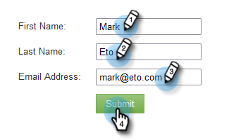
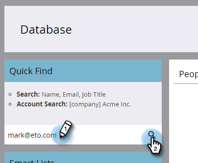

# Openingspagina met formulier {#landing-page-with-a-form}

## Opdracht: Maak een openingspagina met een formulier voor het verkrijgen van nieuwe personen. {#mission-create-a-landing-page-with-a-form-to-acquire-new-people}

>[!PREREQUISITES]
>
>[Instellen en een persoon toevoegen](/help/marketo/getting-started/quick-wins/get-set-up-and-add-a-person.md)

## STAP 1: Een programma maken {#step-create-a-program}

1. Ga naar de **[!UICONTROL Marketing Activities]** gebied.

   

1. Selecteer **Leren** map gemaakt in het dialoogvenster [vorige quick win](/help/marketo/getting-started/quick-wins/send-an-email.md){target="_blank"}. Onder **[!UICONTROL New]**, klikt u op **[!UICONTROL New Program]**.

   

1. Een programma invoeren **[!UICONTROL Name]** selecteert u een **[!UICONTROL Channel]** en klik op **[!UICONTROL Create]**.

   

   >[!TIP]
   >
   >Neem uw initialen op aan het einde van de programmanaam om deze uniek te maken.

   >[!NOTE]
   >
   >Een programma is een specifiek marketinginitiatief. De **kanaal** is bedoeld als leveringsmechanisme, zoals Webinar, Sponsorship, of Online Advertentie. U kunt verschillende kanaalopties in uw drop-down zien, afhankelijk van wat in uw eigen instantie beschikbaar is. U kunt ook [uw eigen kanaal maken](/help/marketo/product-docs/administration/tags/create-a-program-channel.md){target="_blank"}.

Echt waar! Nu we een programma hebben gemaakt, gaan we verder en maken we wat inhoud.

## STAP 2: Een formulier maken {#step-create-a-form}

1. Selecteer het programma en klik op de knop **[!UICONTROL New]** vervolgkeuzelijst en selecteer **[!UICONTROL New Local Asset]**.

   

1. Selecteren **[!UICONTROL Form]**.

   

1. Een formulier invoeren **[!UICONTROL Name]** en klik op **[!UICONTROL Create]**.

   

   >[!NOTE]
   >
   >Zorg ervoor dat de **[!UICONTROL Open in editor]** is ingeschakeld. Als het niet is, zult u moeten klikken **[!UICONTROL Edit Form]** tab.

   >[!TIP]
   >
   >Ziet u de formuliereditor niet? Uw browser heeft het venster waarschijnlijk geblokkeerd. Pop-ups inschakelen vanuit `app.marketo.com` in uw browser en klik op Concept bewerken in de bovenste menubalk.

1. Selecteer **[!UICONTROL Email Address]** veld en controle **[!UICONTROL Is Required]**.

   

1. Klik op **[!UICONTROL Next]**.

   

1. Klik op de pijlen om door de thema&#39;s te schuiven. Selecteer een optie.

   

1. Klik op **[!UICONTROL Next]**.

   

1. Selecteer onder de sectie Pagina bedankt de optie **[!UICONTROL External URL]** for **[!UICONTROL Follow Up With]**.

   

1. Voer de URL in.

   

   >[!NOTE]
   >
   >Op de pagina Follow-up wordt de bezoeker omgeleid nadat hij het formulier heeft ingevuld. Externe URL is één optie, maar er zijn er meer. Zie [Een pagina voor bedankt formulier instellen](/help/marketo/product-docs/demand-generation/forms/creating-a-form/set-a-form-thank-you-page.md){target="_blank"}.

1. Klik op **[!UICONTROL Finish]**.

   

1. Klik op **[!UICONTROL Approve and Close]**.

   

   Geweldig! Nu heb je een programma met een formulier erin. Laten we verder gaan en een pagina maken.

## STAP 3: Een bestemmingspagina maken en uw formulier toevoegen {#step-create-a-landing-page-and-add-your-form}

1. Selecteer het programma en klik op de knop **[!UICONTROL New]** vervolgkeuzelijst en selecteer **[!UICONTROL New Local Asset]**.

   

1. Selecteren **[!UICONTROL Landing Page]**.

   

1. Een pagina invoeren **[!UICONTROL Name]** selecteert u een sjabloon en klikt u op **[!UICONTROL Create]**.

   >[!NOTE]
   >
   >Je hebt misschien een andere sjabloon dan die in onze screenshot. Het is oké, kies er een en ga door.

   

1. Wanneer de bestemmingspagina-editor wordt geopend, sleept u de [!UICONTROL Form] op het canvas.

   

1. Zoek en selecteer het formulier en klik op **[!UICONTROL Insert]**.

   

1. Sleep het formulier naar de gewenste locatie.

   

1. Alle wijzigingen worden automatisch opgeslagen. Sluit het tabblad/venster van de formuliereditor.

   

   Geweldig werk! Er staat nu een bestemmingspagina met een formulier op. We keuren uw pagina goed om deze live te zetten.

## STAP 4: Uw bestemmingspagina goedkeuren {#step-approve-your-landing-page}

1. Selecteer de openingspagina en klik op **[!UICONTROL Approve draft]**.

   

   >[!NOTE]
   >
   >Als de landingspagina wordt goedgekeurd, wordt deze live en beschikbaar op internet.

   Perfect! Zie je het groene vinkje erop?

   

## STAP 5: Uw formulier testen {#step-test-your-form}

1. Selecteer de openingspagina en klik op **[!UICONTROL View Approved Page]**.

   

1. Vul het formulier in met informatie waarvan u weet dat deze uniek is en klik op **[!UICONTROL Submit]**.

   

1. Ga naar de **[!UICONTROL Database]** gebied.

   

1. Zoeken naar het unieke e-mailadres dat u hebt gebruikt bij het invullen van het formulier.

   

   Daar is het! U hebt een nieuwe bestemmingspagina gemaakt met een formulier erop en deze gebruikt om een nieuwe persoon te genereren.

   

## Opdracht voltooid! {#mission-complete}

  

[◄ Missie 1: Een e-mailschok verzenden](/help/marketo/getting-started/quick-wins/send-an-email.md)

[Missie 3: Eenvoudige scores ►](/help/marketo/getting-started/quick-wins/simple-scoring.md)
