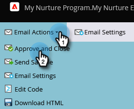

# Een e-mail personaliseren {#personalize-an-email}

## Missie: maak uw e-mails persoonlijk door gegevenstokens toe te voegen {#mission-make-your-emails-personal-by-adding-data-tokens}

>[!PREREQUISITES]
>
>* [ krijgt Opstelling en voegt een Persoon ](/help/marketo/getting-started/quick-wins/get-set-up-and-add-a-person.md){target="_blank"} toe
>* [ verzend een E-mailschoen ](/help/marketo/getting-started/quick-wins/send-an-email.md){target="_blank"}
>* [ Drip, Drip, Nurture ](/help/marketo/getting-started/quick-wins/drip-drip-nurture.md){target="_blank"}

## Stap 1: Selecteer een e-mailadres dat u wilt aanpassen {#step-select-an-email-to-personalize}

1. Selecteer één van de verfrissende e-mails die in [ vorige snelle win ](/help/marketo/getting-started/quick-wins/drip-drip-nurture.md){target="_blank"} worden gecreeerd en klik **[!UICONTROL Create draft]**.

   

   >[!NOTE]
   >
   >Hiermee maakt u een kopie van de e-mail als concept. Vergeet niet het concept voor de wijzigingen goed te keuren om live te gaan.

Als u geen pop-upblokkering hebt ingeschakeld, wordt de e-maileditor geopend in een nieuw tabblad/venster. Anders klikt u tweemaal op **[!UICONTROL Create Draft]** .

## Stap 2: Maak van de Salesperson de Afzender {#step-make-the-salesperson-the-sender}

1. Selecteer het **[!UICONTROL From]** gebied, benadruk en **schrap** de huidige naam.

   

1. Klik het **Symbolische** pictogram rechts van het **[!UICONTROL From]** gebied.

   

1. Zoek en selecteer het token **`{{lead.Lead Owner First Name}}`** .

   

1. Typ uw bedrijfsnaam en een streepje voor de **StandaardWaarde** om ervoor te zorgen dat iets wordt getoond voor het geval de eerste naam van de verkoopvertegenwoordiger niet beschikbaar is. Klik **Tussenvoegsel**.

   

1. Druk op de spatiebalk in het veld **[!UICONTROL From]** en zorg ervoor dat de cursor een spatie laat knipperen na het token dat u net hebt ingevoegd. Dan klik opnieuw het **Symbolische** pictogram.

   

1. Zoek en selecteer het token **`{{lead.Lead Owner Last Name}}`** .

   

1. Het type &quot;Verkoop&quot;voor de **StandaardWaarde** en klikt **Tussenvoegsel**.

   

## Stap 3: Voeg de naam van de lead toe aan de e-mail {#step-add-the-leads-name-to-the-email}

1. Selecteer de bovenste bewerkbare sectie, klik op het tandwielpictogram en selecteer **[!UICONTROL Edit]** .

   

1. Voeg een ruimte na &quot;Hello&quot;toe en plaats uw curseur voor de komma, dan klik het **Symbolische pictogram van het Tussenvoegsel**.

   

1. Zoek en selecteer het token **`{{lead.First Name}}`** .

   

1. Typ &quot;Vriend&quot; (of een willekeurig label dat u wilt gebruiken) in het veld **[!UICONTROL Default Value]** en klik op **[!UICONTROL Insert]** .

   

   >[!TIP]
   >
   >Neem altijd een standaardwaarde voor tokens op. Dit zorgt ervoor dat de standaardwaarde in de e-mail wordt weergegeven als een deel van de persoonlijke gegevens ontbreekt.

1. Klik op **[!UICONTROL Save]**.

   

1. Onder **[!UICONTROL Email Actions]** en selecteer **[!UICONTROL Approve and Close]** .

   

>[!TIP]
>
>Wilt u snel vernieuwen hoe u uzelf de e-mail kunt sturen? Zie [ een E-mailbeslagbal ](/help/marketo/getting-started/quick-wins/send-an-email.md){target="_blank"} verzenden.

### Opdracht voltooid {#mission-complete}

Gefeliciteerd, je e-mail is gepersonaliseerd!

  

[◄ Mission 6: Drip, Drip, Nurture](/help/marketo/getting-started/quick-wins/drip-drip-nurture.md)

[Missie 8: Waarschuwing voor verkoper ►](/help/marketo/getting-started/quick-wins/alert-the-sales-rep.md)
