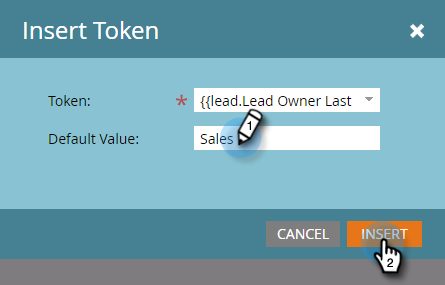

# Een e-mail aanpassen {#personalize-an-email}

## Opdracht: Je e-mailberichten persoonlijk maken door gegevenstokens toe te voegen {#mission-make-your-emails-personal-by-adding-data-tokens}

>[!PREREQUISITES]
>
>* [Instellen en een persoon toevoegen](/help/marketo/getting-started/quick-wins/get-set-up-and-add-a-person.md){target="_blank"}
>* [Een e-mailschok verzenden](/help/marketo/getting-started/quick-wins/send-an-email.md){target="_blank"}
>* [Drip, Drip, Nurture](/help/marketo/getting-started/quick-wins/drip-drip-nurture.md){target="_blank"}

## Stap 1: Selecteer een e-mailadres dat u wilt aanpassen {#step-select-an-email-to-personalize}

1. Selecteer een van de e-mails die u voor de verpleging hebt gemaakt in het dialoogvenster [vorige quick win](/help/marketo/getting-started/quick-wins/drip-drip-nurture.md){target="_blank"} en klik op **[!UICONTROL Create draft]**.

   

   >[!NOTE]
   >
   >Hiermee maakt u een kopie van de e-mail als concept. Vergeet niet het concept voor de wijzigingen goed te keuren om live te gaan.

Als u geen pop-upblokkering hebt ingeschakeld, wordt de e-maileditor geopend in een nieuw tabblad/venster. Anders klikt u op **[!UICONTROL Create Draft]** twee keer.

## Stap 2: De verkoper de afzender maken {#step-make-the-salesperson-the-sender}

1. Selecteer **[!UICONTROL From]** veld, markering en **delete** de huidige naam.

   

1. Klik op de knop **Token** pictogram rechts van **[!UICONTROL From]** veld.

   

1. Zoek en selecteer de **`{{lead.Lead Owner First Name}}`** token.

   

1. Typ uw bedrijfsnaam en een streepje voor de **Standaardwaarde** om ervoor te zorgen dat er iets wordt weergegeven als de voornaam van de verkoopvertegenwoordiger niet beschikbaar is. Klikken **Invoegen**.

   

1. De spatiebalk in het dialoogvenster **[!UICONTROL From]** , zorgt u ervoor dat de cursor één spatie knippert na het token dat u zojuist hebt ingevoegd. Klik vervolgens op de knop **Token** weer.

   

1. Zoek en selecteer de **`{{lead.Lead Owner Last Name}}`** token.

   

1. Typ &quot;Verkoop&quot; voor de **Standaardwaarde** en klik op **Invoegen**.

   

## Stap 3: De naam van de lead toevoegen aan het e-mailbericht {#step-add-the-leads-name-to-the-email}

1. Selecteer de bovenste bewerkbare sectie, klik op het tandwielpictogram en selecteer **[!UICONTROL Edit]**.

   

1. Voeg een spatie na &quot;Hello&quot;toe en plaats uw curseur voor de komma, dan klik **Token invoegen** pictogram.

   

1. Zoek en selecteer de **`{{lead.First Name}}`** token.

   

1. Voer &quot;Vriend&quot; (of elk gewenst label) in het dialoogvenster **[!UICONTROL Default Value]** veld en klik op **[!UICONTROL Insert]**.

   

   >[!TIP]
   >
   >Neem altijd een standaardwaarde voor tokens op. dit zorgt ervoor dat de standaardwaarde in de e-mail wordt weergegeven als een deel van de persoonlijke gegevens ontbreekt.

1. Klik op **[!UICONTROL Save]**.

   

1. Onder **[!UICONTROL Email Actions]** en selecteert u **[!UICONTROL Approve and Close]**.

   

>[!TIP]
>
>Wilt u snel vernieuwen hoe u uzelf de e-mail kunt sturen? Zie [Een e-mailschok verzenden](/help/marketo/getting-started/quick-wins/send-an-email.md){target="_blank"}.

### Opdracht voltooid {#mission-complete}

Gefeliciteerd, je e-mail is gepersonaliseerd!

  

[◄ Missie 6: Drip, Drip, Nurture](/help/marketo/getting-started/quick-wins/drip-drip-nurture.md)

[Missie 8: De verkoper waarschuwen ►](/help/marketo/getting-started/quick-wins/alert-the-sales-rep.md)
