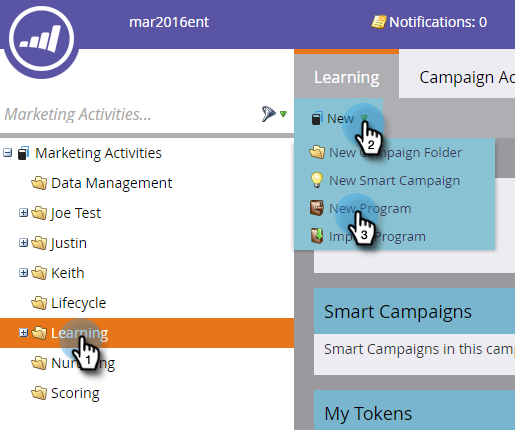
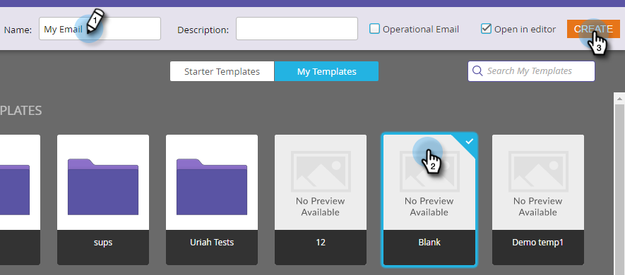

# E-mail verzenden {#send-an-email}

Het is het eerste wat iedereen wil doen. We sturen een e-mail vanuit Marketo!

>[!PREREQUISITES]
>
>[Instellen en een persoon toevoegen](/help/marketo/getting-started/quick-wins/get-set-up-and-add-a-person.md){target=&quot;_blank&quot;}

## Een e-mailprogramma maken {#create-an-email-program}

1. Ga naar de **Marketingactiviteiten** gebied.

   

1. Selecteer uw **Leren** map. Klik op de knop **Nieuw** vervolgkeuzelijst en selecteer **Nieuw programma**.

   

1. Voer een **Naam** en selecteert u **E-mail** for **Type programma.**

   >[!TIP]
   >
   >Voeg uw initialen aan het einde van de programmanaam toe om deze uniek te maken.

   

1. Onder **Kanaal**, selecteert u **E-mail verzenden** en klik op **Maken**.

   

## Uw publiek definiëren {#define-your-audience}

1. Klikken **Slimme lijst bewerken** onder de tegel Publiek.

   

1. Zoek en sleep het filter E-mailadres naar het canvas.

   

   >[!TIP]
   >
   >Gebruiken **Zoeken** boven aan de lijst met filters om het filter gemakkelijker te vinden.

1. Zoek en selecteer uw e-mailadres.

   

   >[!NOTE]
   >
   >Als je e-mailadres niet automatisch wordt ingevuld, ben je wellicht vergeten [Ophalen en een lead toevoegen.](/help/marketo/getting-started/quick-wins/get-set-up-and-add-a-person.md){target=&quot;_blank&quot;}

   >[!NOTE]
   >
   >In dit voorbeeld stuurt u de e-mail alleen naar uzelf, maar u kunt het publiek naar eigen inzicht aanpassen.

1. Ga terug naar het hoofdprogrammatabblad en klik op het pictogram Vernieuwen voor **Persoon**.

   

   Je moet zien dat het aantal personen oploopt tot 1. Dat ben je!

## Een e-mail maken {#create-an-email}

1. Klik onder de tegel E-mail op **Nieuwe e-mail**.

   

1. Voer een **Naam** selecteert u een **Sjabloon** en klik op **Maken**.

   

1. Het venster E-maileditor wordt geopend. Voer een onderwerp in van 50 tekens of minder (aanbevolen).

   

   >[!NOTE]
   >
   >Als u een pop-upblokkering hebt, klikt u op **Concept bewerken** om de e-maileditor in te voeren.

1. Selecteer het gebied dat u wilt bewerken, klik op het tandwielpictogram aan de rechterkant en selecteer **Bewerken** (U kunt ook dubbelklikken op de bewerkbare sectie die u wilt bewerken).

   

1. Voer de gewenste inhoud in en klik op **Opslaan**.

   

1. De wijzigingen worden automatisch opgeslagen. Sluit het editorlusje/venster.

   

1. Klik op de knop **E-mailhandelingen** vervolgkeuzelijst en selecteer **Goedkeuren**.

   

   >[!TIP]
   >
   >Wilt u uzelf een snel voorbeeld sturen om te zien hoe uw e-mail eruitziet voordat u de e-mail start? Selecteren **Voorbeeld verzenden** in het bovenstaande menu of klik op **E-mailhandelingen** dan [**Voorbeeld verzenden**](/help/marketo/product-docs/email-marketing/general/creating-an-email/send-a-sample-email.md){target=&quot;_blank&quot;}.

1. Selecteer het e-mailprogramma in de linkerstructuur.

   

1. Stel onder de titel Planning de startdag voor de e-mail in op **Vandaag.**

   

1. Selecteer een tijd die in de toekomst minstens 15 minuten is.

   

   >[!TIP]
   >
   >Is de standaardtijdzone niet van u? Leer hoe u [hier bijwerken](/help/marketo/product-docs/administration/settings/select-your-language-locale-and-time-zone.md){target=&quot;_blank&quot;}.

1. Klikken **Programma goedkeuren** onder de goedkeuringstegel en u bent klaar!

   

U ontvangt het e-mailbericht kort na de geplande dag/tijd.

## Opdracht voltooid! {#mission-complete}

  

[◄ Opzetten en een persoon toevoegen](/help/marketo/getting-started/quick-wins/get-set-up-and-add-a-person.md)

[Missie 2: De pagina met een formulier laten landen ►](/help/marketo/getting-started/quick-wins/landing-page-with-a-form.md)
