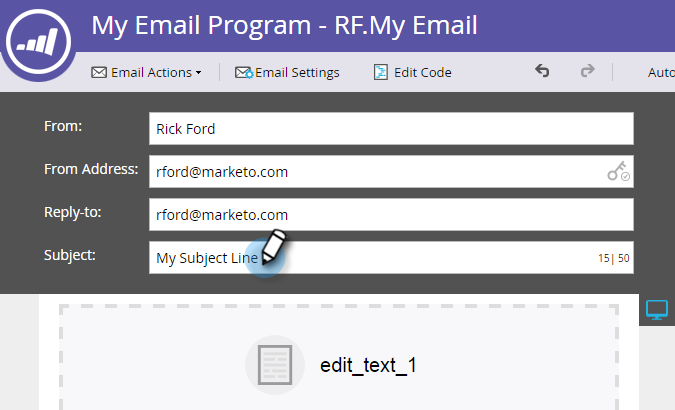

# E-mail verzenden {#send-an-email}

Het is het eerste wat iedereen wil doen. We sturen een e-mail vanuit Marketo!

>[!PREREQUISITES]
>
>[&#x200B; krijgt Opstelling en voegt een Persoon &#x200B;](/help/marketo/getting-started/quick-wins/get-set-up-and-add-a-person.md){target="_blank"} toe

## Een e-mailprogramma maken {#create-an-email-program}

1. Ga naar het **[!UICONTROL Marketing Activities]** -gebied.

   

1. Selecteer de map **[!UICONTROL Learning]** . Klik op de vervolgkeuzelijst **[!UICONTROL New]** en selecteer **[!UICONTROL New Program]** .

   

1. Voer een **[!UICONTROL Name]** in en selecteer **[!UICONTROL Email]** for **[!UICONTROL Program Type]** .

   >[!TIP]
   >
   >Voeg uw initialen aan het einde van de programmanaam toe om deze uniek te maken.

   

1. Selecteer **[!UICONTROL Channel]** onder **[!UICONTROL Email Send]** en klik op **[!UICONTROL Create]** .

   

## Uw publiek definiëren {#define-your-audience}

1. Klik op **[!UICONTROL Edit Smart List]** onder de [!UICONTROL Audience] -tegel.

   

1. Zoek en sleep het filter [!UICONTROL Email Address] naar het canvas.

   

   >[!TIP]
   >
   >Gebruik de functie **[!UICONTROL Search]** om filters gemakkelijker te vinden.

1. Zoek en selecteer uw e-mailadres.

   

   >[!NOTE]
   >
   >Als uw e-mail niet auto-bevolkt is, kunt u aan [&#x200B; opstelling zijn vergeten en een Lood toevoegen.](/help/marketo/getting-started/quick-wins/get-set-up-and-add-a-person.md){target="_blank"}

   >[!NOTE]
   >
   >In dit voorbeeld stuurt u de e-mail alleen naar uzelf, maar u kunt het publiek naar eigen inzicht aanpassen.

1. Ga terug naar het hoofdprogrammatabblad en klik op het pictogram Vernieuwen voor **[!UICONTROL Person]** .

   

   Je moet zien dat het aantal personen oploopt tot 1. Dat ben je!

## Een e-mail maken {#create-an-email}

1. Klik onder de tegel E-mail op **[!UICONTROL New Email]** .

   

1. Ga a **[!UICONTROL Name]** in, selecteer a **Malplaatje**, en klik **[!UICONTROL Create]**.

   

1. Het venster E-maileditor wordt geopend. Voer een onderwerp in van 50 tekens of minder (aanbevolen).

   

   >[!NOTE]
   >
   >Als u een pop-upblokkering hebt, klikt u op **[!UICONTROL Edit Draft]** om de e-maileditor in te voeren.

1. Selecteer het gebied dat u wilt bewerken, klik op het tandwielpictogram aan de rechterkant en selecteer **[!UICONTROL Edit]** (u kunt ook dubbelklikken op de bewerkbare sectie die u wilt bewerken).

   

1. Voer de gewenste inhoud in en klik op **[!UICONTROL Save]** .

   

1. Klik op de vervolgkeuzelijst **[!UICONTROL Email Actions]** en selecteer **[!UICONTROL Approve and Close]** .

   

   >[!TIP]
   >
   >Wilt u uzelf een snel voorbeeld sturen om te zien hoe uw e-mail eruitziet voordat u de e-mail start? Selecteer **[!UICONTROL Send Sample]** in het bovenstaande menu of klik op **[!UICONTROL Email Actions]** then [**[!UICONTROL Send Sample]**](/help/marketo/product-docs/email-marketing/general/creating-an-email/send-a-sample-email.md){target="_blank"} .

1. Selecteer het e-mailprogramma in de linkerstructuur.

   

1. Stel onder de tegel [!UICONTROL Schedule] de startdag voor de e-mail in op **[!UICONTROL Today]** .

   

   >[!NOTE]
   >
   >Leer meer over [&#x200B; Ontvankelijke Streek van de Tijd &#x200B;](/help/marketo/product-docs/email-marketing/email-programs/email-program-actions/scheduling-with-recipient-time-zone/schedule-email-programs-with-recipient-time-zone.md){target="_blank"} en [&#x200B; Begin van het Kop &#x200B;](/help/marketo/product-docs/email-marketing/email-programs/email-program-actions/head-start-for-email-programs.md){target="_blank"}.

1. Selecteer een tijd die in de toekomst minstens 15 minuten is.

   

   >[!TIP]
   >
   >Is de standaardtijdzone niet van u? Leer hoe te [&#x200B; het hier &#x200B;](/help/marketo/product-docs/administration/settings/select-your-language-locale-and-time-zone.md){target="_blank"} bijwerken.

1. Klik op **[!UICONTROL Approve Program]** onder de [!UICONTROL Approval] -tegel en u bent klaar!

   

U ontvangt het e-mailbericht kort na de geplande dag/tijd.

## Opdracht voltooid! {#mission-complete}

  

[◄ Instellen en een persoon toevoegen](/help/marketo/getting-started/quick-wins/get-set-up-and-add-a-person.md)

[Mission 2: Landing Page with a Form ►](/help/marketo/getting-started/quick-wins/landing-page-with-a-form.md)
