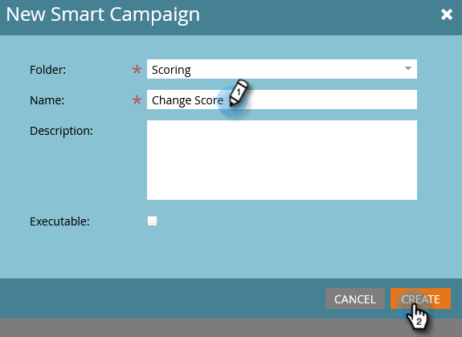
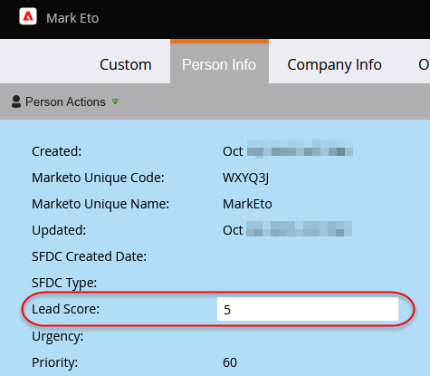

# Eenvoudige scores {#simple-scoring}

>[!PREREQUISITES]
>
>* [ krijgt Opstelling en voegt een Persoon ](/help/marketo/getting-started/quick-wins/get-set-up-and-add-a-person.md){target="_blank"} toe
>* [ het Bestaan Pagina met een Vorm ](/help/marketo/getting-started/quick-wins/landing-page-with-a-form.md){target="_blank"}

## Stap 1: Een scoringcampagne maken {#step-create-a-scoring-campaign}

1. Ga naar het **[!UICONTROL Marketing Activities]** -gebied.

   

1. Klik met de rechtermuisknop op de **leermap** en klik op **[!UICONTROL New Campaign Folder]** .

   

1. Geef de campagnemap een naam &quot;Scoring&quot; en klik op **[!UICONTROL Create]** .

   

   >[!NOTE]
   >
   >Als u al een map met scores hebt, geeft u deze een andere naam, bijvoorbeeld Scoring 1. Mapnamen moeten uniek zijn.

1. Klik met de rechtermuisknop op de **Scorende** map en selecteer **[!UICONTROL New Smart Campaign]** .

   

1. Geef de campagne de naam &#39;Score wijzigen&#39; en klik op **[!UICONTROL Create]** .

   

1. Klik op de tab **[!UICONTROL Smart List]** .

   

   Wij willen deze campagne om lopen wanneer een persoon uw **Vorm van het Verzoek van de Proces** invult.

1. Zoek en sleep de trigger **[!UICONTROL Fills Out Form]** naar het linkercanvas.

   

1. Selecteer **Mijn Vorm**.

   

   >[!NOTE]
   >
   >Als u de [ het Bestaan Pagina met een Vorm ](/help/marketo/getting-started/quick-wins/landing-page-with-a-form.md){target="_blank"} snel win voltooide, zou u de vorm moeten hebben. Als u een andere naam hebt gebruikt voor het formulier, selecteert u die naam.

1. Klik op de tab **[!UICONTROL Flow]** .

   

1. Sleep de **[!UICONTROL Change Score]** flowactie naar het linkercanvas.

   

1. U kunt elke waarde typen die u aan de persoonlijke score wilt toevoegen. Voer &quot;+5&quot; in het veld **[!UICONTROL Change]** in.

   

   >[!TIP]
   >
   >Goede scoringcampagnes zijn essentieel om mensen van hoge kwaliteit aan de Verkoop te leveren. Lees [**de Definitieve Gids aan het Toren van het Lood** ](https://www.marketo.com/definitive-guides/lead-scoring/){target="_blank"}.

1. Klik op de tab **[!UICONTROL Schedule]** en de knop **[!UICONTROL Activate]** .

   

1. Klik op **[!UICONTROL Activate]** op het bevestigingsscherm.

   

>[!NOTE]
>
>Zodra deze campagne actief is, wordt deze uitgevoerd telkens wanneer een persoon het formulier invult. De campagne blijft actief tot ze gedeactiveerd is.

## Stap 2: Vul het formulier in {#step-fill-out-the-form}

1. Selecteer de het landen pagina u in de [ Landing Pagina met een Vorm ](/help/marketo/getting-started/quick-wins/landing-page-with-a-form.md){target="_blank"} snel wint creeerde.

   

1. Klik op **[!UICONTROL Preview]**. De landingspagina wordt geopend op een nieuw tabblad.

   

1. Vul het formulier in met uw voornaam, achternaam en e-mailadres en klik vervolgens op **[!UICONTROL Submit]** .

   

   >[!NOTE]
   >
   >Gebruik dezelfde naam en hetzelfde e-mailadres als u hebt gebruikt toen u zichzelf voor het eerst als persoon hebt ingevoerd om de score + 5 toe te passen.

## Stap 3: De persoonlijke informatie weergeven {#step-view-the-person-info}

1. Ga naar het **[!UICONTROL Database]** -gebied.

   

1. Zoeken naar het e-mailadres dat u hebt gebruikt bij het invullen van het formulier.

   

1. Dubbelklik op uw persoon.

   

De gegevens van uw persoon worden geopend in een nieuw tabblad of venster. Zie hoe uw score met 5 punten is verhoogd om het formulier in te vullen?

## Opdracht voltooid! {#mission-complete}

  

[◄ Opdracht 2: Aanvoerpagina met formulier](/help/marketo/getting-started/quick-wins/landing-page-with-a-form.md)

[Mission 4: Auto-Response via e-mail ►](/help/marketo/getting-started/quick-wins/email-auto-response.md)
