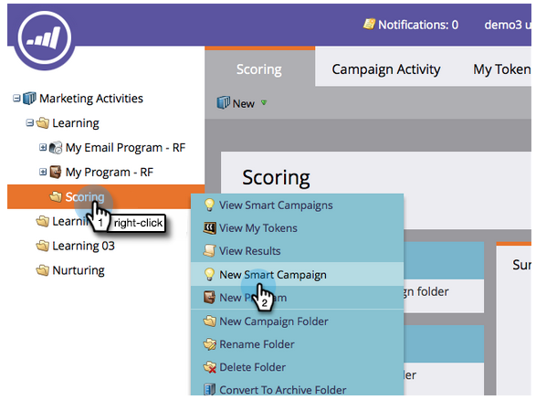

# Eenvoudige scores {#simple-scoring}

>[!PREREQUISITES]
>
>* [Instellen en een persoon toevoegen](get-set-up-and-add-a-person.md)
>* [Openingspagina met formulier](landing-page-with-a-form.md)

## Stap 1: Een scoringcampagne maken {#step-create-a-scoring-campaign}

1. Ga naar **Marketing Activities** gebied.

   

1. Klik met de rechtermuisknop op de map **Learning** en klik op **Nieuwe campagnemap**.

   

1. Geef de map &#39;Scoring&#39; voor de campagne een naam.

   

   >[!NOTE]
   >
   >Als u al een map met scores hebt, geeft u deze een andere naam, bijvoorbeeld Scoring 1. Mapnamen moeten uniek zijn.

1. Klik vervolgens met de rechtermuisknop op de nieuwe **Scoring**-map en selecteer **Nieuwe slimme campagne**.

   

1. **Geef** de campagne de naam &#39;Score wijzigen&#39; en klik op  **Maken**.

   

1. Klik op het tabblad **Slimme lijst**.

   

   We willen dat deze campagne wordt uitgevoerd wanneer een persoon uw **Proefaanvraagformulier** invult.

1. Zoek en sleep de trigger **Formulier invullen** naar het linkercanvas.

   

1. Selecteer **Mijn formulier**.

   >[!NOTE]
   >
   >Als u de [Landing Page met een Vorm](/help/marketo/getting-started/quick-wins/landing-page-with-a-form.md) snel hebt voltooid zou u de vorm moeten hebben. Als u een andere naam hebt gebruikt voor het formulier, selecteert u die naam.

   

1. Klik op het tabblad **Stroom**.

   

1. Sleep de stroomactie **Score** naar het linkercanvas.

   

1. U kunt elke waarde typen die u aan de persoonlijke score wilt toevoegen. Voer &quot;+5&quot; in het veld **Wijzigen** in.

   

   >[!TIP]
   >
   >Goede scoringcampagnes zijn essentieel om mensen van hoge kwaliteit aan de Verkoop te leveren. Lees [**De Definitieve Gids aan het Schorsen van de Lood**](https://www.marketo.com/definitive-guides/lead-scoring/).

1. Klik op de tab **Schema** en de knop **Activeren**.

   

1. Klik **Activeer** op het bevestigingsscherm.

   

>[!NOTE]
>
>Zodra deze campagne actief is, wordt deze uitgevoerd telkens wanneer een persoon het formulier invult. De campagne blijft actief tot ze gedeactiveerd is.

## Stap 2: Formulier {#step-fill-out-the-form} invullen

1. Selecteer de bestemmingspagina u in [Landing Pagina met een Vorm ](/help/marketo/getting-started/quick-wins/landing-page-with-a-form.md) snel win creeerde.

   

1. Klik **Goedgekeurde pagina weergeven**. De landingspagina wordt geopend op een nieuw tabblad.

   

1. Vul het formulier in met uw voornaam, achternaam en e-mailadres en klik vervolgens op **Verzenden**.

   

   >[!NOTE]
   >
   >Gebruik dezelfde naam en hetzelfde e-mailadres als u hebt gebruikt toen u zichzelf voor het eerst als persoon hebt ingevoerd om de score + 5 toe te passen.

## Stap 3: De persoonlijke info weergeven {#step-view-the-person-info}

1. Ga naar het gebied Database.

   

1. Zoeken naar het e-mailadres dat u hebt gebruikt bij het invullen van het formulier.

   

1. Dubbelklik op uw persoon.

   

De gegevens van uw persoon worden geopend in een nieuw tabblad of venster. Zie hoe uw score met 5 punten is verhoogd om het formulier in te vullen?!

**Gefeliciteerd.** Je hebt een scoring campagne gemaakt.
[◄ Missie 2: Openingspagina met formulier](/help/marketo/getting-started/quick-wins/landing-page-with-a-form.md)

[Missie 4: Automatische e-mailrespons ►](/help/marketo/getting-started/quick-wins/email-auto-response.md)
