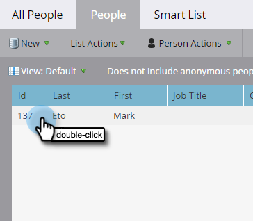
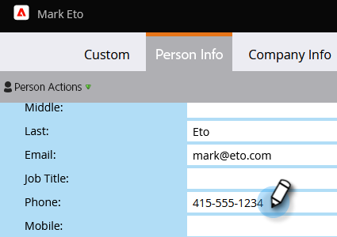

# Persoonsgegevens bijwerken {#update-person-data}

## Opdracht: contactgegevens of andere gegevens van een persoon bijwerken {#mission-update-a-persons-contact-info-or-other-data}

>[!PREREQUISITES]
>
>* [ krijgt Opstelling en voegt een Persoon ](/help/marketo/getting-started/quick-wins/get-set-up-and-add-a-person.md){target="_blank"} toe
>* [ de Invoer een Lijst van Mensen ](/help/marketo/getting-started/quick-wins/import-a-list-of-people.md){target="_blank"}

Stel je voor dat een persoon je in je recente winkel aanvullende contactgegevens gaf. Hier is hoe te om persoongegevens bij te werken.

## Zoek de persoon die u wilt bijwerken {#find-the-person-you-need-to-update}

1. Ga naar de [!UICONTROL Database] .

   

1. Zoek de naam of het e-mailadres van de persoon.

   >[!TIP]
   >
   >Als u het e-mailadres gebruikt om te zoeken, wordt de zoekopdracht sneller uitgevoerd.

   

1. Dubbelklik om de persoondetails te openen.

   

   >[!TIP]
   >
   >Er zijn veel manieren om persoongegevens bij te werken in Marketo. Zie [ een Lijst van Mensen ](/help/marketo/getting-started/quick-wins/import-a-list-of-people.md){target="_blank"} invoeren en [ de Waarde van Gegevens van de Verandering ](/help/marketo/product-docs/core-marketo-concepts/smart-campaigns/flow-actions/change-data-value.md){target="_blank"}.

## De persoonlijke gegevens bijwerken {#update-the-person-data}

1. Typ de nieuwe informatie die u hebt ontvangen en sluit het tabblad.

>[!CAUTION]
>
>* Zorg ervoor dat e-mailadressen alleen ASCII-tekens bevatten.
>
>* Marketo steunt **niet** e-mailadressen die emojis bevatten.

>[!NOTE]
>
>Als u de gegevens hebt gewijzigd, worden de nieuwe gegevens direct herkend in slimme lijsten en slimme campagnes.

## Opdracht voltooid {#mission-complete}

Mooi werk! Je hebt je persoonlijke gegevens bijgewerkt.

  

[◄ Opdracht 8: Waarschuwing voor verkoper](/help/marketo/getting-started/quick-wins/alert-the-sales-rep.md)

[Mission 10: Redirect a Landing Page ► (Engelstalig)](/help/marketo/getting-started/quick-wins/redirect-a-landing-page.md)
