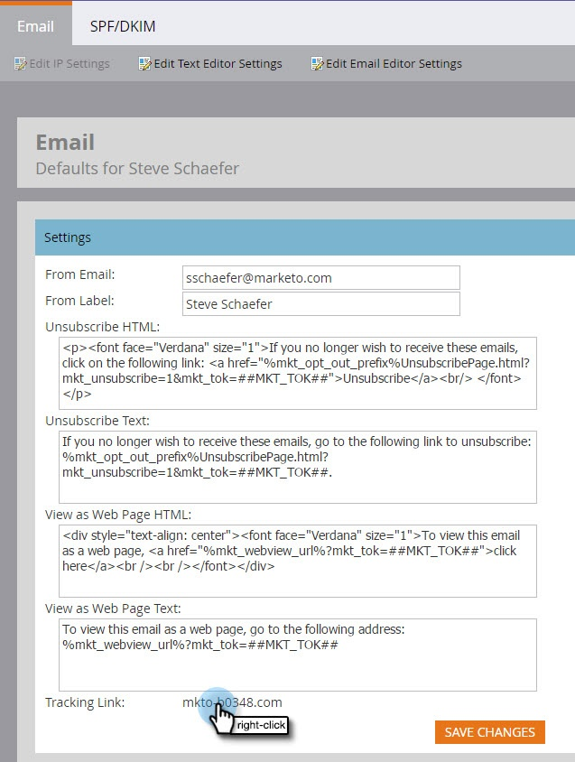

# Stappen instellen {#setup-steps}

**Welkom bij Marketo!**
Voordat u naar Marketo gaat, moet u een aantal stappen uitvoeren.

>[!NOTE]
>
>**FYI**
>
>Marketo is nu bezig met het standaardiseren van de taal voor alle abonnementen, dus u ziet mogelijk leads/leads in uw abonnement en personen/personen in docs.marketo.com. Deze termen betekenen hetzelfde. het heeft geen invloed op de instructies van het artikel . Er zijn nog enkele andere veranderingen. [Meer](http://docs.marketo.com/display/DOCS/Updates+to+Marketo+Terminology)informatie.

Deze stappen omvatten:

* enige basisinstelling voor account
* het brandmerken van uw bestemmingspagina URLs en e-mailverbindingen om vertrouwen en leverbaarheid te verbeteren
* uw CRM synchroniseren
* trackingcode toevoegen aan uw bedrijfswebsite

>[!NOTE]
>
>U hoeft deze stappen alleen uit te voeren als uw bedrijf **nieuw is voor Marketo**. Als dat niet het geval is, is de installatie mogelijk al uitgevoerd.

Sommige stappen vereisen hulp van uw groep van IT.

>[!TIP]
>
>Als u deze checklist  afdrukt, kunt u de punten controleren aangezien u hen voltooit.

1. Aanmelden en extra markeringsgebruikers maken
1. Meld u [hier](https://app.marketo.com/) aan bij Marketo met de gegevens die u per e-mail hebt ontvangen.

   
Gefeliciteerd! U bevindt zich nu in Marketo en kunt beginnen te verkennen. U zou uw collega&#39;s op het marketing team kunnen willen uitnodigen om zich bij u aan te sluiten. U kunt dit doen door nieuwe gebruikers toe te voegen.

   Ga naar het gebied Beheer.

   >[!TIP]
   >
   >Terwijl u hier bent, kunt u op **Mijn account** klikken om uw account- en locatie-instellingen te wijzigen en een nieuwe abonnementsnaam instellen.

   

   >[!NOTE]
   >
   >**Beheerdersmachtigingen vereist**

   Klik op Gebruikers en rollen.

   

   Klik op Nieuwe gebruiker uitnodigen.

   

   Vul het e-mailadres, de voornaam en de achternaam van uw collega in.

   

   U kunt ook een reden voor de uitnodiging en een datum voor het verlopen van de toegang invoeren met de kalenderkiezer. Klik op OK.

   

   Klik op Volgende.

   

   >[!TIP]
   >
   >Een vervaldatum is ideaal voor externe belanghebbenden of consultants voor de korte termijn die Marketo slechts voor een korte tijd nodig hebben.

   >[!NOTE]
   >
   >Wanneer de vervaldatum aankomt, ontvangt de gebruiker een vervalmelding en is de account vergrendeld.

   Selecteer een rol en klik op Volgende. Standaardgebruikers hebben toegang tot alle gebieden behalve Admin.

   

   >[!NOTE]
   >
   >Naast de vijf ingebouwde rollen, kunt u douanerollen ook tot stand brengen. Meer informatie over het [beheren van Gebruikersrollen en -machtigingen](../product-docs/administration/users-and-roles/managing-user-roles-and-permissions.md).

   Voel u vrij om de uitnodigingstekst aan te passen. Klik op Verzenden.

   

   De nieuwe gebruiker wordt nu vermeld op het tabblad Gebruikers en ontvangt een e-mail met een koppeling om een wachtwoord en aanmelding te maken. Volgende stap!   

1. Stel uw geautoriseerde ondersteuningscontactpersonen in

   Mogelijk hebt u een e-mail van Marketo Support ontvangen waarin staat dat u de beheerder van de klantenondersteuning van Marketo voor uw bedrijf bent. Als zo, kunt u opstelling **erkende steuncontacten** voor uw team. Alleen geautoriseerde supportcontactpersonen kunnen rechtstreeks via het portal Marketo Support contact opnemen met de klantenondersteuning van Marketo.

   >[!NOTE]
   >
   >Het aantal ondersteuningscontacten dat u kunt maken, wordt bepaald door het pakket dat u hebt aangeschaft. Deze limiet wordt opgegeven in uw e-mail van Marketo Support.

   Contactdocumenten voor geautoriseerde ondersteuning zijn verplaatst naar de Marketo-community. Zie [dit artikel](http://nation.marketo.com/t5/Knowledgebase/Managing-Authorized-Support-Contacts/ta-p/254341).

   >[!NOTE]
   >
   >Alleen personen die zich hebben aangemeld bij de Marketo-gemeenschap, worden in de lijst weergegeven. Als u de persoon niet kunt vinden, zorg ervoor zij login aan de Gemeenschap eerst.

1. De URL&#39;s van uw bestemmingspagina aanpassen met een CNAME

   >[!NOTE]
   >
   >Bent u een klant van het Pak van de Lancering? U kunt deze stap overslaan. Uw consultant zal u een document met instructies voor de IT-installatie geven tijdens uw gesprek.

   >[!NOTE]
   >
   >**Beheerdersmachtigingen vereist**

   Kies een NAAM voor de bestemmingspagina&#39;s. Enkele voorbeelden:

   * **ga**.[CompanyDomain].com
   * **www2**.[CompanyDomain].com
   * **lp**.[CompanyDomain].com

   >[!TIP]
   >
   >Houd het kort! Kortere URL&#39;s zijn gemakkelijker te onthouden. We stellen voor om &quot;te gaan&quot; als domein.

   Het eerste deel (vet weergegeven) is de [LandingPageCNAME]. U hebt het nodig in Stap 5.
Ga naar het beheergebied als u de accounttekenreeks wilt ophalen die u vervangt door de CNAME-landingspagina.

   

   Klik op Pagina&#39;s landen.

   

   Kopieer de tekenreeks Account uit de instellingen van de openingspagina.

   

   Dit is [AccountString]. Sla het bestand op. U zult het aan IT in Stap 5 moeten geven.

Vorm uw domeinmontages zodat gebruiken de het landen pagina&#39;s het domein van uw bedrijf in plaats van Marketo (waar zij worden ontvangen).

1. E-maillevering garanderen

   >[!NOTE]
   >
   >Bent u een klant van het Pak van de Lancering? U kunt deze stap overslaan. Uw consultant zal u een document met instructies voor de IT-installatie geven tijdens uw gesprek.

   Er zijn verschillende maatregelen die u kunt nemen om ervoor te zorgen dat de e-mails zoveel mogelijk van uw mensen bereiken.

   1. **Geef de koppelingen** voor reeksspatiëring weer. U kunt een CNAME kiezen om uw eigen domein (in plaats van Marketo&#39;s) te gebruiken in de koppelingen die u in e-mails van Marketo opneemt. Dit versterkt uw domeinbranding en verhoogt vertrouwen en leverbaarheid met uw ontvangers.
   1. **Voeg Marketo toe aan uw bedrijfs-e-maillijst van gewenste personen.** Het is gebruikelijk om teste-mails naar uw testaccounts te sturen voordat u e-mails naar de werkelijke gebruikers stuurt. Als u Marketo toe_voegt op lijst van gewenste personen, kunt u voorkomen dat deze teste-mails worden geblokkeerd of gemarkeerd als spam.
   1. **Stel SPF en DKIM in.** Deze technologieën verzekeren uw ontvangers dat uw Marketo e-mails geen spam zijn. Om te helpen voorkomen dat spamfilters van ontvangers u Marketo-e-mails afwijzen, voert u de volgende stappen uit om een SPF en DKIM voor uw e-maillevering [in te](../product-docs/email-marketing/deliverability/set-up-spf-and-dkim-for-your-email-deliverability.md)stellen.

   1. **Stel een MX-record in voor uw domein.** Met een MX-record kunt u e-mail ontvangen naar het domein waarvan u e-mail verzendt om reacties en auto-responders te verwerken. Als u vanuit uw bedrijfsdomein verzendt, is dit waarschijnlijk al geconfigureerd. Als niet, kunt u opstelling gewoonlijk aan kaart aan het MX verslag van uw collectief domein.
   1. **Aanbevolen instellingen voor Van adres.** U moet een geldig, bestaand en werkend e-maildomein in Van Adres in alle e-mailcampagnes gebruiken. Het kan nuttig zijn om subdomain van uw collectief domein eerder dan het verzenden van uw collectief domein te vormen. Dit zal ervoor zorgen de kwesties van uw collectieve brievenstroom niet uw Marketo mailstream en vice versa beïnvloeden. Bovendien zal het verzenden van post van [`[email protected]`](http://docs.marketo.com/cdn-cgi/l/email-protection#e99a86848c9d8180878ea98786878c91809a9d8c879d8d8684888087c78a8684) zullen e-mail om worden gefiltreerd of worden geblokkeerd. Elk domein dat wordt gebruikt in het Van-adres van de afzender, moet een geldig en werkend [[e-mailbeveiligd]](http://docs.marketo.com/cdn-cgi/l/email-protection) en [[e-mailbeveiligd]](http://docs.marketo.com/cdn-cgi/l/email-protection) account hebben.\
      Als u Google Apps gebruikt om uw bedrijfs-e-mail te hosten, kunt u [[e-mailbeveiligde]](http://docs.marketo.com/cdn-cgi/l/email-protection) of [[e-mailbeveiligde]](http://docs.marketo.com/cdn-cgi/l/email-protection) e-mails niet onder uw domein maken. Om dit probleem te verhelpen, moet u groepen maken met de naam &quot;misbruik&quot; en &quot;postmeester&quot;. Gebruikers die lid zijn van deze groepen ontvangen e-mails die naar die adressen worden verzonden (d.w.z. [postmail `[email protected]`](http://docs.marketo.com/cdn-cgi/l/email-protection#88f8e7fbfce5e9fbfcedfac8ece7e5e9e1e6a6ebe7e5)). U vindt [hier](https://support.google.com/a/answer/33343#adminconsole)gedetailleerde instructies voor het maken van groepen.

   Kies een NAAM voor koppelingen voor het bijhouden van e-mail. (Kies een naam die *anders* is dan de CNAME van de bestemmingspagina die u hebt gekozen in stap 3.) Enkele voorbeelden:

   * go2.[CompanyDomain].com
   * em.[CompanyDomain].com
   * wow.[CompanyDomain].com

   Het eerste deel is de e-mailtracking CNAME, [EmailTrackingCNAME]. U zult het aan IT in Stap 5 moeten geven.

   >[!CAUTION]
   >
   >De NAAM van de e-mail- en bestemmingspagina moet anders zijn. Vermijd ook CNAME&#39;s zoals &#39;track&#39; of &#39;link&#39;. Het wordt vaak gemarkeerd als spam

   Ga naar het beheergebied als u de koppeling Marketo bijhouden wilt zoeken.

   

   Klik op E-mail.

   

   Kopieer de koppeling Tracking uit uw e-mailinstellingen.

   De koppeling voor het bijhouden van gegevens heeft de volgende vorm: mkto-[a-z][4 digits].com

   

   Dit is uw [MktoTrackingLink]. Sla het bestand op. U zult het aan IT in Stap 5 moeten geven.

   Verzamel &#39;Van&#39; domeinen. Maak een lijst van alle &quot;Van&quot;domeinen (zoals in, [Afzender]@[VanDomein].com) die u voor het verzenden van e-mails van Marketo van plan bent te gebruiken. Voor de meesten is er slechts één.

   Bijvoorbeeld &#39;marketo.com,&#39; &#39;info.marketo.com,&#39;. Dit zijn [FromDomain1],[FromDomain2], enz. Sla ze op. U zult hen aan IT in Stap 5 moeten geven.

   U hebt nu alle informatie die u nodig hebt om uw verzoek naar IT te verzenden.

1. IT vragen om protocollen te configureren

   >[!NOTE]
   >
   >Bent u een klant van het Pak van de Lancering? U kunt deze stap overslaan. Uw consultant zal u een document met instructies voor de IT-installatie geven tijdens uw gesprek.

   Zodra u alle benodigde informatie hebt verzameld, kunt u een aanvraag naar de IT-afdeling sturen. U kunt de onderstaande tekst als een sjabloon gebruiken en de vetgedrukte tekst vervangen door uw eigen gegevens.

   [Neem een koppeling naar dit artikel](setup-steps/configure-protocols-for-marketo.md)op.

   Plak deze tekst in het e-mailbericht en vervang de gebrande plaatsaanduidingen:

   >[!NOTE]
   >
   >Zie Stap 3 en 4 hierboven om de tekst te bepalen die de plaatsaanduidingen moet vervangen. Vergeet niet dat [LandingPageCNAME] en [EmailTrackingCNAME] anders moeten zijn.

   Geachte Awesome IT Administrator,

   Ons marketingteam gebruikt nu het Marketo-platform om met onze mensen te communiceren. Voor een goede e-mailleverbaarheid moeten we de volgende wijzigingen aanbrengen:

   `1)` Voor onze landingspagina&#39;s, voeg een DNS Ingang (CNAME) voor **[LandingPageCNAME]** toe.**[CompanyDomain]**.com, wijzend naar **[AccountString]**.mktoweb.com.

   `2)` Voor onze het volgen verbindingen in e-mail, voeg een DNS Ingang (CNAME) voor **[EmailTrackingCNAME]** toe.**[CompanyDomain]**.com, wijzend naar **[MktoTrackingLink]**.

   `3)` Lijst van gewenste personen Marketo.

   * Als wij IP adressen in onze E-mailLijst van gewenste personen gebruiken, voeg hieronder vermelde IPs toe:\
      199.15.212.0/22

      192.28.144.0/20

      192.28.160.0/19

      185.28.196.0/22

      130.248.172.0/24

      130.248.173.0/24

      103.237.104.0/22

      94.236.119.0/26
   OPMERKING: Bereik uit aan de Steun van de Marketo als u een verkorte lijst van IPs aan lijst van gewenste personen specifiek voor uw milieu wilt.

   * Als ons anti-anti-spamsysteem van domeinen gebruikt, voeg deze toe:

   **`[FromDomain1]`**
   **`[FromDomain2]`**

   `4)` We moeten SPF en DKIM instellen, zodat Marketo namens ons ondertekende e-mailberichten kan verzenden.

   `a.` Om SPF op te zetten, te voegen gelieve de volgende lijn aan onze DNS ingangen toe:

   IN TXT **[vanaf domein]**:  v=spf1 mx ip4:**[Bedrijfs IP(s)]*******include: mktomail.com ~all

   Als wij reeds een bestaand SPF- verslag in onze DNS ingang hebben, voeg eenvoudig het volgende aan het toe:

   include:mktomail.com

   `[`Vervang **Van domein** door uw E-mail Van Domein (bijvoorbeeld: bedrijf.com) en **CorpIP** met het IP adres van uw collectieve e-mailserver (bv.: 255.255.255.255).  Als u e-mail van veelvoudige domeinen door Marketo zult verzenden, zou u uw personeel van IT deze lijn voor elk domein (op één lijn) moeten hebben toevoegen.`]`

   `b.` Voor DKIM, gelieve DNS de Verslagen van het Middel voor elk domein te creëren wij zouden willen opstelling. Hieronder zijn de Verslagen van de Gastheer en de Waarden TXT voor elk domein wij zullen ondertekenen voor:

   **`[DKIMDomain1]`**: Hostrecord is **`[HostRecord1]`** en de TXT-waarde is **[TXTValue1]**.

   **`[DKIMDomain2]`**: Hostrecord is **`[HostRecord2]`** en de TXT-waarde is **`[TXTValue2]`**.

   `[`Kopieer de **HostRecord** en de **TXTVvalue** voor elk **DKIMDomain** u opstelling na het volgen van de [instructies hier](../product-docs/email-marketing/deliverability/set-up-a-custom-dkim-signature.md)hebt. Vergeet niet elk domein te verifiëren in **Beheer > E-mail > DKIM** nadat uw IT-personeel deze stap heeft voltooid.`]`

   `5)` We moeten ervoor zorgen dat er een geldige MX-record is voor onze FROM-domeinen **[FromDomain1]**, **[FromDomain2]**, enzovoort. Kunt u bevestigen? Als niet, gelieve te vormen om aan ons collectief domein MX verslag in kaart te brengen. Zo kunnen we antwoorden/autoresponders op onze Marketo-mailings verwerken.

   Laat me weten wanneer u deze stappen hebt voltooid, zodat ik het opstellingsproces met Marketo kan voltooien.

   Bedankt! Je bent de beste!

   Liefde

   **`[Your Name]`**

   Stuur de e-mail naar de IT-afdeling. We begrijpen dat het enige tijd kan duren voordat IT deze taken kan uitvoeren. U kunt aan Stap 7 verdergaan, maar herinner dat u Stap 6 moet terugkeren om uw opstelling van het Marketo te voltooien.

1. Voltooi uw Marketo-instelling nadat de IT-afdeling is voltooid

   Nadat de IT-afdeling hun taken heeft voltooid, voert u de volgende stappen uit om uw bestemmingspagina en e-mailCNAME&#39;s toe te voegen en om DKIM-ondertekening te activeren.

   Ga naar het gebied Admin om de NAAM van uw landingspagina toe te voegen

   

   Selecteer Openingspagina&#39;s en klik op Bewerken in het gedeelte Instellingen.

   

   Voer uw nieuwe domeinnaam in in het veld Domeinnaam voor bestemmingspagina&#39;s. Dit moet de volgende vorm hebben:

   [LandingPageCNAME].[CompanyDomain].com

   

   Voer in het veld Pagina voor alternatieven de URL in waarnaar mensen moeten gaan als er geen bestemmingspagina beschikbaar is. U kunt de homepage van uw bedrijf gebruiken als u geen reservepagina hebt. Voer in het veld Homepage de website van uw bedrijf in.

   

   Selecteer in het gebied Beheer de optie E-mail om uw e-mailNAAM toe te voegen

   

   Blader omlaag en klik op Bewerken.

   

   Voer in het veld Domein uw domein voor het bijhouden van e-mail in. Dit moet de volgende vorm hebben:

   [EmailTrackingCNAME].[CompanyDomain].com. Klik op **Opslaan**.

   

1. Een URL verzenden voor bestemmingspagina en e-mailsjablonen

   Onze creatieve ontwerpers kunnen u aangepaste sjablonen voor e-mail- en landingspagina&#39;s bieden waarmee u uw marketingprogramma&#39;s snel en eenvoudig kunt starten. U moet hen van wat informatie voorzien zodat zij de malplaatjes aan uw bedrijfwebsite en embleem kunnen aanpassen.

   >[!NOTE]
   >
   >Deze aangepaste sjablonen zijn alleen beschikbaar voor klanten van Launch Pack.

   Ga naar het formulier [Marketo Template Design and Build](http://pages2.marketo.com/CESubmit-URL-ForTemplates.html) . Vul uw bedrijfsgegevens in.

   

   Voer voor de URL van uw bestemmingspagina een voorbeeld-URL in op de website van uw bedrijf met de kleuren, het logo en de stijl van uw bedrijf. De meeste klanten gebruiken een pagina van het Contact van ons die een vorm omvat.

   

   Voer bij CNAME de CNAME van de bestemmingspagina in die u hebt geselecteerd in Stap 3 ([LandingPageCNAME]). Verzend uw aanvraag.

   

   >[!NOTE]
   >
   >Uw malplaatjes kunnen niet worden voltooid tot uw IT tot een DNS verslag voor uw het landen pagina CNAME leidt.

   Dat is het! U zou uw nieuwe malplaatjes in de Studio van het Ontwerp van de Marketo binnen 3-5 werkdagen moeten zien.

1. Uw CRM integreren

   Dit is waarschijnlijk de meest opwindende stap van uw opstelling - het is tijd om Marketo met al die lood en contacten te vullen u in uw CRM hebt opgeslagen!

   Kies uit het volgende, afhankelijk van CRM uw bedrijf gebruikt.

   * [Marketo integreren met Salesforce.com](http://docs.marketo.com/display/docs/salesforce+sync)
   * [Marketo integreren met Microsoft Dynamics](http://docs.marketo.com/pages/viewpage.action?pageid=6094951)

   >[!NOTE]
   >
   >U hebt de hulp van de beheerder van CRM van uw bedrijf nodig om deze stappen te voltooien.

## 9. Trackingcode toevoegen aan uw website {#add-tracking-code-to-your-website}

>[!NOTE]
>
>Bent u een klant van het Pak van de Lancering? U kunt deze stap overslaan. Uw consultant zal u in het handboek met instructies voor de installatie van uw IT-afdeling codeinstructies geven.

Marketo beschikt over JavaScript voor het bijhouden van wijzigingen (Munchkin genoemd) waarmee u persoonlijke activiteiten op elke webpagina kunt bijhouden. Munchkin is vereist om uw website te integreren in Marketo. Voer de volgende stappen uit om code voor het bijhouden van Munchkin-codes aan uw website [toe te](../product-docs/administration/additional-integrations/add-munchkin-tracking-code-to-your-website.md)voegen.

>[!NOTE]
>
>Ervaring met HTML vereist om de volgende code toe te voegen.

Al uw opstellingsstappen zijn voorbij. Het enige wat er over is, is om in te duiken en Marketo te gebruiken!
