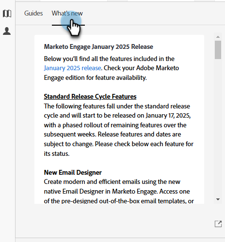

# Helpcentrum {#help-center}

Het Help Center in Adobe Marketo Engage fungeert als een centrale locatie voor hulp. Naast het verbinden uit aan diverse middelen (b.v., [ productdocumentatie ](/help/marketo/home.md){target="_blank"}, [ versieinformatie ](/help/marketo/release-notes/current.md){target="_blank"}, de [ Gemeenschap van de Natie van de Marketing ](https://nation.marketo.com/){target="_blank"}), kunt u tot nuttige in-product analyses toegang hebben die door ervaringsniveau worden georganiseerd.

## Toegang verkrijgen {#how-to-access}

Er zijn twee verschillende ervaringen, afhankelijk van of uw abonnement al naar Adobe Identity Management System (IMS) is gemigreerd.

### Migratie vóór Adobe IMS {#pre-adobe-ims-integration}

Deze stappen zijn voor de gebruikers van Marketo Engage die _niet_ zijn gemigreerd aan [ IMS van Adobe ](/help/marketo/product-docs/administration/marketo-with-adobe-identity/adobe-identity-management-overview.md){target="_blank"} nog.

[ Login ](https://login.marketo.com/){target="_blank"} aan Marketo Engage en klik het pictogram van de Hulp.

#### Gidsen {#guides}

Hulplijnen dienen als snelle doorverwijzingen voor veelgebruikte functies.

1. Klik op de gewenste hulplijn om deze weer te geven.

   

1. Klik **krijgen Begonnen**.

   

1. Klik **daarna** om verder te gaan.

   

1. Klik **Gedaan** om de analyse weg te gaan.

   

   >[!TIP]
   >
   >Ga de gids op elk ogenblik weg door **te klikken Ontwerpen**.

#### Nieuwe functies {#whats-new}

Het tabblad Nieuwe functies bevat de details van de laatste release van Marketo Engage.

>[!TIP]
>
>Klik op het pijlpictogram onderaan om de pagina in Experience League weer te geven.

#### Bronnen {#resources}

Op het tabblad Bronnen hebt u snel en rechtstreeks toegang tot verschillende manieren waarop u extra hulp kunt krijgen met uw Marketo Engage-exemplaar.

### Migratie na Adobe IMS {#post-adobe-ims-integration}

Deze stappen zijn voor de gebruikers van Marketo Engage die reeds aan [ IMS van Adobe ](/help/marketo/product-docs/administration/marketo-with-adobe-identity/adobe-identity-management-overview.md){target="_blank"} zijn gemigreerd.

[ Login ](https://experience.adobe.com/){target="_blank"} aan Marketo Engage en klik het pictogram van de Hulp.

Het Help-centrum wordt weergegeven. Klik op een van de vermelde Help-bronnen die u naar het desbetreffende gebied wilt verplaatsen. U kunt ook naar specifieke termen zoeken.

Hulplijnen (die voorheen deel uitmaakten van het Help Center vóór de migratie naar Adobe IMS) bevinden zich nu in het linkernavigatiegebied.

Het Guide Center heeft twee tabbladen, hulplijnen en nieuwe functies. Hulplijnen dienen als snelle doorverwijzingen voor veelgebruikte functies in Marketo Engage. Klik op een gewenste gids, of onderzoek naar een specifieke.

Het tabblad Nieuwe functies bevat de details van de laatste release van Marketo Engage.

