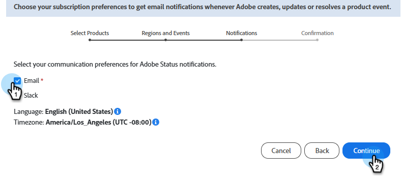

# Abonneren op systeemstatusmeldingen {#subscribe-to-system-status-notifications}

INTRO TEXT

>[!PREREQUISITES]
>
>Voordat u een abonnement kunt maken, moet u eerst bepalen in welk datacenter en in welke pod/server uw abonnement zich bevindt.

## Uw datacenter identificeren {#identify}

+++Uw datacenter en pod/server identificeren

1. In de **Admin** sectie van Marketo Engage, klik **Mijn Rekening**.

   

1. De rol neer aan _Informatie van de Steun_.

   

Op het _gebied van het centrum van 0&rbrace; Gegevens, zijn de brieven het gegevenscentrum en de aantallen zijn de peul._ In het bovenstaande voorbeeld bevindt de gebruiker zich in ons Ashburn-datacenter op pod 49.

In stap 7 van [&#x200B; creërend een abonnement &#x200B;](#create-a-subscription), zou deze gebruiker de regionale plaats **Marketo Ashburn** en peul **ab49** selecteren.

<table style="width:225px;">
  <tr>
    <th colspan="2">Afkortingen voor datacenters</th>
  </tr>
  <tr>
    <td style="width:25%;">ab</td>
    <td>Ashburn</td>
  </tr>
  <tr>
    <td style="width:25%;">sj</td>
    <td>San Jose</td>
  </tr>
  <tr>
    <td style="width:25%;">sn</td>
    <td>Sydney</td>
  </tr>
  <tr>
    <td style="width:25%;">lon</td>
    <td>Londen</td>
  </tr>
  <tr>
    <td style="width:25%;">nld</td>
    <td>Amsterdam</td>
  </tr>
</table>

>[!TIP]
>
>Deze methode kan ook worden gebruikt om te identificeren welke Real Time Personalization (RTP) peul/server uw abonnement is.

+++

## Abonnement maken {#create-a-subscription}

Na [&#x200B; identificerend uw gegevenscentrum en pod/server &#x200B;](#identify), volg de stappen hieronder om een abonnement tot stand te brengen.

1. Op [&#x200B; status.adobe.com &#x200B;](https://status.adobe.com), klik **leiden Abonnementen**.

   

1. Teken binnen (als u niet reeds) gebruikend uw geloofsbrieven van Adobe, of klik **creeer een rekening** als u geen hebt.

   

1. Het verblijf in het _lusje van de beschrijvingen van het Product_ en klikt **creeert abonnementen**.

   

1. Klik het  pictogram naast _Experience Cloud_ om het menu uit te breiden. Doe het zelfde voor _Adobe Marketo Engage_.

   {width="800" zoomable="yes"}

1. Selecteer het gewenste productdienstenaanbod/de diensten u berichten over wilt ontvangen en **blijven** klikken.

   >[!TIP]
   >
   >Controle _Adobe Marketo Engage_ om allen te selecteren.

   {width="800" zoomable="yes"}

1. Selecteer de gewenste gebeurtenistypen.

   

   <table style="width:600px;">
   <tr>
   <td style="width:30%;"><b>Probleem met grote service</b></td>
   <td>De onbeschikbaarheid van de dienst of ernstige prestatiesvermindering voor veelvoudige gebruikers op productiesystemen.</td>
   </tr>
   <tr>
   <td style="width:30%;"><b>Probleem met kleine service</b></td>
   <td>Onbeschikbaarheid van de gedeeltelijke dienst of matige prestatiesvermindering voor veelvoudige gebruikers op productiesystemen.</td>
   </tr>
   <tr>
   <td style="width:30%;"><b>Onderhoud van service</b></td>
   <td>Tekst</td>
   </tr>
   <tr>
   <td style="width:30%;"><b>Aankondigingen</b></td>
   <td>Aankondigingen met betrekking tot..</td>
   </tr>
   </table>

1. Selecteer de gewenste locatie en omgeving. Klik **verdergaan**.

   {width="800" zoomable="yes"}

1. Kies uw abonnementsvoorkeur, **E-mail** of **Slack**, en klik **verdergaan**.

   

1. Herzie uw selecties en klik **bevestigen voorkeur**.

   
