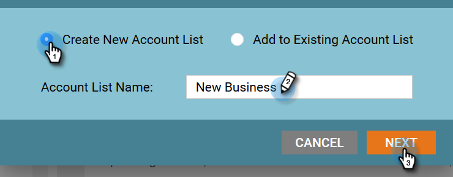

# Nieuwe accountdetectie {#new-account-discovery}

De Nieuwe Ontdekking van de Rekening kan u helpen nieuwe rekeningen vinden om te richten door op AI-Gebaseerde aanbevelingen van uw ideale klantenprofiel te gebruiken.

>[!PREREQUISITES]
>
>[Accountprofielen instellen](http://docs.marketo.com/x/FgAKAQ)

>[!TIP]
>
>Het wordt aanbevolen op de knop Bestaande accounts **** bijwerken te drukken voordat u een nieuwe zoekopdracht uitvoert om te controleren of u de meest recente gegevens bekijkt. Deze update kan maximaal 24 uur in beslag nemen.

1. Klik in Mijn Marketo op **ABM**.

   

1. Klik op het tabblad **Accountprofilering** .

   

1. Klik op het tabblad **Nieuwe accounts** .

   

   >[!NOTE]
   >
   >Nieuwe accounts bevatten een lijst met accounts die nog niet van u zijn in ABM. Het zijn accounts die mogelijk nieuw voor u zijn op basis van filters die u selecteert.

1. Selecteer alle toepasselijke filters (dit deel is hoogst aanpasbaar, het volgende is enkel één voorbeeld om het filtreren aan te tonen).

   

1. Klik op Alle **opslaan en lijst** maken rechtsonder op de pagina.

   

   >[!NOTE]
   >
   >Als u slechts een paar accounts ziet die u wilt, kunt u desgewenst op afzonderlijke accounts klikken en op Geselecteerde accounts **** opslaan klikken.

1. Je kunt een lijst maken met je eigen nieuwe account of deze toevoegen aan een bestaande lijst. In dit voorbeeld maken we een nieuwe.

   

   >[!NOTE]
   >
   >Als u de account wilt opslaan in een bestaande accountlijst, selecteert u die optie, klikt u op de vervolgkeuzelijst en selecteert u de gewenste accountlijst en klikt u op **Volgende**.

1. Klik op **Opslaan**.

   

   >[!NOTE]
   >
   >U kunt maximaal 5.000 accounts tegelijk opslaan. Als uw zoekopdracht 10.000 resultaten oplevert, moet u de eerste (bovenste) 5.000 opslaan, vervolgens de filters opnieuw instellen en de volgende 5.000 opslaan. De **totale** rekeninglimiet is 1 miljoen.

1. Klik op **OK**.

   

   >[!TIP]
   >
   >Nadat uw rekeningen worden bewaard, kunt u een [aangepast publiek op LinkedIn](http://docs.marketo.com/x/rYGZAQ) gebruiken om hen te richten.

