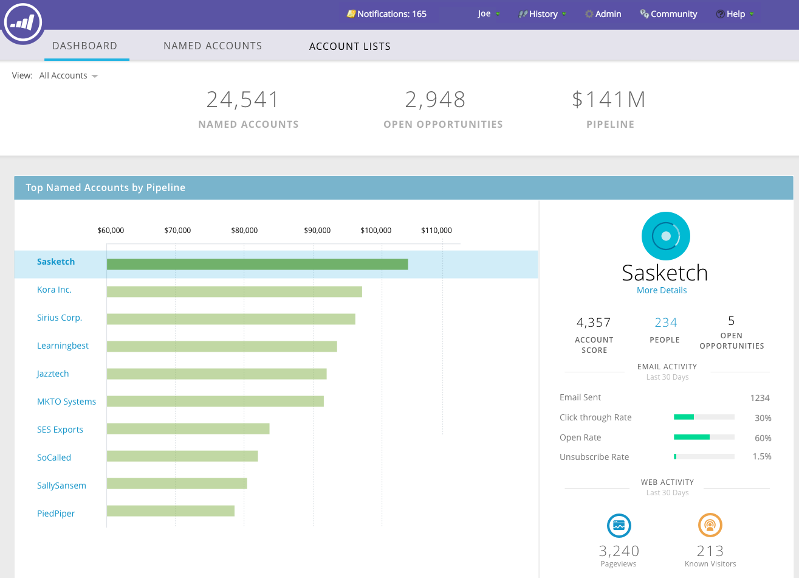

# ABM hoofddashboard {#abm-main-dashboard}

Het hoofddashboard bevat een overzicht van uw inspanningen voor marketing op basis van accounts. U kunt de doelaccounts of accountlijsten zien die succes tonen, en de accounts die meer aandacht nodig hebben.

Als u wilt filteren op accountlijst, klikt u op de vervolgkeuzelijst Weergave..

...en maak een selectie. In dit voorbeeld kiezen we onze accountlijst &#39;High Tech&#39;.

Als u het dashboard [Accountlijst](http://docs.marketo.com/display/DOCS/Account+List+Insights#AccountListInsights-AccountListDashboard)wilt weergeven, klikt u op de naam van de accountlijst die u hebt geselecteerd...

...en het dashboard wordt geladen.

Als u in plaats van het dashboard Accountlijst weer te geven een account met een naam wilt openen, klikt u op **Meer details** onder de naam...

...en bekijk de inzichten [van de](http://docs.marketo.com/display/DOCS/Named+Account+Insights)benoemde account.

