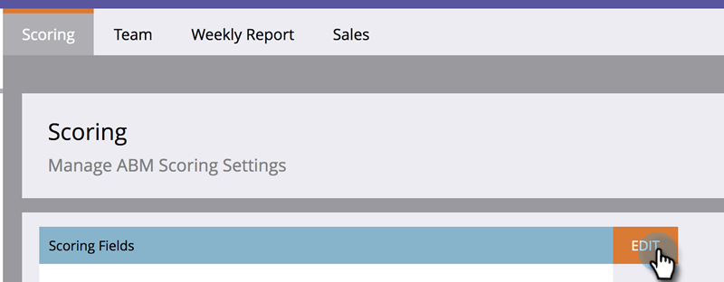

# Accountscore {#account-score}

Het Scoren van de rekening is een essentieel deel van Account Gebaseerde Marketing. Het helpt u de mate van betrokkenheid van uw accounts te bepalen.

## Wat is het Scorebord van de Rekening? {#what-is-account-scoring}

Het is een systematische benadering die wordt ontworpen om verkoop en marketing teams te helpen de bedrijven (met inbegrip van vooruitzichten) identificeren en voorrang geven die het meest waarschijnlijk om een aankoop zullen maken.

In de complexe wereld van B2B-aankoopprocessen is het zeldzaam dat één persoon een aankoopbeslissing neemt. Er zijn vaak verschillende rollen mee gemoeid, elk met zijn eigen behoeften. Bij het maken van een score op basis van accounts wordt hiermee rekening gehouden door de leadscores van meerdere leads samen te voegen en een score op accountniveau te leveren.

## Algemene voorbeelden {#common-examples}

| **Score voor accountbetrokkenheid** | Diepte van betrokkenheid op basis van gedragsactiviteiten die via verschillende kanalen (bijvoorbeeld e-mail, web en advertenties) van personen in specifieke doelaccounts worden bijgehouden. |
|---|---|
| **Interescore voor product van account** | Personen van doelaccounts die belangstelling tonen voor de inhoud van een specifiek product (bijvoorbeeld het downloaden van een witboek). |
| **Score voor online betrokkenheid van account** | Personen van doelaccounts die webkanaal bezoeken. Dezelfde score kan worden gemaakt om de betrokkenheid van kanalen via e-mail, advertenties of andere kanalen te meten. |

## Hoe te om de Score van de Rekening {#how-to-configure-account-score} te vormen

>[!NOTE]
>
>Als u accountscores wilt berekenen, moet u eerst loodscores maken. Marketo ABM aggregeert automatisch leadscores naar accountscores. Als voorbeeld, zullen wij twee van de bovengenoemde voorbeelden (_Score van de Rente van het Product van de Rekening_ en _Score van de Betrokkenheid van het Web van de Rekening_) nemen.
>
>Maak eerst loodscore-velden waarin relevante details van elke lead van een doelaccount worden vastgelegd.\
>Wijs vervolgens die leadscores toe aan hun respectievelijke accountscores:\
>Account Product Interest Score = SUM (Lood Product Interest Score)\
>Account Web Engagement Score = SUM (Lead Web Engagement Score)

>[!NOTE]
>
>Gebruikers kunnen meerdere betrokkenheidsscores voor hun account maken en verschillende persoonlijke scores toewijzen aan verschillende accountscores.

Nadat u de hoofdscore hebt geconfigureerd, voert u de onderstaande stappen uit.

1. Klik **Admin**.

   

1. Klik **ABM**.

   

1. Klik in Velden noteren op **Bewerken**.

   

   >[!NOTE]
   >
   >U kunt maximaal **vijf** velden kiezen om de accountscore te berekenen.

1. Ga de naam van de Score van de Rekening in, klik **Uitgezochte Score** drop-down en selecteer de overeenkomstige score.

   

1. Klik **+Add** om meer scores toe te voegen.

   

1. Voeg alle gewenste scores toe. Klik **Opslaan** wanneer gereed.

   
