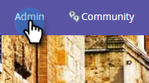
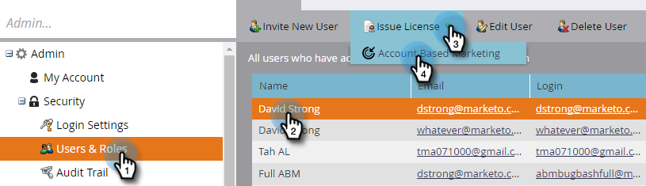

# Licentie {#issue-a-license} uitgeven

U moet gebruikers instellen met een licentie om ABM te gebruiken. Zo doe je dat.

>[!NOTE]
>
>Het aantal beschikbare licenties is afhankelijk van uw abonnement. Neem contact op met je verkoper als je meer wilt.

1. Klik **Admin**.

   

1. Klik **Gebruikers &amp; rollen**. Selecteer de gebruiker om de vergunning aan uit te geven, **Geef Vergunning** drop-down uit, en selecteer **Account Based Marketing**.

   

1. Schakel het selectievakje **Licentie inschakelen** in en klik op **Opslaan**.

   

   >[!NOTE]
   >
   >Als u een gebruikerslicentie wilt verwijderen, volgt u stap 1 en *un* schakelt u het selectievakje in en klikt u op **Opslaan**.

