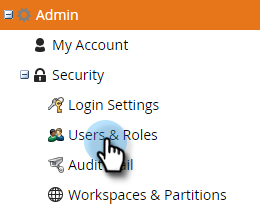

# Machtigingen {#permissions}

U moet machtigingen instellen zodat uw gebruikers ABM kunnen gebruiken. Zo gaat het.

1. Klik **Admin**.

   

1. Klik **Gebruikers &amp; rollen**.

   

   >[!NOTE]
   >
   >U kunt ABM-machtigingen toevoegen voor een bestaande rol of een geheel nieuwe rol maken. In dit voorbeeld wordt een nieuwe rol gebruikt.

1. Klik **Rollen**, dan **Nieuwe Rol**.

   

1. Voer een rolnaam in en klik op het pictogram **+** naast het selectievakje Op account gebaseerde marketing openen.

   

1. Als u _alle_ machtigingen wilt selecteren, schakelt u gewoon het selectievakje **Op account gebaseerde marketing benaderen** in.

   

   >[!NOTE]
   >
   >U kunt ook slechts enkele opties selecteren. Doe dat door elk selectievakje afzonderlijk in te schakelen.

1. Klik **+** om het menu van Admin van de Toegang te openen. Schakel het selectievakje **Access ABM Admin** in.

   

   Uw nieuwe ABM-rol is nu klaar om [te worden toegewezen aan een gebruiker](/help/marketo/product-docs/administration/users-and-roles/managing-user-roles-and-permissions.md#assign-roles-to-a-user)!

   
