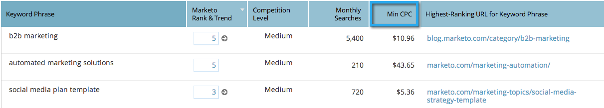

# SEO - Kolommen toevoegen/verwijderen uit de trefwoordenweergave {#seo-add-remove-columns-from-your-keywords-view}

U kunt uw sleutelwoordmening aanpassen om de gegevens te tonen u het interessantst bent in.
>[!IMPORTANT]
>
>Op 31 maart 2026 zal Marketo Engage de functie Optimalisatie zoekmachine vervangen. Exporteer alle relevante gegevens op of vóór 30 maart. [&#x200B; leer meer &#x200B;](https://nation.marketo.com/t5/product-blogs/marketo-engage-seo-feature-deprecation/ba-p/359060){target="_blank"}.
>
>* [&#x200B; Uitvoer Kwesties &#x200B;](https://experienceleague.adobe.com/nl/docs/marketo/using/product-docs/additional-apps/seo/pages/seo-export-issues-to-csv){target="_blank"}
>* [&#x200B; Resultaten van het Trefwoord van de Uitvoer &#x200B;](https://experienceleague.adobe.com/nl/docs/marketo/using/product-docs/additional-apps/seo/keywords/seo-exporting-keyword-results){target="_blank"}
>* [&#x200B; Trends van het Sleutelwoord van de Uitvoer &#x200B;](https://experienceleague.adobe.com/nl/docs/marketo/using/product-docs/additional-apps/seo/reports/seo-use-the-keyword-trends-report#exporting-data){target="_blank"}
>* [&#x200B; Trends van het Sleutelwoord van de Concurrentie van de Uitvoer &#x200B;](https://experienceleague.adobe.com/nl/docs/marketo/using/product-docs/additional-apps/seo/reports/seo-use-the-competitor-kw-trends-report#exporting-data){target="_blank"}

1. Ga naar de sectie **[!UICONTROL Keywords]** .

   

   Dit zijn de standaardkolommen:

   

1. Klik op het tandwielpictogram.

   

1. Selecteer of maak de kolommen ongedaan u wilt zien. Klik op **[!UICONTROL Save]**.

   

   Geweldig! U hebt nu de trefwoordweergave aangepast.

   

   >[!MORELIKETHIS]
   >
   >[&#x200B; Begrijpend Trefwoorden - Samenvattingsmening &#x200B;](/help/marketo/product-docs/additional-apps/seo/keywords/seo-understanding-keywords.md)
