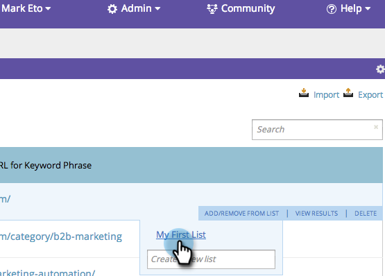

# SEO - Trefwoorden toevoegen/verwijderen uit een lijst {#seo-add-remove-keywords-from-a-list}

U kunt al uw trefwoorden mooi houden en ordenen met behulp van lijsten. Hierdoor wordt het veel gemakkelijker om gegevens over specifieke trefwoorden te vinden.
>[!IMPORTANT]
>
>Op 31 maart 2026 zal Marketo Engage de functie Optimalisatie zoekmachine vervangen. Exporteer alle relevante gegevens op of vóór 30 maart. [&#x200B; leer meer &#x200B;](https://nation.marketo.com/t5/product-blogs/marketo-engage-seo-feature-deprecation/ba-p/359060){target="_blank"}.
>
>* [&#x200B; Uitvoer Kwesties &#x200B;](https://experienceleague.adobe.com/nl/docs/marketo/using/product-docs/additional-apps/seo/pages/seo-export-issues-to-csv){target="_blank"}
>* [&#x200B; Resultaten van het Trefwoord van de Uitvoer &#x200B;](https://experienceleague.adobe.com/nl/docs/marketo/using/product-docs/additional-apps/seo/keywords/seo-exporting-keyword-results){target="_blank"}
>* [&#x200B; Trends van het Sleutelwoord van de Uitvoer &#x200B;](https://experienceleague.adobe.com/nl/docs/marketo/using/product-docs/additional-apps/seo/reports/seo-use-the-keyword-trends-report#exporting-data){target="_blank"}
>* [&#x200B; Trends van het Sleutelwoord van de Concurrentie van de Uitvoer &#x200B;](https://experienceleague.adobe.com/nl/docs/marketo/using/product-docs/additional-apps/seo/reports/seo-use-the-competitor-kw-trends-report#exporting-data){target="_blank"}

## Toevoegen aan lijst {#add-to-a-list}

1. Ga naar de sectie **[!UICONTROL Keywords]** .

   

1. Houd de muisaanwijzer boven het trefwoord dat u aan een lijst wilt toevoegen. Klik op **[!UICONTROL Add/Remove from list]**.

   

1. Klik op de lijst en de trefwoorden worden toegevoegd.

   

   >[!TIP]
   >
   >U kunt ook een nieuwe lijst maken voor uw trefwoorden. Typ gewoon de naam in **[!UICONTROL Create a new list]** .

   

Woo hoo! Selecteer de lijst om de nieuwe trefwoorden weer te geven.

## Trefwoord uit lijst verwijderen {#remove-keyword-from-list}

U kunt ook trefwoorden uit een lijst verwijderen.

1. Ga naar de sectie **[!UICONTROL Keywords]** .

   

1. Houd de muisaanwijzer boven het trefwoord dat u uit een lijst wilt verwijderen. Klik op **[!UICONTROL Add/Remove from list]**.

   

1. Klik op de lijst waaruit u de trefwoorden wilt verwijderen.

   >[!NOTE]
   >
   >Alle lijsten waartoe het trefwoord momenteel behoort, hebben een vinkje. Zodra u de controle uit de lijst hebt verwijderd, verdwijnt deze.

   

   Perfect, het sleutelwoord is niet meer op deze lijst. Vernieuw de pagina om de weergave bij te werken.

   >[!MORELIKETHIS]
   >
   >[&#x200B; Begrijpend Trefwoorden (Samenvattingsmening) &#x200B;](/help/marketo/product-docs/additional-apps/seo/keywords/seo-understanding-keywords.md)
