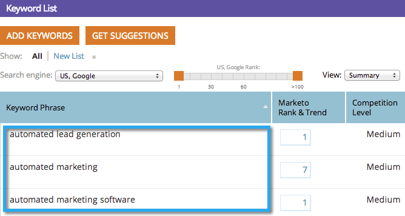

# SEO - Trefwoorden importeren met een CSV {#seo-importing-keywords-with-a-csv}

U kunt [ sleutelwoorden ](/help/marketo/product-docs/additional-apps/seo/keywords/seo-add-keywords.md) manueel toevoegen, [ krijgen sleutelwoordsuggesties ](/help/marketo/product-docs/additional-apps/seo/keywords/seo-get-suggested-keywords.md) en zelfs sleutelwoorden van een Csv- dossier invoeren. Hieronder wordt beschreven hoe u het bestand importeert.

>[!IMPORTANT]
>
>Op 31 maart 2026 zal Marketo Engage de functie Optimalisatie zoekmachine vervangen. Exporteer alle relevante gegevens op of vóór 30 maart. [ leer meer ](https://nation.marketo.com/t5/product-blogs/marketo-engage-seo-feature-deprecation/ba-p/359060){target="_blank"}.
>
>* [ Uitvoer Kwesties ](https://experienceleague.adobe.com/en/docs/marketo/using/product-docs/additional-apps/seo/pages/seo-export-issues-to-csv){target="_blank"}
>* [ Resultaten van het Trefwoord van de Uitvoer ](https://experienceleague.adobe.com/en/docs/marketo/using/product-docs/additional-apps/seo/keywords/seo-exporting-keyword-results){target="_blank"}
>* [ Trends van het Sleutelwoord van de Uitvoer ](https://experienceleague.adobe.com/en/docs/marketo/using/product-docs/additional-apps/seo/reports/seo-use-the-keyword-trends-report#exporting-data){target="_blank"}
>* [ Trends van het Sleutelwoord van de Concurrentie van de Uitvoer ](https://experienceleague.adobe.com/en/docs/marketo/using/product-docs/additional-apps/seo/reports/seo-use-the-competitor-kw-trends-report#exporting-data){target="_blank"}

1. Ga naar de sectie **[!UICONTROL Keywords]** .

   

1. Klik op **[!UICONTROL Import]**.

   

1. Kies het Excel-bestand dat u wilt importeren.

   

1. Klik op **[!UICONTROL Choose File]**.

   

   >[!NOTE]
   >
   >De importbeperkingen zijn afhankelijk van uw abonnement. Neem contact op met je verkoper voor meer informatie.

1. Klik op **[!UICONTROL Import]**.

   

   De nieuwe trefwoorden worden in alfabetische volgorde weergegeven in de lijst met trefwoorden.

   

   >[!NOTE]
   >
   >Het kan een paar minuten duren om alle gegevens te laden die aan elk trefwoord zijn gekoppeld.

   >[!MORELIKETHIS]
   >
   >* [ Begrijpend Trefwoorden (Samenvattingsmening) ](/help/marketo/product-docs/additional-apps/seo/keywords/seo-understanding-keywords.md)
   >* [ voeg/verwijder Trefwoorden van een Lijst toe ](/help/marketo/product-docs/additional-apps/seo/keywords/seo-add-remove-keywords-from-a-list.md)
