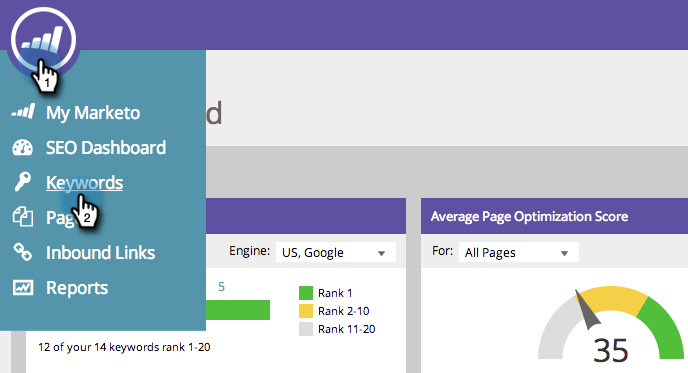

# SEO - Een trefwoord verwijderen {#seo-remove-a-keyword}

Als u een sleutelwoord hebt dat u niet wilt blijven optimaliseren voor, is hier hoe te om het te verwijderen.

>[!IMPORTANT]
>
>Op 31 maart 2026 zal Marketo Engage de functie Optimalisatie zoekmachine vervangen. Exporteer alle relevante gegevens op of vóór 30 maart. [Meer info](https://nation.marketo.com/t5/product-blogs/marketo-engage-seo-feature-deprecation/ba-p/359060){target="_blank"}.
>
>* [&#x200B; Uitvoer Kwesties &#x200B;](https://experienceleague.adobe.com/nl/docs/marketo/using/product-docs/additional-apps/seo/pages/seo-export-issues-to-csv){target="_blank"}
>* [&#x200B; Resultaten van het Trefwoord van de Uitvoer &#x200B;](https://experienceleague.adobe.com/nl/docs/marketo/using/product-docs/additional-apps/seo/keywords/seo-exporting-keyword-results){target="_blank"}
>* [&#x200B; Trends van het Sleutelwoord van de Uitvoer &#x200B;](https://experienceleague.adobe.com/nl/docs/marketo/using/product-docs/additional-apps/seo/reports/seo-use-the-keyword-trends-report#exporting-data){target="_blank"}
>* [&#x200B; Trends van het Sleutelwoord van de Concurrentie van de Uitvoer &#x200B;](https://experienceleague.adobe.com/nl/docs/marketo/using/product-docs/additional-apps/seo/reports/seo-use-the-competitor-kw-trends-report#exporting-data){target="_blank"}

1. Klik om naar de sectie **[!UICONTROL Keywords]** te gaan.

   

1. Houd de cursor boven het trefwoord dat u wilt verwijderen en klik op **[!UICONTROL Delete]** .

   

1. Klik nogmaals op **[!UICONTROL Delete]** om te bevestigen.

   
