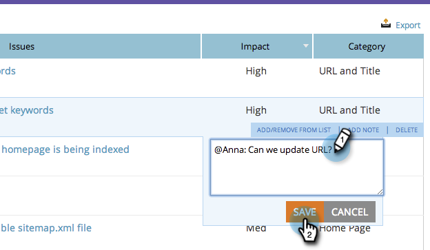

# SEO - Notities toevoegen aan pagina-problemen {#seo-add-notes-to-page-issues}

Wist u dat u notities kunt toevoegen aan paginaproblemen als persoonlijke herinneringen of teamberichten?

## Notities toevoegen in sectie {#adding-notes-in-page-issues-section} Paginaproblemen

1. Ga naar de sectie Pagina&#39;s.

   

1. Klik op **Issues** op het tabblad Pagina&#39;s.

   

1. Houd de muisaanwijzer boven het probleem waaraan u een notitie wilt toevoegen. Klik **Notitie toevoegen**.

   

1. Voer een notitie in het gele tekstvak in. Als u buiten het tekstvak klikt, wordt de notitie opgeslagen.

>[!TIP]
>
>U kunt uw nota schrappen door kleine **x** in de hogere linkerhoek te klikken.

## Notities toevoegen in opboeking van paginadetails {#add-notes-in-page-detail-drill-down}

1. Ga naar de sectie Pagina&#39;s.

   

1. Klik op de pagina waarvoor u details wilt zien.

   

1. Houd de muis boven de pagina-uitgave waaraan u een notitie wilt toevoegen en klik op **Notitie toevoegen**.

   

1. Voer uw notitie in. Klik **Opslaan**.

   

   Uw opmerking is toegevoegd!

   
