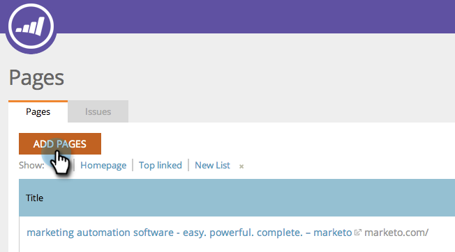

# SEO - Pagina&#39;s toevoegen {#seo-add-pages}

Je hebt pagina&#39;s! Marketo SEO doorloopt automatisch uw site en volgt deze. Als we er een paar gemist hebben, haal ze dan als volgt in de SEO-app:

1. Ga naar de **Pagina&#39;s** sectie.

   

1. Klikken **Pagina&#39;s toevoegen**.

   

1. Typ de URL&#39;s die u wilt toevoegen. Klikken **Toevoegen**.

   

   >[!TIP]
   >
   >Wist u dat u [uw pagina toevoegen aan een nieuwe of bestaande lijst](/help/marketo/product-docs/additional-apps/seo/understanding-seo/seo-managing-lists.md)? Kijk eens!

   Het kan even duren voordat de paginagegevens zijn geladen. Wacht op het groene waarschuwingsbericht en vernieuw uw pagina om de weergave bij te werken.

   

   U kunt nu bijhouden hoe deze pagina in de zoekopdracht presteert.
