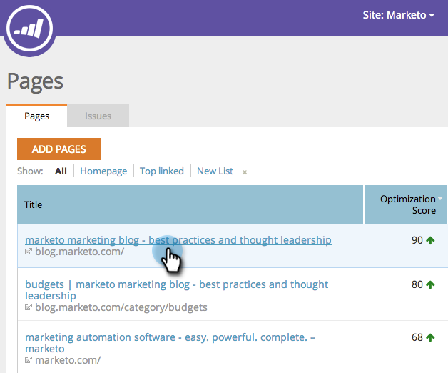

# SEO - Problemen exporteren naar CSV {#seo-export-issues-to-csv}

U kunt uw [ gegevens van de paginagebeurtenis ](/help/marketo/product-docs/additional-apps/seo/pages/seo-understanding-pages.md) naar een Csv- dossier uitvoeren als u die informatie met mensen buiten Marketo wilt delen. Zo gaat het.

>[!IMPORTANT]
>
>Op 31 maart 2026 zal Marketo Engage de functie Optimalisatie zoekmachine vervangen. Exporteer alle relevante gegevens op of vóór 30 maart. [Meer info](https://nation.marketo.com/t5/product-blogs/marketo-engage-seo-feature-deprecation/ba-p/359060){target="_blank"}.
>
>* [ Uitvoer Kwesties ](https://experienceleague.adobe.com/en/docs/marketo/using/product-docs/additional-apps/seo/pages/seo-export-issues-to-csv){target="_blank"}
>* [ Resultaten van het Trefwoord van de Uitvoer ](https://experienceleague.adobe.com/en/docs/marketo/using/product-docs/additional-apps/seo/keywords/seo-exporting-keyword-results){target="_blank"}
>* [ Trends van het Sleutelwoord van de Uitvoer ](https://experienceleague.adobe.com/en/docs/marketo/using/product-docs/additional-apps/seo/reports/seo-use-the-keyword-trends-report#exporting-data){target="_blank"}
>* [ Trends van het Sleutelwoord van de Concurrentie van de Uitvoer ](https://experienceleague.adobe.com/en/docs/marketo/using/product-docs/additional-apps/seo/reports/seo-use-the-competitor-kw-trends-report#exporting-data){target="_blank"}

1. Ga naar de sectie **[!UICONTROL Pages]** .

   

1. Klik op de pagina waarvoor u details wilt zien.

   

   Dit is de [ Boor van het Detail van de Pagina neer ](/help/marketo/product-docs/additional-apps/seo/pages/seo-using-the-page-detail-drill-down.md). **[!UICONTROL Page Optimization Results]** is een lijst van alle kwesties met die bepaalde pagina.

   

1. Klik op **[!UICONTROL Export]**.

   

Perfect! U hebt nu alle uitgaven met deze pagina naar een CSV-bestand gedownload.
