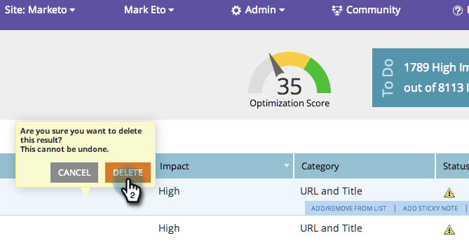

# SEO - Een pagina-probleem verwijderen/verwijderen {#seo-remove-delete-a-page-issue}

Mogelijk zijn niet alle pagina-problemen nuttig voor u. Hier is hoe je er een kunt verwijderen.

>[!IMPORTANT]
>
>Op 31 maart 2026 zal Marketo Engage de functie Optimalisatie zoekmachine vervangen. Exporteer alle relevante gegevens op of vóór 30 maart. [&#x200B; leer meer &#x200B;](https://nation.marketo.com/t5/product-blogs/marketo-engage-seo-feature-deprecation/ba-p/359060){target="_blank"}.
>
>* [&#x200B; Uitvoer Kwesties &#x200B;](https://experienceleague.adobe.com/nl/docs/marketo/using/product-docs/additional-apps/seo/pages/seo-export-issues-to-csv){target="_blank"}
>* [&#x200B; Resultaten van het Trefwoord van de Uitvoer &#x200B;](https://experienceleague.adobe.com/nl/docs/marketo/using/product-docs/additional-apps/seo/keywords/seo-exporting-keyword-results){target="_blank"}
>* [&#x200B; Trends van het Sleutelwoord van de Uitvoer &#x200B;](https://experienceleague.adobe.com/nl/docs/marketo/using/product-docs/additional-apps/seo/reports/seo-use-the-keyword-trends-report#exporting-data){target="_blank"}
>* [&#x200B; Trends van het Sleutelwoord van de Concurrentie van de Uitvoer &#x200B;](https://experienceleague.adobe.com/nl/docs/marketo/using/product-docs/additional-apps/seo/reports/seo-use-the-competitor-kw-trends-report#exporting-data){target="_blank"}

1. Ga naar de sectie **[!UICONTROL Pages]** .

   

1. Klik in de sectie [!UICONTROL Pages] op **[!UICONTROL Issues]** .

   

1. Houd de muisaanwijzer boven de pagina die u wilt verwijderen. Klik op **[!UICONTROL Remove]**.

   

1. Als u op **[!UICONTROL Delete]** klikt, wordt deze pagina-uitgave definitief verwijderd.

   >[!CAUTION]
   >
   >U kunt deze handeling niet ongedaan maken. Nadat een uitgave is verwijderd, kunt u de uitgaven opnieuw opbouwen door de pagina te verwijderen en weer in te voegen.

   

Uw pagina-uitgave is nu verwijderd.
