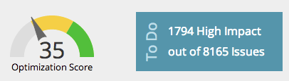

# SEO - Pagina&#39;s begrijpen {#seo-understanding-pages}

## Score voor optimalisatie van pagina / taakwidget {#page-optimization-score-to-do-widget}

De pagina [!UICONTROL Optimization Score] is een algemene rangschikking van hoe goed uw pagina is geoptimaliseerd voor een zoekopdracht, op een schaal van 1 tot 100. Het is gebaseerd op tientallen beste praktijken in SEO.

* 0 - 35 = Niet goed geoptimaliseerd
* 35 - 70 = Op de rechterbaan
* 70 - 100 = geweldig doen!

>[!TIP]
>
>Klik op de koppeling [!UICONTROL High Impact] in het vak [!UICONTROL To Do] om deze om te leiden naar de map [!UICONTROL Issues tab] en om te tonen welke problemen met hoge prioriteit moeten worden opgelost.

## [!UICONTROL Pages] Tab {#pages-tab}

Het **[!UICONTROL Pages]lusje** toont u hoe goed de individuele pagina&#39;s op uw plaats voor onderzoek worden geoptimaliseerd.

| Kolomnaam | Beschrijving |
|---|---|
| [!UICONTROL Title] | Titel en URL van alle pagina&#39;s in uw domein. Verifieer uw domein. |
| [!UICONTROL Optimization Score] | De geheime saus die wordt gebruikt om u te tonen hoe goed uw pagina voor onderzoek op een schaal van 1 tot 100 wordt geoptimaliseerd. |
| [!UICONTROL Links] | Aantal verschillende domeinen met minstens 1 inkomende verbinding aan uw plaats. |
| [!UICONTROL Target Keywords] | De trefwoorden waarvoor u elke pagina optimaliseert. [ dit vereist uw input ](/help/marketo/product-docs/additional-apps/seo/pages/seo-using-the-page-detail-drill-down.md). |

## [!UICONTROL Issues] Tab {#issues-tab}

Het **[!UICONTROL Issues]lusje** zal identificeren welke verbeteringen u kunt maken om uw optimaliseringsscore en het rangschikken te verhogen.

| Kolomnaam | Beschrijving |
|---|---|
| [!UICONTROL Issues] | Lijst met handelbare items die u helpen uw optimalisatiescore te verbeteren. |
| [!UICONTROL Impact] | Hoe belangrijk het is voor uw algemene score. Los eerst de items met een grote impact op! |
| [!UICONTROL Category] | Het type emissie dat wordt gerapporteerd. |
| [!UICONTROL Status] | Is de taak voltooid of nog open. Nadat u en uw webstramien het probleem op uw site hebben verholpen, verandert de status in opgelost (groene controle). |

Fantastisch, nu u de grondbeginselen van pagina&#39;s kent, controleer uit het [ artikel van de Boor van het Detail van de Pagina neer ](/help/marketo/product-docs/additional-apps/seo/pages/seo-using-the-page-detail-drill-down.md) om meer coole dingen te leren u kunt doen.
