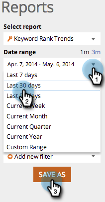

# SEO - het Rapport van de Trends van het Sleutelwoord gebruiken {#seo-use-the-keyword-trends-report}

In dit rapport kunt u zien hoe u in de loop der tijd op trefwoorden wordt gerangschikt.

## Rapport laden {#load-report}

1. Ga naar **[!UICONTROL Reports]**.

   

1. Klikken op **[!UICONTROL Keyword Rank Trends]**.

   

   Hier is het:

   

   Beschrijvende items rapporteren:

   | Item | Beschrijving |
   |---|---|
   | [!UICONTROL Keywords] | Het aantal trefwoorden dat u bijhoudt. |
   | [!UICONTROL Ranking URLs] | Het aantal URL&#39;s in de siterangschikking in het bereik dat u hebt ingesteld. |
   | [!UICONTROL Avg. rank] | De gemiddelde positie van trefwoorden in het bereik dat u hebt ingesteld. |
   | [!UICONTROL Avg. searches] | Het gemiddelde aantal zoekopdrachten bij de trefwoorden die zijn opgetreden tijdens het bereik dat u instelt (in de laatste 30 dagen) bij de zoekactie in Google US |

## Gegevens filteren {#filtering-data}

1. Klik op de vervolgkeuzelijst en selecteer de gewenste tijdsperiode.

   

1. Klik op het keuzemenu Rank om te kiezen voor welk bereik u trefwoorden wilt weergeven.

   

## Gegevens exporteren {#exporting-data}

>[!TIP]
>
>U kunt dit rapport naar uw bureaublad exporteren.

1. Klikken **[!UICONTROL Export CSV]** of **[!UICONTROL Export PDF]**.

   

   Geweldig werk! U kunt ook zien hoe u met uw concurrenten in sleutelwoordrangschikking vergelijkt.

   >[!NOTE]
   >
   >[Het rapport Concurrerende KW Rank Trends gebruiken](/help/marketo/product-docs/additional-apps/seo/reports/seo-use-the-competitor-kw-trends-report.md)
