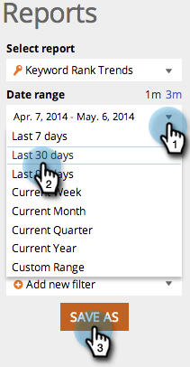

# SEO - het Rapport van de Trends van het Sleutelwoord gebruiken {#seo-use-the-keyword-trends-report}

In dit rapport kunt u zien hoe u in de loop der tijd op trefwoorden wordt gerangschikt.

>[!IMPORTANT]
>
>Op 31 Maart, 2026, verwierp Marketo Engage [ de Optimalisering van de Motor van het Onderzoek ](https://nation.marketo.com/t5/product-blogs/marketo-engage-seo-feature-deprecation/ba-p/359060){target="_blank"} eigenschap. [ seo.marketo.com ](https://seo.marketo.com/) is nog beschikbaar voor een beperkte tijd. Voer de stappen in de onderstaande artikelen uit om gegevens te exporteren.
>
>* [ Uitvoer Kwesties ](https://experienceleague.adobe.com/en/docs/marketo/using/product-docs/additional-apps/seo/pages/seo-export-issues-to-csv){target="_blank"}
>* [ Resultaten van het Trefwoord van de Uitvoer ](https://experienceleague.adobe.com/en/docs/marketo/using/product-docs/additional-apps/seo/keywords/seo-exporting-keyword-results){target="_blank"}
>* [ Trends van het Sleutelwoord van de Uitvoer ](https://experienceleague.adobe.com/en/docs/marketo/using/product-docs/additional-apps/seo/reports/seo-use-the-keyword-trends-report#exporting-data){target="_blank"}
>* [ Trends van het Sleutelwoord van de Concurrentie van de Uitvoer ](https://experienceleague.adobe.com/en/docs/marketo/using/product-docs/additional-apps/seo/reports/seo-use-the-competitor-kw-trends-report#exporting-data){target="_blank"}

## Rapport laden {#load-report}

1. Ga naar **[!UICONTROL Reports]** .

   

1. Klik op **[!UICONTROL Keyword Rank Trends]** .

   

   Hier is het:

   

   Beschrijvende items rapporteren:

   | Item | Beschrijving |
   |---|---|
   | [!UICONTROL Keywords] | Het aantal trefwoorden dat u bijhoudt. |
   | [!UICONTROL Ranking URLs] | Het aantal URL&#39;s in de siterangschikking in het bereik dat u hebt ingesteld. |
   | [!UICONTROL Avg. rank] | De gemiddelde positie van trefwoorden in het bereik dat u hebt ingesteld. |
   | [!UICONTROL Avg. searches] | Het gemiddelde aantal zoekopdrachten bij de trefwoorden die zijn opgetreden tijdens het bereik dat u instelt (in de laatste 30 dagen) bij de zoekactie in Google US |

## Gegevens filteren {#filtering-data}

1. Klik op de vervolgkeuzelijst en selecteer de gewenste tijdsperiode.

   

1. Klik op het keuzemenu Rank om te kiezen voor welk bereik u trefwoorden wilt weergeven.

   

## Gegevens exporteren {#exporting-data}

1. Klik op **[!UICONTROL Export CSV]** of **[!UICONTROL Export PDF]** .

   
