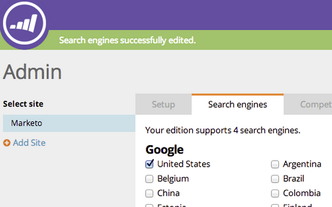

# SEO - Kies Regio/Land voor je zoekmachine {#seo-pick-region-country-for-your-search-engine}

SEO Admins zal het gebied voor de onderzoeksmotor kunnen kiezen die u de informatie van de sleutelwoordrang wilt krijgen.

>[!IMPORTANT]
>
>Op 31 maart 2026 zal Marketo Engage de functie Optimalisatie zoekmachine vervangen. Exporteer alle relevante gegevens op of vóór 30 maart. [Meer info](https://nation.marketo.com/t5/product-blogs/marketo-engage-seo-feature-deprecation/ba-p/359060){target="_blank"}.
>
>* [&#x200B; Uitvoer Kwesties &#x200B;](https://experienceleague.adobe.com/en/docs/marketo/using/product-docs/additional-apps/seo/pages/seo-export-issues-to-csv){target="_blank"}
>* [&#x200B; Resultaten van het Trefwoord van de Uitvoer &#x200B;](https://experienceleague.adobe.com/en/docs/marketo/using/product-docs/additional-apps/seo/keywords/seo-exporting-keyword-results){target="_blank"}
>* [&#x200B; Trends van het Sleutelwoord van de Uitvoer &#x200B;](https://experienceleague.adobe.com/en/docs/marketo/using/product-docs/additional-apps/seo/reports/seo-use-the-keyword-trends-report#exporting-data){target="_blank"}
>* [&#x200B; Trends van het Sleutelwoord van de Concurrentie van de Uitvoer &#x200B;](https://experienceleague.adobe.com/en/docs/marketo/using/product-docs/additional-apps/seo/reports/seo-use-the-competitor-kw-trends-report#exporting-data){target="_blank"}

>[!NOTE]
>
>**Vereiste Bevoegdheden Admin**

1. Ga naar de sectie **[!UICONTROL Admin]** .

1. Klik op de tab **[!UICONTROL Search engines]** .

   

1. Kies het land of de plaats waarvoor u wilt optimaliseren en klik op **[!UICONTROL Save]** .

>[!NOTE]
>
>Standaard kunt u één land gebruiken voor één zoekprogramma. Neem contact op met je verkoper als je meer wilt.

Zie nu de trefwoordnummers voor het land of de stad van uw keuze.

>[!MORELIKETHIS]
>
>* [&#x200B; Begrijpend het Dashboard: Momentopname van SEO &#x200B;](/help/marketo/product-docs/additional-apps/seo/understanding-seo/understanding-the-seo-dashboard-seo-snapshot.md){target="_blank"}
>* [&#x200B; Begrijpend het dashboard: De Aanbevelingen van SEO &#x200B;](/help/marketo/product-docs/additional-apps/seo/understanding-seo/understanding-the-seo-dashboard-seo-recommendations.md){target="_blank"}
