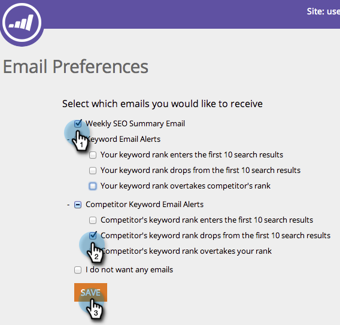

# SEO - Voorkeuren voor e-mailwaarschuwingen instellen {#seo-set-your-email-alert-preferences}

U kunt uw e-mailvoorkeuren aanpassen om te bepalen wanneer u over uw SEO-inspanningen wordt bijgewerkt.

>[!IMPORTANT]
>
>Op 31 maart 2026 zal Marketo Engage de functie Optimalisatie zoekmachine vervangen. Exporteer alle relevante gegevens op of vóór 30 maart. [Meer info](https://nation.marketo.com/t5/product-blogs/marketo-engage-seo-feature-deprecation/ba-p/359060){target="_blank"}.
>
>* [ Uitvoer Kwesties ](https://experienceleague.adobe.com/en/docs/marketo/using/product-docs/additional-apps/seo/pages/seo-export-issues-to-csv){target="_blank"}
>* [ Resultaten van het Trefwoord van de Uitvoer ](https://experienceleague.adobe.com/en/docs/marketo/using/product-docs/additional-apps/seo/keywords/seo-exporting-keyword-results){target="_blank"}
>* [ Trends van het Sleutelwoord van de Uitvoer ](https://experienceleague.adobe.com/en/docs/marketo/using/product-docs/additional-apps/seo/reports/seo-use-the-keyword-trends-report#exporting-data){target="_blank"}
>* [ Trends van het Sleutelwoord van de Concurrentie van de Uitvoer ](https://experienceleague.adobe.com/en/docs/marketo/using/product-docs/additional-apps/seo/reports/seo-use-the-competitor-kw-trends-report#exporting-data){target="_blank"}

1. Klik in de bovenste navigatiebalk op uw gebruikersnaam. Klik op **[!UICONTROL Email Preferences]**.

   

1. Geef aan waarover u via e-mail een melding wilt ontvangen en klik op **[!UICONTROL Save]** .

   
