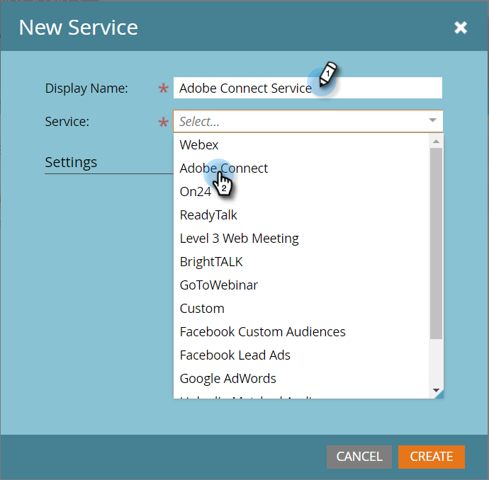

# Adobe Connect toevoegen als een LaunchPoint-service {#add-adobe-connect-as-a-launchpoint-service}

Marketo beheert uw Adobe Connect-webinarregistratie en -aanwezigheid.

>[!NOTE]
>
>**Beheerdersmachtigingen vereist**

>[!NOTE]
>
>**Herinnering**
>
>Voor deze stap zijn een bestaand abonnement op Adobe Connect en beheerrechten vereist. Zorg dat u de volgende instellingen hebt: gebruikersnaam, wachtwoord, deelnemerwachtwoord en URL van vergaderingsmap.

>[!NOTE]
>
>Adobe Connect On Site wordt momenteel niet ondersteund.

1. Ga naar **Admin** en klik **LaunchPoint**.

   

1. Selecteer **Nieuw** en dan **Nieuwe Dienst**.

   

1. Voer een **weergavenaam** in. Selecteer Adobe Connect onder **Service**.

   

1. Voer uw **gebruikersnaam** en **toegangscode** in.

   

1. Voltooi het proces door uw URL **van de** Vergadermap en het **Wachtwoord** van de **deelnemer** in te voeren,** **en klik** vervolgens op Maken.**

   ** 

   **

   >[!TIP]
   >
   >Wanneer u het deelnemerswachtwoord maakt, wordt de waarde die u kiest, opgenomen in een queryreeks wanneer de koppelingen voor de gebeurtenis worden verzonden. Daarom stellen wij voor dat u het klantvriendelijk maakt.

   >[!NOTE]
   >
   >**Voorbeeld**
   >
   >
   >Nadat u zich hebt aangemeld bij uw Adobe Connect-account, selecteert u het tabblad **Seminars** . Kopieer de URL vanuit de browserbalk naar de URL- **instelling** van de map **Vergadering zonder naar een specifiek seminar te gaan.**

1. Fenomenal! Je **Adobe Connect-service** is nu gesynchroniseerd met Marketo.

   

>[!MORELIKETHIS]
>
>Leer hoe u een gebeurtenis [maakt met Adobe Connect](../../../product-docs/demand-generation/events/create-an-event/create-an-event-with-adobe-connect.md).

