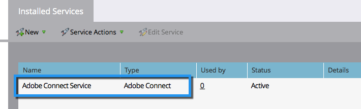

# Adobe Connect toevoegen als een [!DNL LaunchPoint] -service {#add-adobe-connect-as-a-launchpoint-service}

Marketo beheert uw Adobe Connect-webinarregistratie en -aanwezigheid.

>[!NOTE]
>
>**Vereiste Bevoegdheden Admin**

>[!NOTE]
>
>Voor deze stap zijn een bestaand abonnement op Adobe Connect en beheerrechten vereist. Beschikt u over de volgende instellingen: gebruikersnaam, wachtwoord, deelnemerswachtwoord en URL van vergadermap.

>[!NOTE]
>
>Adobe Connect On Site wordt momenteel niet ondersteund.

1. Ga naar het **[!UICONTROL Admin]** -gebied.

   

1. Klik op **[!UICONTROL LaunchPoint]** .

   

1. Klik op de vervolgkeuzelijst **[!UICONTROL New]** en selecteer **[!UICONTROL New Service]** .

   

1. Voer een **[!UICONTROL Display Name]** in. Selecteer onder **[!UICONTROL Service]** Adobe Connect.

   

1. Voer de **[!UICONTROL Username]** en **[!UICONTROL Access Code]** in.

   

1. Voltooi het proces door uw **[!UICONTROL Meeting Folder URL]** en **[!UICONTROL Participant Password]** in te voeren en vervolgens op **[!UICONTROL Create]** te klikken.

   

   >[!TIP]
   >
   >Wanneer u het deelnemerswachtwoord maakt, wordt de waarde die u kiest, opgenomen in een queryreeks wanneer de koppelingen voor de gebeurtenis worden verzonden. Men adviseert dat u het klantvriendelijk maakt.

   >[!NOTE]
   >
   >Nadat u zich hebt aangemeld bij uw Adobe Connect-account, selecteert u de tab **[!UICONTROL Seminars]** . Kopieer de URL vanuit de browserbalk naar de instelling **[!UICONTROL Meeting Folder URL]** zonder naar een specifiek seminar te gaan.

Uw Adobe Connect-service is nu gesynchroniseerd met Marketo!

>[!MORELIKETHIS]
>
>Leer hoe te [ een gebeurtenis met Adobe Connect ](/help/marketo/product-docs/demand-generation/events/create-an-event/create-an-event-with-adobe-connect.md){target="_blank"} tot stand brengen.
