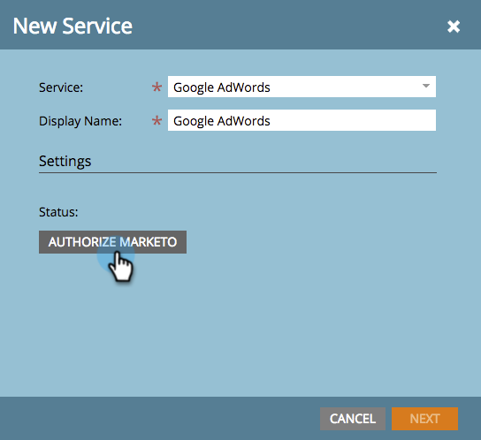

# Toevoegen [!DNL Google AdWords] als [!DNL Launchpoint] Service met een beheerdersaccount {#add-google-adwords-as-a-launchpoint-service-with-a-manager-account}

Koppel uw [!DNL Google AdWords] account naar Marketo om offline conversiegegevens automatisch te uploaden van Marketo naar [!DNL Google AdWords]. Dan, van [!DNL AdWords] UI, zult u gemakkelijk kunnen zien welke kliks in gekwalificeerde lood, kansen en nieuwe klanten (of om het even welke opbrengststadia resulteerden u) na u wilt volgen  [aangepaste kolommen toevoegen](https://support.google.com/adwords/answer/3073556){target="_blank"} in [!DNL AdWords]. Deze informatie wordt niet weergegeven in de gebruikersinterface van Marketo.

Als u meerdere [!DNL Google Adwords] accounts, kunt u een [[!DNL Google AdWords Manager Account]](https://www.google.com/adwords/manager-accounts/){target="_blank"} (voorheen bekend als [!DNL My Client Center]) om ze te integreren met Marketo.

Meer informatie over [Google, functie voor het importeren van offlineconversies](https://support.google.com/adwords/answer/2998031?hl=en){target="_blank"}.

>[!AVAILABILITY]
>
>Niet alle gebruikers van het Marketo Engage hebben deze functionaliteit aangeschaft. Neem contact op met het accountteam van de Adobe (uw accountmanager) voor meer informatie.

>[!NOTE]
>
>**Beheerdersmachtigingen vereist**

>[!NOTE]
>
>U kunt ook een [zelfstandig [!DNL Google AdWords] account als [!DNL Launchpoint] service](/help/marketo/product-docs/administration/additional-integrations/add-google-adwords-as-a-launchpoint-service.md){target="_blank"}.

1. Ga naar de **[!UICONTROL Admin]** gebied.

   

1. Selecteren **[!UICONTROL LaunchPoint]**.

   

1. Klik op de knop **[!UICONTROL New]** vervolgkeuzelijst en selecteer **[!UICONTROL New Service]**.

   

1. Voer een **[!UICONTROL Display Name]** en selecteert u **[!UICONTROL Google AdWords]**.

   

1. Selecteren **[!UICONTROL Authorize Marketo]**.

   >[!NOTE]
   >
   >Zorg ervoor dat u zich afmeldt bij uw persoonlijke [!DNL Gmail] en inschakelen van pop-ups.

   

1. Selecteer uw account die is gekoppeld aan **[!DNL Google AdWords]**.

   

1. Klik op **[!UICONTROL Accept]**.

   

1. De status wordt weergegeven als **[!UICONTROL Success]**. Selecteren **[!UICONTROL Next]**.

   

1. Offline conversies uploaden van Marketo naar [!DNL Google AdWords] **[!UICONTROL Weekly]** of **[!UICONTROL Daily]**.

   

1. Kenmerken omzetten in de **[!UICONTROL First Click]** of **[!UICONTROL Last Click]**.

   

   | Type | Definitie |
   |---|---|
   | [!UICONTROL First Click] | Offlineconversies worden aan de eerste [!DNL AdWords] en dat een persoon in de afgelopen 90 dagen heeft geklikt |
   | [!UICONTROL Last Click] | Offlineconversies worden aan de laatste [!DNL AdWords] toevoegen dat een persoon heeft geklikt |

   >[!NOTE]
   >
   >[Automatisch labelen](https://support.google.com/adwords/answer/1752125?hl=en){target="_blank"} Deze functie werkt alleen als u deze selecteert. Het moet binnen worden geactiveerd [!DNL AdWords].

1. Klik op **[!UICONTROL Next]**.

   

1. Deselecteer accounts die u niet wilt bijwerken. Klik op **[!UICONTROL Create]**.

   

   Zie nu het verwante artikel hieronder voor hoe u het kunt toewijzen [!DNL AdWords] offline conversies in uw inkomstenmodel.

   >[!MORELIKETHIS]
   >
   >[Set [!DNL Google AdWords] Conversies in het inkomstenmodel met een beheerdersaccount](/help/marketo/product-docs/reporting/revenue-cycle-analytics/revenue-cycle-models/set-google-adwords-conversions-in-the-revenue-model-with-a-manager-account.md){target="_blank"}
