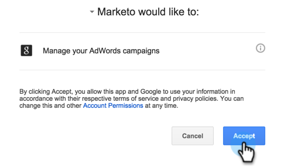
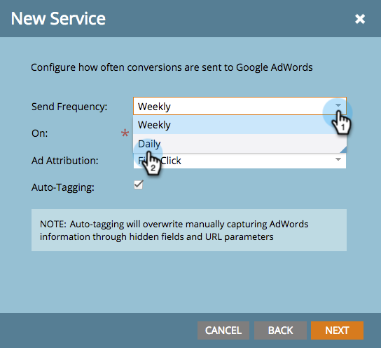

# [!DNL Google AdWords] toevoegen als een [!DNL Launchpoint] -service met een beheerdersaccount {#add-google-adwords-as-a-launchpoint-service-with-a-manager-account}

Koppel uw [!DNL Google AdWords] -account aan Marketo om automatisch offline conversiegegevens te uploaden van Marketo naar [!DNL Google AdWords] . Dan, van [!DNL AdWords] UI, zult u gemakkelijk kunnen zien welke kliks in gekwalificeerde lood, kansen en nieuwe klanten (of welke opbrengststadia resulteerden u) wilt volgen nadat u [ douanekolommen ](https://support.google.com/adwords/answer/3073556){target="_blank"} in [!DNL AdWords] toevoegt. Deze informatie wordt niet weergegeven in de gebruikersinterface van Marketo.

Als u meerdere [!DNL Google Adwords] -accounts hebt, kunt u een [[!DNL Google AdWords Manager Account] ](https://www.google.com/adwords/manager-accounts/){target="_blank"} (voorheen bekend als [!DNL My Client Center] ) gebruiken om deze te integreren met Marketo.

Leer meer over [ de off-line omzettingsde invoereigenschap van Google ](https://support.google.com/adwords/answer/2998031?hl=en){target="_blank"}.

>[!AVAILABILITY]
>
>Niet alle Marketo Engage-gebruikers hebben deze functionaliteit aangeschaft. Neem contact op met het Adobe-accountteam (uw accountmanager) voor meer informatie.

>[!NOTE]
>
>**Vereiste Bevoegdheden Admin**

>[!NOTE]
>
>U kunt a [ stand-alone  [!DNL Google AdWords]  rekening als a  [!DNL Launchpoint]  dienst ](/help/marketo/product-docs/administration/additional-integrations/add-google-adwords-as-a-launchpoint-service.md){target="_blank"} ook integreren.

1. Ga naar het **[!UICONTROL Admin]** -gebied.

   

1. Selecteer **[!UICONTROL LaunchPoint]**.

   

1. Klik op de vervolgkeuzelijst **[!UICONTROL New]** en selecteer **[!UICONTROL New Service]** .

   

1. Voer een **[!UICONTROL Display Name]** in en selecteer **[!UICONTROL Google AdWords]** .

   

1. Selecteer **[!UICONTROL Authorize Marketo]**.

   >[!NOTE]
   >
   >Meld u af van uw persoonlijke [!DNL Gmail] account en schakel pop-ups in.

   

1. Selecteer de account die aan **[!DNL Google AdWords]** is gekoppeld.

   

1. Klik op **[!UICONTROL Accept]**.

   

1. De status wordt weergegeven als **[!UICONTROL Success]** . Selecteer **[!UICONTROL Next]**.

   

1. Upload uw offlineconversies van Marketo naar [!DNL Google AdWords] **[!UICONTROL Weekly]** of **[!UICONTROL Daily]** .

   

1. Kenmerkomzetting in de **[!UICONTROL First Click]** of **[!UICONTROL Last Click]** .

   

   | Type | Definitie |
   |---|---|
   | [!UICONTROL First Click] | Offlineconversies worden toegewezen aan de eerste [!DNL AdWords] -advertentie waarop een persoon in de afgelopen 90 dagen heeft geklikt |
   | [!UICONTROL Last Click] | Offlineconversies worden toegewezen aan de laatste [!DNL AdWords] -advertentie waarop een persoon heeft geklikt |

   >[!NOTE]
   >
   >[ auto-etiketterend ](https://support.google.com/adwords/answer/1752125?hl=en){target="_blank"} moet voor deze eigenschap worden geselecteerd om te werken. Deze moet binnen [!DNL AdWords] worden geactiveerd.

1. Klik op **[!UICONTROL Next]**.

   

1. Deselecteer accounts die u niet wilt bijwerken. Klik op **[!UICONTROL Create]**.

   

   Zie nu het verwante artikel hieronder voor het toewijzen van [!DNL AdWords] offline conversies in uw inkomstenmodel.

   >[!MORELIKETHIS]
   >
   >[ Reeks  [!DNL Google AdWords]  Omzettingen in het Model van Inkomsten met een Rekening van de Manager ](/help/marketo/product-docs/reporting/revenue-cycle-analytics/revenue-cycle-models/set-google-adwords-conversions-in-the-revenue-model-with-a-manager-account.md){target="_blank"}
