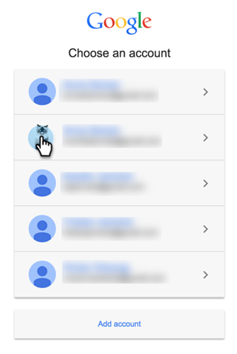

# Google AdWords toevoegen als opstartservice met een beheerdersaccount {#add-google-adwords-as-a-launchpoint-service-with-a-manager-account}

Koppel uw Google AdWords-account aan Marketo om automatisch offline conversiegegevens te uploaden van Marketo naar Google AdWords. Dan, van AdWords UI, zult u gemakkelijk kunnen zien welke klikken in gekwalificeerde lood, kansen en nieuwe klanten (of welke opbrengststadia u wilt volgen) na u resulteerden  [aangepaste kolommen toevoegen](https://support.google.com/adwords/answer/3073556){target=&quot;_blank&quot;} in AdWords. Deze informatie wordt niet weergegeven in de gebruikersinterface van Marketo.

Als u meerdere Google Adwords-accounts hebt, kunt u een [Google AdWords Manager-account](https://www.google.com/adwords/manager-accounts/){target=&quot;_blank&quot;} (voorheen Mijn clientcentrum genoemd) om deze te integreren met Marketo.

Meer informatie over [De functie voor het importeren van offlineconversies van Google](https://support.google.com/adwords/answer/2998031?hl=en){target=&quot;_blank&quot;}.

>[!AVAILABILITY]
>
>Niet alle klanten hebben deze functie aangeschaft. Neem voor meer informatie contact op met de succesmanager van de klant.

>[!NOTE]
>
>**Beheerdersmachtigingen vereist**

>[!NOTE]
>
>U kunt ook een [stand-alone Google AdWords-account als Launchpoint-service](/help/marketo/product-docs/administration/additional-integrations/add-google-adwords-as-a-launchpoint-service.md){target=&quot;_blank&quot;}.

1. Ga naar de **Beheer** sectie.

   

1. Selecteren **LaunchPoint**.

   

1. Klik op de knop **Nieuw** vervolgkeuzelijst en selecteer **Nieuwe service**.

   

1. Geef een weergavenaam op en selecteer **Google AdWords**.

   

1. Selecteren **Marketo autoriseren**.

   >[!NOTE]
   >
   >Meld u af bij uw persoonlijke Gmail-account en schakel pop-ups in.

   

1. Selecteer uw account die is gekoppeld aan **Google AdWords**.

   

1. Klikken **Accepteren**.

   

1. De status wordt weergegeven als **Succes**. Selecteren **Volgende**.

   

1. Upload uw offlineconversies van Marketo naar Google AdWords **Wekelijks** of **Dagelijks**.

   

1. Kenmerken omzetten in de **Eerste klik** of **Laatste klik**.

   

   | Type | Definitie |
   |---|---|
   | Eerste klik | Offlineconversies worden toegeschreven aan de eerste Advertentie-Woorden en die een persoon in de afgelopen 90 dagen klikte |
   | Laatste klik | Offlineconversies worden toegewezen aan de laatste AdWords en door een persoon die erop heeft geklikt |

   >[!NOTE]
   >
   >[Automatisch labelen](https://support.google.com/adwords/answer/1752125?hl=en)Deze functie werkt alleen als {target=&quot;_blank&quot;} is geselecteerd. Het moet worden geactiveerd binnen AdWords.

1. Klikken **Volgende**.

   

1. Deselecteer accounts die u niet wilt bijwerken. Klikken **Maken**.

   

   Zie nu het Verwante Artikel hieronder voor hoe te om AdWords off-line omzettingen in uw opbrengstmodel in kaart te brengen.

   >[!MORELIKETHIS]
   >
   >[Conversies van Google AdWords in het inkomstenmodel instellen met een beheerdersaccount](/help/marketo/product-docs/reporting/revenue-cycle-analytics/revenue-cycle-models/set-google-adwords-conversions-in-the-revenue-model-with-a-manager-account.md){target=&quot;_blank&quot;}
