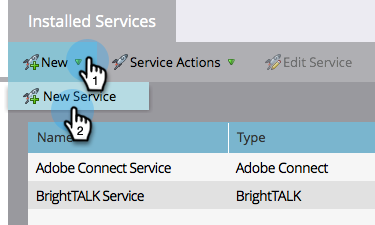

# [!DNL GoToWebinar] toevoegen als een [!DNL LaunchPoint] -service {#add-gotowebinar-as-a-launchpoint-service}

Marketo beheert uw registratie en aanwezigheid van [!DNL GoToWebinar] .

>[!NOTE]
>
>**Vereiste Bevoegdheden Admin**

>[!NOTE]
>
>Voor deze stap zijn een bestaand abonnement op [!DNL GoToWebinar] en beheerrechten vereist. U moet beschikken over het e-mailadres en wachtwoord waarmee u zich kunt aanmelden bij [!DNL GoToWebinar] .

>[!NOTE]
>
>[!DNL GoToMeeting] , [!DNL GoToWebcast] en [!DNL GoToTraining] worden momenteel niet ondersteund.

1. Ga naar het **[!UICONTROL Admin]** -gebied.

   

1. Klik op **[!UICONTROL LaunchPoint]**.

   

1. Selecteer **[!UICONTROL New]** en **[!UICONTROL New Service]** .

   

1. Voer een **[!UICONTROL Display Name]** in. Selecteer onder **[!UICONTROL Service]** de optie **[!UICONTROL GoToWebinar]** .

   

1. Klik op **[!UICONTROL Log Into GoToWebinar]**.

   

   >[!NOTE]
   >
   >Als u bedrijfsnaam en functie wilt synchroniseren van uw Marketo-formulier naar [!DNL GoToWebinar] , selecteert u het vak **[!UICONTROL Enable Additional Fields]** .

1. Voer in het pop-upvenster [!DNL GoToWebinar] Aanmelden uw **[!UICONTROL GoToWebinar]** e-mail en wachtwoord in en klik op **[!UICONTROL Sign In]** .

   

1. Klik op **[!UICONTROL Create]** nadat het venster is gesloten.

   

1. Geweldig! Uw **[!UICONTROL GoToWebinar]** -account is nu gesynchroniseerd met Marketo.

   

>[!CAUTION]
>
>Wanneer u uw wachtwoord bijwerkt in [!DNL GoToWebinar] , moet u uw wachtwoord ook in Marketo bijwerken.

>[!MORELIKETHIS]
>
>Leer hoe te om [ een gebeurtenis met  [!DNL GotoWebinar]](/help/marketo/product-docs/demand-generation/events/create-an-event/create-an-event-with-gotowebinar.md){target="_blank"} tot stand te brengen.
