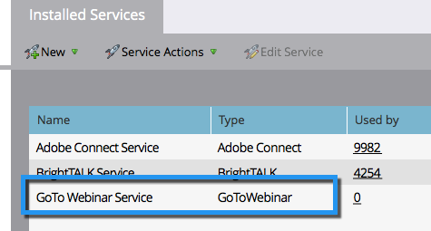

# Toevoegen [!DNL GoToWebinar] als [!DNL LaunchPoint] Service {#add-gotowebinar-as-a-launchpoint-service}

Marketo beheert uw [!DNL GoToWebinar] registratie en aanwezigheid.

>[!NOTE]
>
>**Beheerdersmachtigingen vereist**

>[!NOTE]
>
>Een bestaand abonnement op [!DNL GoToWebinar] en voor deze stap zijn administratieve rechten nodig. E-mail en wachtwoord laten gebruiken om u aan te melden [!DNL GoToWebinar] aan de hand.

>[!NOTE]
>
>[!DNL GoToMeeting], [!DNL GoToWebcast], en [!DNL GoToTraining] worden momenteel niet ondersteund.

1. Ga naar de **[!UICONTROL Admin]** gebied.

   

1. Klik op **[!UICONTROL LaunchPoint]**.

   

1. Selecteren **[!UICONTROL New]** en **[!UICONTROL New Service]**.

   

1. Voer een **[!UICONTROL Display Name]**. Selecteer onder **[!UICONTROL Service]** de optie **[!UICONTROL GoToWebinar]**.

   

1. Klik op **[!UICONTROL Log Into GoToWebinar]**.

   

   >[!NOTE]
   >
   >Als u bedrijfsnaam en functie wilt synchroniseren van uw Marketo-formulier naar [!DNL GoToWebinar], selecteert u de **[!UICONTROL Enable Additional Fields]** doos.

1. In de [!DNL GoToWebinar] Meld u aan in het pop-upvenster en voer uw **[!UICONTROL GoToWebinar]** e-mail en wachtwoord en klik **[!UICONTROL Sign In]**.

   

1. Klik op **[!UICONTROL Create]**.

   

1. Geweldig! Uw **[!UICONTROL GoToWebinar]** account is nu gesynchroniseerd met Marketo.

   

>[!CAUTION]
>
>Wanneer u uw wachtwoord bijwerkt in [!DNL GoToWebinar], moet u uw wachtwoord ook in Marketo bijwerken.

>[!MORELIKETHIS]
>
>Leer hoe u [een gebeurtenis maken met [!DNL GotoWebinar]](/help/marketo/product-docs/demand-generation/events/create-an-event/create-an-event-with-gotowebinar.md){target="_blank"}.
