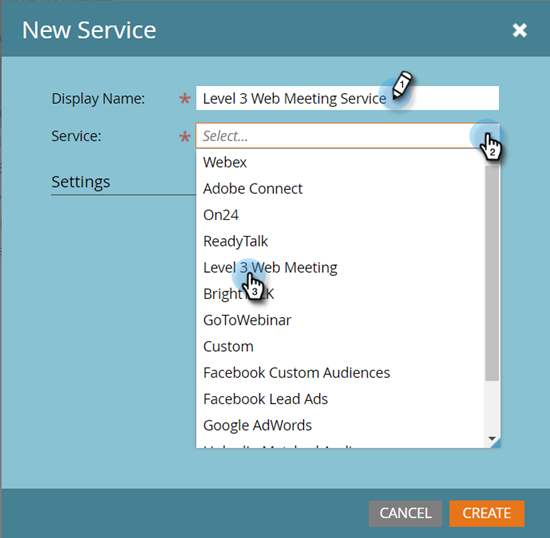

# Niveau 3 Webvergadering als Dienst van LaunchPoint toevoegen {#add-level-three-web-meeting-as-a-launchpoint-service}

Marketo beheert de registratie en aanwezigheid van Level 3-webvergaderingen.

>[!NOTE]
>
>**Beheerdersmachtigingen vereist**

>[!NOTE]
>
>Een bestaand abonnement op Niveau 3 Vergadering van het Web en de beheersrechten zijn noodzakelijk voor deze stap. Heb uw Aantal van de Toegang, de Code van de Toegang, en Wachtwoord bij hand.

1. Ga naar de **Beheer** gebied.

   

1. Klikken **LaunchPoint**.

   

1. Selecteren **Nieuw** en vervolgens **Nieuwe service**.

   

1. Voer een **Weergavenaam**. Onder **Service**, selecteert u **Niveau 3 Webvergadering**.

   

1. Voer uw **Toegangsnummer**, **Toegangscode**, en **Wachtwoord** en klik vervolgens op **Maken**.

   

Uw Level 3-webvergaderaccount is nu gesynchroniseerd met Marketo!

>[!MORELIKETHIS]
>
>Leer hoe u [een gebeurtenis maken met een Level 3-webvergadering](/help/marketo/product-docs/demand-generation/events/create-an-event/create-an-event-with-level-3-web-meeting.md){target=&quot;_blank&quot;}.
