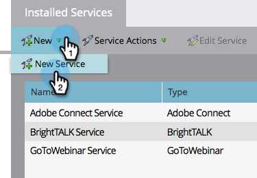
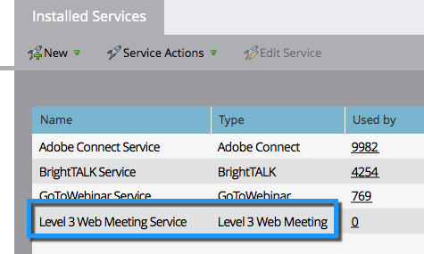

# [!DNL Level 3 Web Meeting] toevoegen als een [!DNL LaunchPoint] -service {#add-level-three-web-meeting-as-a-launchpoint-service}

Marketo beheert uw registratie en aanwezigheid van [!DNL Level 3 Web Meeting] .

>[!NOTE]
>
>**Vereiste Bevoegdheden Admin**

>[!NOTE]
>
>Voor deze stap zijn een bestaand abonnement op [!DNL Level 3 Web Meeting] en beheerrechten vereist. Heb uw Aantal van de Toegang, de Code van de Toegang, en Wachtwoord bij hand.

1. Ga naar het **[!UICONTROL Admin]** -gebied.

   

1. Klik op **[!UICONTROL LaunchPoint]**.

   

1. Selecteer **[!UICONTROL New]** en vervolgens **[!UICONTROL New Service]** .

   

1. Voer een **[!UICONTROL Display Name]** in. Selecteer onder **[!UICONTROL Service]** de optie **[!UICONTROL Level 3 Web Meeting]** .

   

1. Voer **[!UICONTROL Access Number]**, **[!UICONTROL Access Code]** en **[!UICONTROL Passcode]** in en klik op **[!UICONTROL Create]** .

   

Uw [!DNL Level 3 Web Meeting] -account is nu gesynchroniseerd met Marketo!

>[!MORELIKETHIS]
>
>Leer hoe te om [ een gebeurtenis met a  [!DNL Level 3 Web Meeting]](/help/marketo/product-docs/demand-generation/events/create-an-event/create-an-event-with-level-3-web-meeting.md){target="_blank"} tot stand te brengen.
