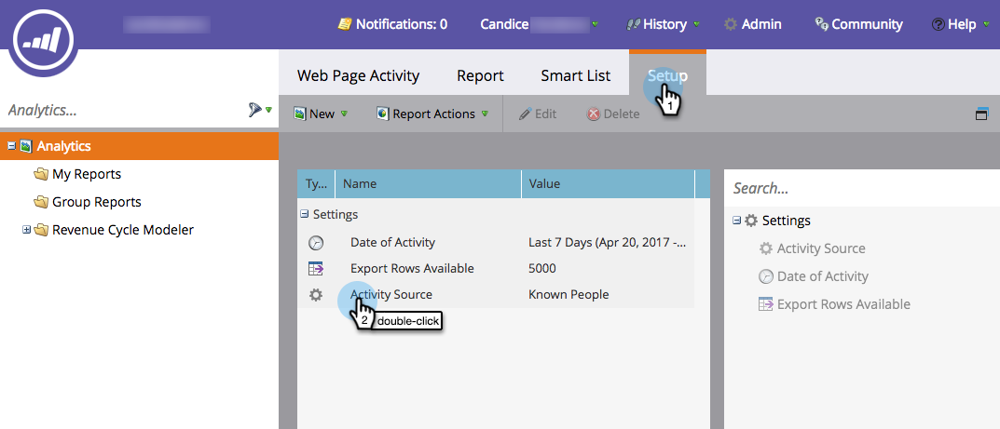
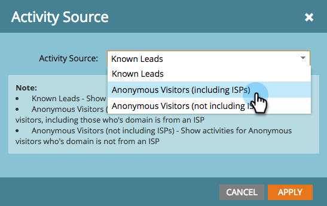

# Munchkin-trackingcode toevoegen aan uw website {#add-munchkin-tracking-code-to-your-website}

Marketo&#39;s aangepaste JavaScript-trackingcode, Munchkin, volgt alle personen die uw website bezoeken, zodat u op hun bezoeken kunt reageren met geautomatiseerde marketingcampagnes. Zelfs worden de anonieme bezoekers gevolgd samen met hun IP adressen en andere informatie. ** Zonder deze code kunt u geen bezoeken of andere activiteiten op uw website volgen.**

>[!NOTE]
>
>**Vereisten**
>
>Zorg ervoor dat u toegang hebt tot een ervaren JavaScript-ontwikkelaar. Marketo Technical Support is niet ingesteld als hulp bij het oplossen van problemen met aangepaste JavaScript.

## Trackingcode toevoegen aan uw website {#add-tracking-code-to-your-website}

>[!NOTE]
>
>Adobe Experience Cloud-klanten kunnen ook gebruikmaken van de integratie van Marketo in Adobe Launch om Munchkin-script op hun webpagina&#39;s op te nemen. Download de app [hier](https://www.adobeexchange.com/experiencecloud.details.101054.html).

1. Ga naar **Admin** en klik op **Munchkin** in de boomstructuur links.

   

   Selecteer Asynchroon bij Type code bijhouden.

   

   >[!NOTE]
   >
   >In bijna alle gevallen moet u de asynchrone code gebruiken. [Meer weten?](#types-of-munchkin-tracking-codes)

   Klik en kopieer de Javascript-code die u op uw website wilt plaatsen.

   

   >[!CAUTION]
   >
   >Gebruik niet de code die in deze schermafbeelding wordt weergegeven. U moet de unieke code gebruiken die in uw account wordt weergegeven!

   >[!TIP]
   >
   >Plaats trackingcode op de webpagina&#39;s die u wilt bijhouden. Dit kan elke pagina voor kleinere plaatsen, of slechts zeer belangrijke pagina&#39;s op plaatsen zijn die vele dynamisch geproduceerde Web-pagina&#39;s, gebruikersforums, etc. hebben.

   Voor de beste resultaten gebruikt u de asynchrone Munchkin-code en plaatst u deze in de `<head>` elementen van uw pagina&#39;s. Als u de eenvoudige code gebruikt (niet geadviseerd), is dit recht vóór de `</body>` markering.
   

>[!TIP]
>
>Voor plaatsen die een hoog volume van verkeer (d.w.z., honderdduizenden bezoeken per maand) zien, adviseren wij u niet om anonieme mensen te volgen. [Meer weten?](http://developers.marketo.com/documentation/websites/lead-tracking-munchkin-js/)

## Trackingcode toevoegen bij gebruik van meerdere werkruimten {#add-tracking-code-when-using-multiple-workspaces}

Als u Werkruimten gebruikt in uw Marketo-account, hebt u waarschijnlijk ook aparte webvoorkeuren die overeenkomen met uw werkruimten. In dat geval, kunt u Munchkin gebruiken die Javascript volgen om uw anonieme mensen aan de correcte werkruimte en de verdeling toe te wijzen.

1. Ga naar Admin en klik op Munchkin in de structuur aan de linkerkant.

1. Selecteer de juiste werkruimte voor de webpagina&#39;s die u wilt bijhouden.

>[!NOTE]
>
>Als u de speciale werkruimte Munchkin-code niet gebruikt, worden de personen toegewezen aan de standaardpartitie die is gemaakt toen uw account werd ingesteld. Het heet &quot;Standaard&quot;aanvankelijk, maar u zou dat in uw eigen Marketo rekening kunnen veranderd hebben.

1. Selecteer Asynchroon bij Type code bijhouden.

   

1. Klik en kopieer de code voor het bijhouden van JavaScript die u op uw website wilt plaatsen.

>[!CAUTION]
>
>Gebruik niet de code die in deze schermafbeelding wordt weergegeven. U moet de unieke code gebruiken die in uw account wordt weergegeven!

1. Plaats de trackingcode op uw webpagina&#39;s in het `<head>` element. Nieuwe personen die deze pagina bezoeken, worden toegewezen aan deze partitie.

>[!CAUTION]
>
>U kunt slechts één Munchkin-trackingscript gebruiken voor één partitie en werkruimte op een pagina. Neem geen bijgehouden scripts voor meerdere partities/werkruimten op uw website op.

>[!NOTE]
>
>Op Marketo gemaakte bestemmingspagina&#39;s bevatten automatisch code voor bijhouden, dus u hoeft deze code niet op deze pagina&#39;s te plaatsen.

## Typen Munchkin-trackingcodes {#types-of-munchkin-tracking-codes}

U kunt kiezen uit drie typen Münchkin-trackingcodes. Elke keer dat de laadtijd van de webpagina anders wordt beïnvloed.

1. **Eenvoudig**: heeft de minste coderegels, maar is niet geoptimaliseerd voor het laden van webpagina&#39;s. Deze code laadt de jQuery-bibliotheek telkens wanneer een webpagina wordt geladen.
1. **Asynchroon**: verkort de laadtijd van de webpagina.
1. **Asynchrone jQuery**: verkort de laadtijd van webpagina&#39;s en verbetert ook de systeemprestaties. In deze code wordt ervan uitgegaan dat u al jQuery hebt en wordt niet gecontroleerd om deze te laden.

## Testen of uw Munchkin-code werkt {#test-if-your-munchkin-code-is-working}

U kunt als volgt controleren of uw Munchkin-code werkt nadat u deze hebt toegevoegd:

1. Ga naar uw webpagina.
1. Ga naar **Analytics**.

   

1. Klik op **Webpaginageactiviteit**.

   

1. Klik het lusje van de **Opstelling** , klik de Bron **van de** Activiteit tweemaal, en verander het in **Anonieme Bezoekers (met inbegrip van ISPs)**.

   

   

1. Klik op het tabblad **Rapport** . Als u geen gegevens ziet, wacht u een paar minuten en klikt u op het pictogram Vernieuwen onder aan het scherm.

