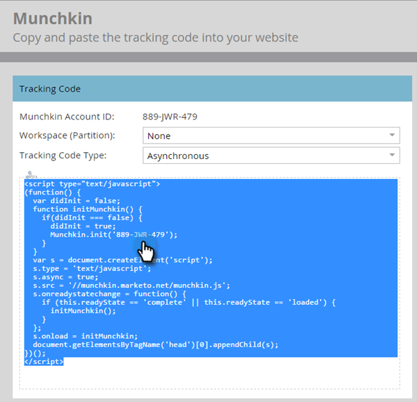
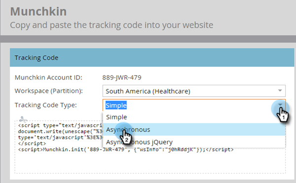
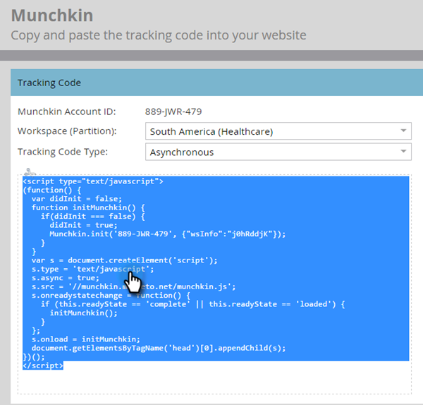
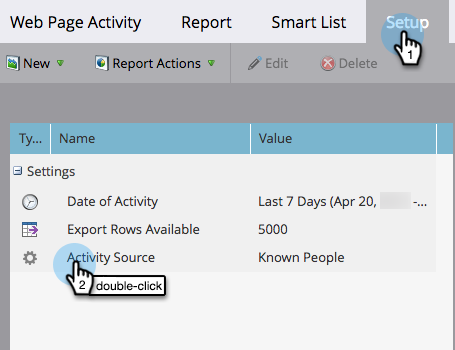

# [!DNL Munchkin] Trackingcode toevoegen aan uw website {#add-munchkin-tracking-code-to-your-website}

Marketo houdt aangepaste JavaScript-trackingcode, [!DNL Munchkin] genaamd, bij welke personen uw website bezoeken, zodat u op hun bezoeken kunt reageren met geautomatiseerde marketingcampagnes. Zelfs worden de anonieme bezoekers gevolgd samen met hun IP adressen en andere informatie. **zonder deze het volgen code, zult u geen bezoeken of andere activiteit op uw website** kunnen volgen!

>[!PREREQUISITES]
>
>Zorg ervoor dat u toegang hebt tot een ervaren JavaScript-ontwikkelaar. Marketo Technical Support is niet ingesteld als hulp bij het oplossen van problemen met aangepaste JavaScript.

## Trackingcode toevoegen aan uw website {#add-tracking-code-to-your-website}

>[!NOTE]
>
>De gebruikers van Adobe Experience Cloud kunnen de [ integratie van Marketo in de Lancering van Adobe ](https://exchange.adobe.com/apps/ec/100223/adobe-launch-core-extension){target="_blank"} ook gebruiken om [!DNL Munchkin] manuscript op hun Web-pagina&#39;s te omvatten. Als u de Lancering van Adobe gebruikt, _wordt het [!DNL Munchkin] manuscript automatisch toegevoegd_, zodat zou u het niet zelf hoeven toe te voegen.

1. Ga naar het **[!UICONTROL Admin]** -gebied.

   

1. Klik op **[!UICONTROL Munchkin]**.

   

1. Selecteer **[!UICONTROL Asynchronous]** voor **[!UICONTROL Tracking Code Type]** .

   

   >[!NOTE]
   >
   >In bijna alle gevallen moet u de asynchrone code gebruiken. [ leer meer ](#types-of-munchkin-tracking-codes).

1. Klik en kopieer de Javascript-code die u op uw website wilt plaatsen.

   

   >[!CAUTION]
   >
   >Gebruik niet de code die in deze schermafbeelding wordt weergegeven - u moet de unieke code gebruiken die in uw account wordt weergegeven!

   >[!TIP]
   >
   >Plaats trackingcode op de webpagina&#39;s die u wilt bijhouden. Dit kan elke pagina voor kleinere plaatsen, of slechts zeer belangrijke pagina&#39;s op plaatsen zijn die vele dynamisch geproduceerde Web-pagina&#39;s, gebruikersforums, etc. hebben.

   U bereikt de beste resultaten met de asynchrone [!DNL Munchkin] -code en plaats deze in de `<head>` -elementen van uw pagina&#39;s. Als u de eenvoudige code gebruikt (wordt dit niet aanbevolen), staat deze vlak voor de tag `</body>` .

   

   >[!TIP]
   >
   >Voor plaatsen die een hoog volume van verkeer (d.w.z., honderdduizenden bezoeken per maand) zien, adviseren wij u niet om anonieme mensen te volgen. [ leer meer ](https://experienceleague.adobe.com/en/docs/marketo-developer/marketo/javascriptapi/leadtracking/lead-tracking){target="_blank"}.

## Trackingcode toevoegen bij gebruik van meerdere werkruimten {#add-tracking-code-when-using-multiple-workspaces}

Als u Workspaces gebruikt in uw Marketo-account, hebt u waarschijnlijk ook aparte webvoorkeuren die overeenkomen met uw werkruimten. In dat geval kunt u met [!DNL Munchkin] tracking Javascript uw anonieme personen toewijzen aan de juiste werkruimte en partitie.

1. Ga naar het **[!UICONTROL Admin]** -gebied.

   

1. Klik op **[!UICONTROL Munchkin]**.

   

1. Selecteer de juiste werkruimte voor de webpagina&#39;s die u wilt bijhouden.

   

   >[!NOTE]
   >
   >Als u de code voor de speciale werkruimte [!DNL Munchkin] niet gebruikt, worden de personen toegewezen aan de standaardpartitie die is gemaakt toen uw account werd ingesteld. Het is genoemd &quot;[!UICONTROL Default]&quot;aanvankelijk, maar u zou dat in uw eigen rekening van Marketo kunnen veranderd hebben.

1. Selecteer **[!UICONTROL Asynchronous]** voor **[!UICONTROL Tracking Code Type]** .

   

1. Klik en kopieer de code voor het bijhouden van JavaScript die u op uw website wilt plaatsen.

   

   >[!CAUTION]
   >
   >Gebruik niet de code die in deze schermafbeelding wordt weergegeven - u moet de unieke code gebruiken die in uw account wordt weergegeven!

1. Plaats de trackingcode op uw webpagina&#39;s in het element `<head>` . Nieuwe personen die deze pagina bezoeken, worden toegewezen aan deze partitie.

   

   >[!CAUTION]
   >
   >U kunt slechts één [!DNL Munchkin] traceringsscript gebruiken voor één partitie en werkruimte op een pagina. Neem geen bijgehouden scripts voor meerdere partities/werkruimten op uw website op.

   >[!NOTE]
   >
   >De het landen pagina&#39;s die in Marketo worden gecreeerd bevatten automatisch het volgen code, zodat te hoeven u niet om deze code op hen te zetten.

## Typen [!DNL Munchkin] volgcodes {#types-of-munchkin-tracking-codes}

U kunt kiezen uit drie typen [!DNL Munchkin] volgcodes. Elke keer dat de laadtijd van de webpagina anders wordt beïnvloed.

1. **[!UICONTROL Simple]**: heeft de minste coderegels, maar is niet geoptimaliseerd voor het laden van webpagina&#39;s. Deze code laadt de jQuery-bibliotheek telkens wanneer een webpagina wordt geladen.
1. **[!UICONTROL Asynchronous]**: verkort de laadtijd van de webpagina.
1. **[!UICONTROL Asynchronous jQuery]**: verkort de laadtijd van de webpagina en verbetert ook de systeemprestaties. In deze code wordt ervan uitgegaan dat u al jQuery hebt en wordt niet gecontroleerd om deze te laden.

## Testen of uw [!DNL Munchkin] -code werkt {#test-if-your-munchkin-code-is-working}

U kunt als volgt controleren of de [!DNL Munchkin] -code werkt nadat u deze hebt toegevoegd:

1. Ga naar uw webpagina.

1. Klik in de [!DNL My Marketo] op de **[!UICONTROL Analytics]** -tegel.

   

1. Klik op **[!UICONTROL Web Page Activity]**.

   

1. Klik op de tab **[!UICONTROL Setup]** en dubbelklik op **[!UICONTROL Activity Source]** .

   

1. Wijzig [!UICONTROL Activity Source] in **[!UICONTROL Anonymous Visitors (including ISPs)]** en klik op **[!UICONTROL Apply]** .

   

1. Klik op de tab **[!UICONTROL Report]** .

   

   >[!NOTE]
   >
   >Als er geen gegevens worden weergegeven, wacht u een paar minuten en klikt u op het pictogram [!UICONTROL refresh] onderaan.
