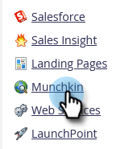

# Toevoegen [!DNL Munchkin] Code volgen op uw website {#add-munchkin-tracking-code-to-your-website}

Aangepaste JavaScript-trackingcode voor Marketo, genaamd [!DNL Munchkin], volgt alle personen die uw website bezoeken, zodat u op hun bezoeken kunt reageren met geautomatiseerde marketingcampagnes. Zelfs worden de anonieme bezoekers gevolgd samen met hun IP adressen en andere informatie. **Zonder deze code kunt u geen bezoeken of andere activiteiten op uw website volgen**!

>[!PREREQUISITES]
>
>Zorg ervoor dat u toegang hebt tot een ervaren JavaScript-ontwikkelaar. Marketo Technical Support is niet ingesteld als hulp bij het oplossen van aangepaste JavaScript-problemen.

## Trackingcode toevoegen aan uw website {#add-tracking-code-to-your-website}

>[!NOTE]
>
>Adobe Experience Cloud-gebruikers kunnen ook de [Marketo-integratie in Adobe Launch](https://exchange.adobe.com/apps/ec/100223/adobe-launch-core-extension){target="_blank"} op te nemen [!DNL Munchkin] script op hun webpagina&#39;s te plaatsen. Als u Adobe starten gebruikt, _de [!DNL Munchkin] script wordt automatisch toegevoegd_, dus hoeft u het niet zelf toe te voegen.

1. Ga naar de **[!UICONTROL Admin]** gebied.

   

1. Klik op **[!UICONTROL Munchkin]**.

   

1. Selecteren **[!UICONTROL Asynchronous]** for **[!UICONTROL Tracking Code Type]**.

   

   >[!NOTE]
   >
   >In bijna alle gevallen moet u de asynchrone code gebruiken. [Meer informatie](#types-of-munchkin-tracking-codes).

1. Klik en kopieer de Javascript-code die u op uw website wilt plaatsen.

   

   >[!CAUTION]
   >
   >Gebruik niet de code die in deze schermafbeelding wordt weergegeven - u moet de unieke code gebruiken die in uw account wordt weergegeven!

   >[!TIP]
   >
   >Plaats trackingcode op de webpagina&#39;s die u wilt bijhouden. Dit kan elke pagina voor kleinere plaatsen, of slechts zeer belangrijke pagina&#39;s op plaatsen zijn die vele dynamisch geproduceerde Web-pagina&#39;s, gebruikersforums, etc. hebben.

   U bereikt de beste resultaten met de asynchrone modus [!DNL Munchkin] code en plaats deze in de `<head>` elementen van uw pagina&#39;s. Als u de eenvoudige code gebruikt (niet geadviseerd), is dit recht vóór `</body>` -tag.

   

   >[!TIP]
   >
   >Voor plaatsen die een hoog volume van verkeer (d.w.z., honderdduizenden bezoeken per maand) zien, adviseren wij u niet om anonieme mensen te volgen. [Meer informatie](https://developers.marketo.com/documentation/websites/lead-tracking-munchkin-js/){target="_blank"}.

## Trackingcode toevoegen bij gebruik van meerdere werkruimten {#add-tracking-code-when-using-multiple-workspaces}

Als u Workspaces gebruikt in uw Marketo-account, hebt u waarschijnlijk ook aparte webvoorkeuren die overeenkomen met uw werkruimten. In dat geval kunt u de opdracht [!DNL Munchkin] het volgen Javascript om uw anonieme mensen aan de correcte werkruimte en de verdeling toe te wijzen.

1. Ga naar de **[!UICONTROL Admin]** gebied.

   

1. Klik op **[!UICONTROL Munchkin]**.

   

1. Selecteer de juiste werkruimte voor de webpagina&#39;s die u wilt bijhouden.

   

   >[!NOTE]
   >
   >Als u de speciale werkruimte niet gebruikt [!DNL Munchkin] code, zullen de mensen aan de standaardverdeling worden toegewezen die werd gecreeerd toen uw rekening opstelling was. De naam ervan is &quot;[!UICONTROL Default]&quot; in eerste instantie, maar je hebt dat wellicht gewijzigd in je eigen Marketo-account.

1. Selecteren **[!UICONTROL Asynchronous]** for **[!UICONTROL Tracking Code Type]**.

   

1. Klik en kopieer de code voor het bijhouden van JavaScript die u op uw website wilt plaatsen.

   

   >[!CAUTION]
   >
   >Gebruik niet de code die in deze schermafbeelding wordt weergegeven - u moet de unieke code gebruiken die in uw account wordt weergegeven!

1. Plaats de trackingcode op uw webpagina&#39;s in het dialoogvenster `<head>` element. Nieuwe personen die deze pagina bezoeken, worden toegewezen aan deze partitie.

   

   >[!CAUTION]
   >
   >U kunt slechts één [!DNL Munchkin] script bijhouden voor één partitie en werkruimte op een pagina. Neem geen bijgehouden scripts voor meerdere partities/werkruimten op uw website op.

   >[!NOTE]
   >
   >De het landen pagina&#39;s die in Marketo worden gecreeerd bevatten automatisch het volgen code, zodat te hoeven u niet om deze code op hen te zetten.

## Typen [!DNL Munchkin] Trackingcodes {#types-of-munchkin-tracking-codes}

Er zijn drie typen [!DNL Munchkin] volgcodes waaruit u kunt kiezen. Elke keer dat de laadtijd van de webpagina anders wordt beïnvloed.

1. **[!UICONTROL Simple]**: heeft de minste coderegels, maar is niet geoptimaliseerd voor het laden van webpagina&#39;s. Deze code laadt de jQuery-bibliotheek telkens wanneer een webpagina wordt geladen.
1. **[!UICONTROL Asynchronous]**: verkort de laadtijd van de webpagina.
1. **[!UICONTROL Asynchronous jQuery]**: verkort de laadtijd van de webpagina en verbetert ook de systeemprestaties. In deze code wordt ervan uitgegaan dat u al jQuery hebt en wordt niet gecontroleerd om deze te laden.

## Test of uw [!DNL Munchkin] Code werkt {#test-if-your-munchkin-code-is-working}

Om te controleren of uw [!DNL Munchkin] code werkt nadat u deze hebt toegevoegd:

1. Ga naar uw webpagina.

1. In uw [!DNL My Marketo]klikt u op de knop **[!UICONTROL Analytics]** tegel.

   

1. Klik op **[!UICONTROL Web Page Activity]**.

   

1. Klik op de knop **[!UICONTROL Setup]** tab, dubbelklikken **[!UICONTROL Activity Source]**.

   

1. Wijzig de [!UICONTROL Activity Source] tot **[!UICONTROL Anonymous Visitors (including ISPs)]** en klik op **[!UICONTROL Apply]**.

   

1. Klik op de knop **[!UICONTROL Report]** tab.

   

   >[!NOTE]
   >
   >Als u geen gegevens ziet, wacht u een paar minuten en klikt u op het pictogram Vernieuwen onder aan het scherm.
