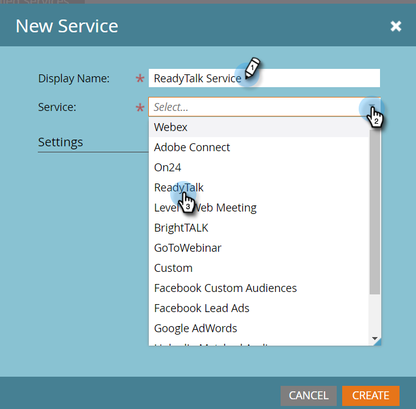

# ReadyTalk toevoegen als een LaunchPoint-service {#add-readytalk-as-a-launchpoint-service}

Marketo beheert uw ReadyTalk-webinarregistratie en -aanwezigheid.

>[!NOTE]
>
>**Beheerdersmachtigingen vereist**

>[!NOTE]
>
>Voor deze stap is een bestaand abonnement op ReadyTalk en beheerrechten vereist. Zorg dat u de volgende instellingen hebt: Toegangsnummer, Toegangscode en Wachtwoord.

1. Ga naar **Admin** en klik **ReadyTalk**.

   

1. Selecteer **Nieuw** en **Nieuwe service**.

   

1. Voer een **Weergavenaam** in. Selecteer **ReadyTalk** onder **Service**.

   

1. Voer uw **Toegangsnummer** en **Toegangscode** in.

   

1. Voltooi het proces door uw **Passcode** in te voeren en **Create** te klikken.

   

Uw **ReadyTalk**-account is nu gesynchroniseerd met Marketo.

>[!MORELIKETHIS]
>
>Leer hoe u [een gebeurtenis maakt met ReadyTalk](/help/marketo/product-docs/demand-generation/events/create-an-event/create-an-event-with-readytalk.md).
